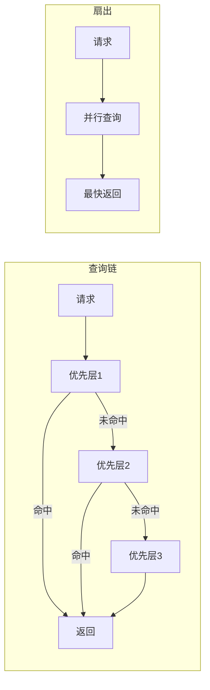

---
tags:
  - ComputerScience
  - Go
  - 方法性
  - 基本原理
title: "Query Chain Pattern"
created: 2026-06-01
modified: 2026-06-01
---

# Query Chain Pattern

> [!abstract] 查询链将多个数据源按优先级组成链式查询：每个节点给出结果则返回，否则降到下一级。这是短路优先与自动降级的组合模式。

## 1. 概念

多个数据源按优先级组成串联查询管道，每个节点独立负责一件事：

```
请求 → 优先层1（最快） → 命中？→ 返回
                    ↓ 未命中
                 优先层2 → 命中？→ 返回
                       ↓ 未命中
                    优先层N（最慢/最完整）→ 返回
```

### 1.1 在 bl 中的体现

```
离线词典（内存映射 / 文件读，微秒级）
  → SQLite 缓存（本地数据库，毫秒级）
    → HTTP 在线（网络请求，百毫秒级）
```

| 层级 | 速度 | 依赖 | 容量 |
|------|------|------|------|
| 离线词典 | ~μs | 本地索引文件 | 预置词库 |
| SQLite 缓存 | ~ms | 本地 .db 文件 | 用户查询历史 |
| HTTP 在线 | ~100ms | 网络连通 | 无限（在线） |

## 2. 核心行为

### 2.1 短路

命中即返回，后续层不再执行：

```go
type Chain []Source

func (c Chain) Query(text string) (*Result, error) {
    for _, source := range c {
        result, err := source.Query(text)
        if err == nil {
            return result, nil  // 短路：命中即返回
        }
    }
    return nil, ErrNoResults
}
```

### 2.2 降级

某层不可用时跳到下一层，不阻断整个查询：

```go
func (c Chain) Query(text string) (*Result, error) {
    var errors []error
    for _, source := range c {
        result, err := source.Query(text)
        if err == nil {
            return result, nil
        }
        errors = append(errors, err)
        // 继续下一层（降级）
    }
    return nil, fmt.Errorf("all sources failed: %w", errors.Join(errors...))
}
```

### 2.3 严格模式

强制只走某一层，未命中则报错：

```go
type Engine struct {
    chain  Chain
    strict bool  // 严格模式标志
}

func (e *Engine) Query(text string) (*Result, error) {
    if e.strict {
        return e.chain[0].Query(text)  // 只走第一层
    }
    return e.chain.Query(text)  // 走完整链
}
```

## 3. 实现结构

```go
// 所有数据源实现同一接口
type Source interface {
    Query(text string) (*Result, error)
}

// 查询链是 Source 列表
type Chain []Source

// 每个层独立实现
type OfflineDict struct { /* 离线词典 */ }
type CacheLayer  struct { /* SQLite 缓存 */ }
type OnlineSource struct { /* HTTP 查询 */ }

// 组合成链
engine := Chain{
    &OfflineDict{path: "dict.zi"},
    &CacheLayer{db: sqliteDB},
    &OnlineSource{client: httpClient},
}
```

## 4. 模式对比

| 模式 | 行为 | 适用场景 |
|------|------|---------|
| **查询链**（本模式） | 逐级尝试，命中返回 | 多数据源优先级明确 |
| **扇出（Fan-out）** | 并行查全部，取最快返回 | 数据源冗余，追求最低延迟 |
| **合并（Merge）** | 并行查全部，合并结果 | 需要最完整的结果 |



## 相关笔记

- [[Caching Principles]] — 缓存层在查询链中的位置
- [[Layered Architecture]] — 查询链的分层设计思想
- [[Unified Data Flow Design]] — 统一数据模型使链式传递成为可能
