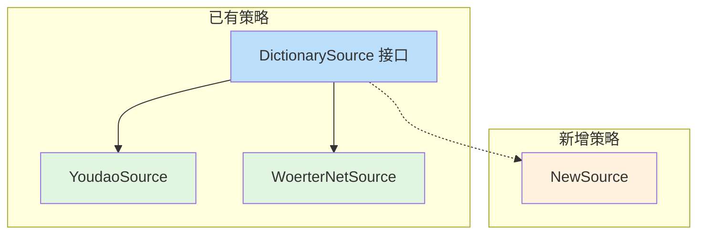

---
tags:
  - ComputerScience
  - Go
  - 方法性
  - 基本原理
  - ProgrammingLanguages
title: "Strategy Pattern"
created: 2026-06-01
modified: 2026-06-01
---

# Strategy Pattern

> [!abstract] 策略模式定义一系列算法，将它们封装起来，使它们可以互相替换。算法的变化独立于使用算法的客户端。Go 中通过接口天然实现。

## 1. 定义

```
策略抽象（接口）
  ├── 具体策略 A
  ├── 具体策略 B
  └── 具体策略 C

上下文（Context）—— 持有策略接口，运行时切换
```

| 角色 | Go 中的体现 | 职责 |
|------|------------|------|
| **策略抽象** | `interface` | 定义算法的统一接口 |
| **具体策略** | 结构体实现接口 | 实现特定算法 |
| **上下文** | 持有接口字段的结构体 | 运行时选择/切换策略 |

## 2. 在 bl 中的体现

```go
// 策略抽象
type DictionarySource interface {
    FetchURL(query string) string
    Parse(html string) (*TranslationData, error)
}

// 具体策略：有道词典（英⇄中）
type YoudaoSource struct{}

func (y YoudaoSource) FetchURL(query string) string {
    return fmt.Sprintf("https://dict.youdao.com/result?q=%s", url.QueryEscape(query))
}

func (y YoudaoSource) Parse(html string) (*TranslationData, error) {
    // 英⇄中解析逻辑
}

// 具体策略：德语词典
type WoerterNetSource struct{}

func (w WoerterNetSource) FetchURL(query string) string {
    return fmt.Sprintf("https://www.verbformen.com/?w=%s", url.QueryEscape(query))
}

func (w WoerterNetSource) Parse(html string) (*TranslationData, error) {
    // 德语解析逻辑
}

// 上下文：引擎只关心策略接口
type Rdict struct {
    source DictionarySource  // 运行时可替换
}

func (r *Rdict) Query(text string) (*Result, error) {
    url := r.source.FetchURL(text)
    // ...
}
```

## 3. 运行时切换

```go
// 用户通过 -s 参数切换策略
source := flag.String("s", "youdao", "dictionary source")

var dictSource DictionarySource
switch *source {
case "youdao":
    dictSource = YoudaoSource{}
case "woerter-net":
    dictSource = WoerterNetSource{}
}

rdict := Rdict{source: dictSource}
```

## 4. 开闭原则

策略模式满足开闭原则：**对扩展开放，对修改关闭**。

```go
// 新增策略不需要修改已有代码
type NewSource struct{}

func (n NewSource) FetchURL(query string) string { /* ... */ }
func (n NewSource) Parse(html string) (*TranslationData, error) { /* ... */ }

// 只需在 switch 中添加一个 case
```



## 5. 策略模式 vs 其他模式

| 模式 | 目的 | 结构 |
|------|------|------|
| **策略模式** | 算法可变 | 上下文持有策略接口 |
| **模板方法** | 算法骨架固定，步骤可变 | 基类定义步骤，子类重写 |
| **状态模式** | 对象行为随状态改变 | 状态接口 + 上下文委托 |

## 6. 适用场景

| 适用 | 不适用 |
|------|--------|
| 多个类仅在行为上不同 | 策略不会变化 |
| 需要运行时切换算法 | 只有一种实现 |
| 算法逻辑庞大，需要隔离 | 算法非常简单 |

## 相关笔记

- [[Go - Interfaces]] — Go 中策略模式的实现基础
- [[Layered Architecture]] — 策略模式在分层中的应用
- [[Query Chain Pattern]] — 多个策略组合成链
