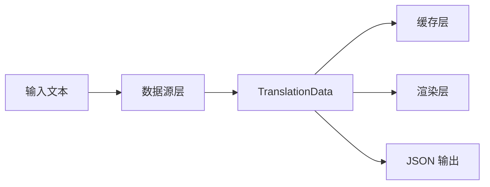

---
tags:
  - ComputerScience
  - Go
  - 方法性
  - 基本原理
title: "Unified Data Flow Design"
created: 2026-06-01
modified: 2026-06-01
---

# Unified Data Flow Design

> [!abstract] 统一数据流设计：所有数据源返回相同的数据类型，渲染层、缓存层、离线词典层都操作同一类型。这是模块解耦的关键设计决策。

## 1. 统一数据模型

所有词典源都返回同一个数据类型：

```go
type TranslationData struct {
    Type           ResultType
    InputText      string
    Pronunciation  *Pronunciation
    Meanings       []Meaning
    Examples       []Example
    // ... 其他通用字段
}

// 所有数据源操作同一个类型
type Source interface {
    FetchURL(query string) string
    Parse(html string) (*TranslationData, error)
}

type Cache interface {
    Get(key string) (*TranslationData, bool)
    Set(key string, data *TranslationData)
}
```

## 2. 数据流

```
输入文本
  → 查询链（多种数据源）
    → 统一 TranslationData
      → 缓存存储
      → 格式化渲染
```

### 2.1 各层操作同一类型

| 阶段 | 操作 | 输入 | 输出 |
|------|------|------|------|
| **数据源** | 抓取并解析 HTML | HTML 文本 | `*TranslationData` |
| **缓存** | 序列化为 JSON 并存储 | `*TranslationData` | BLOB |
| **渲染** | 格式化输出 | `*TranslationData` | 终端文本/JSON |



## 3. 设计优势

| 优势 | 为什么 |
|------|--------|
| **模块解耦** | 各层只依赖数据类型，不互相依赖 |
| **替换友好** | 可以更换任一层实现而不影响其他层 |
| **可扩展** | 新增词典源只需填充统一类型 |
| **可测试** | Mock 一个 `TranslationData` 就可以测渲染层 |

## 4. 对比：非统一数据流

```mermaid
graph TB
    subgraph 非统一设计（❌）
        A1[数据源A] --> B1[类型X]
        A2[数据源B] --> B2[类型Y]
        B1 --> C1[渲染A]
        B2 --> C2[渲染B]
        B1 -.-> D1[缓存A]
        B2 -.-> D2[缓存B]
    end
    subgraph 统一设计（✅）
        E1[数据源A] --> F[统一类型]
        E2[数据源B] --> F
        F --> G[统一渲染]
        F --> H[统一缓存]
    end
```

| 维度 | 非统一 | 统一 |
|------|--------|------|
| 渲染层 | 每种数据源一套渲染 | 一套渲染 |
| 缓存层 | 需要 N 个缓存表/序列化器 | 一个缓存实现 |
| 新增数据源 | 需实现渲染、缓存、序列化 | 只需实现数据源接口 |

## 5. 实现要点

```go
// 1. 定义统一类型
type TranslationData struct {
    InputText     string          `json:"input_text"`
    Pronunciation *Pronunciation  `json:"pronunciation,omitempty"`
    Meanings      []Meaning       `json:"meanings,omitempty"`
    Examples      []Example       `json:"examples,omitempty"`
}

// 2. 所有源填充统一类型
type Source interface {
    FetchURL(query string) string
    Parse(html string) (*TranslationData, error)  // ← 统一返回
}

// 3. 统一序列化（JSON）
data, _ := json.Marshal(translationData)
cache.Set(key, string(data))

// 4. 统一渲染
func Render(data *TranslationData, colored bool) string {
    // 一次实现，所有数据源共用
}
```

## 相关笔记

- [[Layered Architecture]] — 统一数据流使分层成为可能
- [[Query Chain Pattern]] — 链中各层传递统一类型
- [[Tagged Union]] — 当不同数据源需要不同结构时
