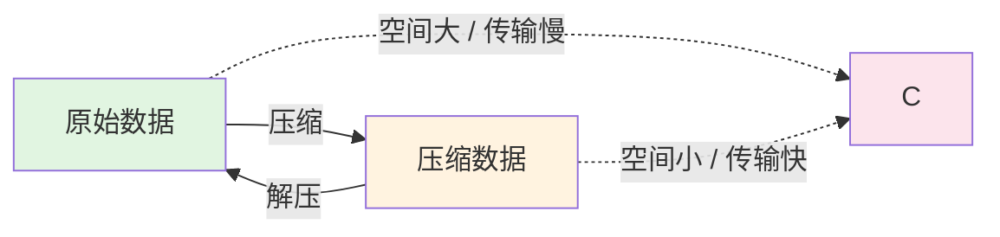

---
tags:
  - ComputerScience
  - Go
  - 基本原理
title: "zlib Compression"
created: 2026-06-01
modified: 2026-06-01
---

# zlib Compression

> [!abstract] zlib 是广泛使用的无损压缩库，内部使用 DEFLATE 算法。Go 标准库 `compress/zlib` 直接提供支持，零额外依赖。

## 1. 压缩基础

### 1.1 无损压缩

解压后与原文完全一致，对比有损压缩（如 JPEG）会丢失信息。

### 1.2 文本压缩特性

| 数据类型 | 典型压缩率 | 原因 |
|---------|-----------|------|
| 自然语言文本 | 60-80% | 大量重复模式（字母频率、常见词） |
| JSON | 70-85% | 重复的键名和结构 |
| 已压缩文件 | 几乎无 | 已接近熵极限 |

## 2. DEFLATE 算法

zlib 内部使用 DEFLATE 算法，由两个阶段组成：

```
DEFLATE
├── LZ77 —— 匹配重复串（滑动窗口）
└── Huffman 编码 —— 变长编码（高频字符用短码）
```

| 阶段 | 作用 | 原理 |
|------|------|------|
| **LZ77** | 查找重复 | 滑动窗口搜索已出现过的字符串，用"距离+长度"替代 |
| **Huffman** | 最短编码 | 高频字符用短码，低频字符用长码 |

## 3. Go 标准库

### 3.1 压缩写入

```go
import "compress/zlib"

func compressData(data []byte) ([]byte, error) {
    var buf bytes.Buffer
    w := zlib.NewWriter(&buf)
    
    if _, err := w.Write(data); err != nil {
        return nil, err
    }
    if err := w.Close(); err != nil {
        return nil, err
    }
    return buf.Bytes(), nil
}
```

### 3.2 解压读取

```go
func decompressData(compressed []byte) ([]byte, error) {
    r, err := zlib.NewReader(bytes.NewReader(compressed))
    if err != nil {
        return nil, err
    }
    defer r.Close()
    
    return io.ReadAll(r)
}
```

### 3.3 压缩级别

```go
import "compress/flate"

// zlib 支持 1-9 的压缩级别
w, _ := zlib.NewWriterLevel(&buf, flate.BestCompression)  // 级别 9
w, _ := zlib.NewWriterLevel(&buf, flate.BestSpeed)         // 级别 1
w, _ := zlib.NewWriterLevel(&buf, flate.DefaultCompression) // 级别 6
```

| 级别 | 名称 | 压缩率 | 速度 |
|------|------|--------|------|
| 0 | NoCompression | 0% | 最快 |
| 1 | BestSpeed | 低 | 快 |
| 6 | DefaultCompression | 中 | 中 |
| 9 | BestCompression | 高 | 慢 |

## 4. 空间-时间权衡



| 操作 | CPU 开销 | 适用场景 |
|------|---------|---------|
| **压缩** | 高 | 写入时做一次 |
| **解压** | 低 | 每次读取时做 |
| **预压缩** | 一次构建 | 离线词典提前压缩好 |

> [!tip] 离线词典策略
> 词典数据在构建时预压缩，运行时只需解压。解压速度远快于压缩，适合运行时频繁读取的场景。

## 相关笔记

- [[SQLite]] — 缓存中使用 BLOB 存储压缩数据
- [[Caching Principles]] — 存储空间优化
