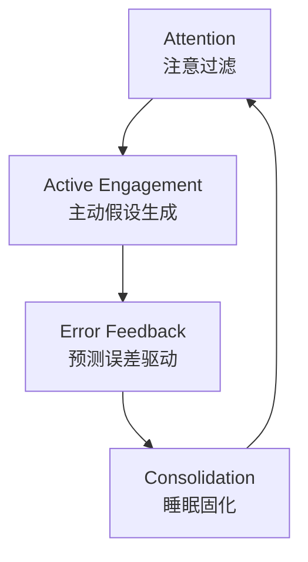

# 学习科学基础

> [!abstract] 概述
> 本笔记综合 6 本学习科学核心著作，覆盖从神经机制到实践策略的完整图谱。核心结论：**有效学习是努力反直觉的**——最有效的策略（检索练习、间隔重复、交错、刻意练习）当下感觉更低效，但长期效果远超填鸭式学习。

## 核心结论矩阵

| 维度 | 关键发现 | 来源 |
|:--|:--|:--|
| **学习本质** | 学习 = 构建并优化内部世界模型 | Dehaene |
| **四大支柱** | 注意、主动参与、错误反馈、巩固 | Dehaene |
| **最有效策略** | 检索练习、间隔重复、交错练习 | Brown et al. |
| **专家机制** | 心理表征 + 刻意练习 | Ericsson |
| **注意力** | 工作记忆 4 个槽位，多任务是神话 | Levitin |
| **专注力** | 深度工作 = 时间 × 强度 | Newport |

---

## 一、学习的神经机制

### 1.1 四大支柱（Dehaene）

**Pillar 1 — Attention（注意）**
- 注意是学习的门户：将相关神经信号放大 100 倍
- 三种注意系统：警觉（何时注意）、定向（注意什么）、执行注意（如何处理）
- 非注意刺激几乎不产生学习 → "看不见的大猩猩"实验（Simons & Chabris, 1999）

**Pillar 2 — Active Engagement（主动参与）**
- 被动生物学不到东西：主动生成假设是核心
- 好奇心激活与食物/性相同的多巴胺回路
- 好奇心中钟形曲线（Goldilocks 效应）：最关注新颖但可及的材料
- Kirschner & Hendrick：发现式学习效果差 → 主动参与 + 明确指导最佳

**Pillar 3 — Error Feedback（错误反馈）**
- 惊讶（预测误差）是学习的基本驱动力 — 无误差 = 无学习
- Rescorla-Wagner 理论："阻断实验"证实预期违背的必要性
- 错误反馈 ≠ 惩罚：恐惧环境抑制可塑性
- 高质量反馈是学业成功最强预测因子之一（Hattie 元分析）

**Pillar 4 — Consolidation（巩固）**
- 睡眠时大脑以远高于经历的速度重放白天活动
- 海马体 → 皮层记忆转移发生在深睡期
- 睡眠中的发现：被试睡眠后隐藏规律发现率翻倍
- 间隔学习（间隔 ≈ 20% 目标记忆时长）效果最优

### 1.2 神经可塑性与神经元回收

- **Hebb 规则**："一起放电的神经元连在一起" — 长时程增强（LTP）
- **敏感期**：视觉皮层突触增生峰在 2 岁，前额叶可塑性持续至青春期晚期
- **神经元回收假说**：文化发明（阅读、数学）必须在既有脑回路中找到"生态位"
- 盲人将视觉皮层回收用于数学和语言 — 相同抽象概念，不同输入
- 阅读习得将人脸识别推向右半球 — 皮层竞争

### 1.3 婴儿的核心知识

> [!tip] 婴儿 ≠ 白板
> 新生儿拥有：客体概念、数感、概率直觉、语言习得装置、面孔感知、心理理论。婴儿像科学家一样做贝叶斯推理（Xu & Garcia, 2008）。

---

## 二、高效学习策略（Brown et al.）

> [!note] 必要难度（Desirable Difficulties）
> Bjork 的核心框架：学习策略的难度越高（在合理范围内），长期保持越好。检索练习、间隔重复、交错、生成都是必要难度的具体实例——当下感觉更低效，但正是这种"合意困难"驱动深度编码。

### 2.1 检索练习（Testing Effect）

> [!tip] 核心反直觉发现
> 自检比重读有效得多。读后测试的学生比重读学生多保留 50%，此效应已被重复数百次。

测试效应的神经机制与 Dehaene 的"错误反馈"支柱一致——检索时的预测误差驱动记忆再巩固。

- 努力程度越高 = 学习越强（简答题 > 选择题，论述题 > 简答题）
- 间隔 3 次测试：一周后保留 53% vs 不测试的 28%
- 测试不是"测量"工具 — 测试本身就是学习（检索-再巩固机制）
- 哥伦比亚中学研究：测试材料在一个月后仍高出整整一个等级（A- vs C+）

### 2.2 间隔练习 vs 填鸭

- 集中练习感觉更高效但产出短暂收益
- 外科医生分 4 周训练 vs 1 天填鸭：操作错误率 0% vs 16%（实验室指标，非临床结局）
- **类比**：砌砖墙 — 砂浆（突触连接）需要干燥时间

### 2.3 交错练习

- 混合问题类型练习：期末 63% vs 集中练习的 20%（提升 215%）
- 提升辨别能力 — 识别问题类型、选择正确策略
- 沙包投掷研究：从未练习过测试距离的孩子表现更好（Make It Stick, beanbag experiment）
- Cal Poly 棒球：随机投球练习 > 集中练习

### 2.4 生成与精细化

- 先尝试解题再听讲解 — 即使尝试失败也促进学习
- 精细化：用自己的话连接先验知识 → 语义加工（75% 保留）vs 视觉加工（33%）
- 反思（检索 + 精细化 + 生成）：写作提升半档考试分数

### 2.5 校准与元认知

> [!note] 元认知（Metacognition）
> "对思考的思考"——监控和评估自己的学习状态。大多数人元认知能力低下，产生系统性误判。

- **流畅性错觉**：重读产生虚假掌握感
- **Dunning-Kruger 效应**：底部 25% 学生自估在 58 百分位（实际仅 12 百分位）
- **解决方案**：定期自检校准判断力
- 重读 + 集中练习是 >80% 学生的首选策略，但效果最差
- "学习风格"匹配假说无实证支持——学习风格作为偏好存在，但按风格匹配教学方式不能提升效果。教学方式应匹配内容，非学习者偏好

---

## 三、专注与深度工作

### 3.1 大脑的双模式（Oakley）

| 模式 | 特点 | 神经基础 | 隐喻 |
|:--|:--|:--|:--|
| **Focused** | 集中、序列、分析 | 前额叶皮层 | 聚光灯（窄而强） |
| **Diffuse** | 放松、整体、创新 | 默认模式网络 | 泛光灯（宽而弱） |

- 两种模式不能同时有意识切换 — 但 diffuse 可在后台工作
- **Einstellung 效应**：已有想法阻碍更好方案 → 需切换 diffuse 模式打破
- **三 B 法则**：bed, bath, bus — 激活 diffuse 模式
- 学习 = 两种模式来回切换的"网球 volley"

### 3.2 组块化（Chunking）

> [!note] 什么是组块？
> 通过理解和练习将信息绑定为有意义整体。类似 .zip 压缩 — 将复杂性压缩为可访问单元。

- 工作记忆容纳 ~4 个组块 — 专家每个组块包含更多信息
- 形成组块三步：专注理解基本理念 → 练习获得上下文（何时用/不用）→ 建立自上而下 + 自下而上的连接
- **手写 > 打字**：促进深度加工，提升概念理解（Mueller & Oppenheimer, 2014）
- 记忆 ≠ 组块化（Solomon Shereshevsky 案例：记住一切却无法抽象）

### 3.3 拖延机制（Oakley）

- 拖延 = 习惯回路：触发 → 惯常行为 → 奖励 → 信念
- 预期任务激活脑内痛区 — 实际做时痛感消失
- **Pomodoro 技巧**：25 分钟专注 + 奖励，关注过程而非产品
- "我将工作 20 分钟" < "我必须完成这份作业"（痛感更低）
- 每晚写次日任务清单 — 释放工作记忆，激活夜间 diffuse 处理

### 3.4 深度工作 vs 浅薄工作（Newport）

- **深度工作**：无分散注意力的专注活动，将认知推向极限 → 创造新价值、提升技能
- **浅薄工作**：后勤性任务，可复制性强 → 价值低
- 知识工作者大量时间用于电邮/会议等浅层事务
- **生产力方程**：高质量产出 = 时间 × 专注强度（非线性）
- 多任务处理重塑大脑：重度多任务者无法过滤无关信息（Clifford Nass 研究）

### 3.5 注意力残留（Attention Residue）

- 从任务 A 切换到 B：部分注意力滞留在 A，削弱 B 表现
- 检查邮箱即产生残留 → 损害后续所有任务
- 策略：批量处理高认知工作（Adam Grant：将教学集中在一个学期，另一学期完全投入深度研究）

### 3.6 四种深度工作哲学

| 哲学 | 方式 | 代表人物 |
|:--|:--|:--|
| **Monastic** | 消除一切浅层事务 | Donald Knuth（1990 起无邮箱）|
| **Bimodal** | 周期性深层/开放交替 | Carl Jung（Bollingen 塔闭关）|
| **Rhythmic** | 每日同时段 | Brian Chappell（每天 5:30-7:30）|
| **Journalistic** | 见缝插针 | Walter Isaacson（900 页书于零碎时间）|

- 关键：用仪式感减少进入深度专注的意志力消耗
- "罗斯福冲刺"：设超短截止期限、极高强度攻击 — 注意力间歇训练

---

## 四、专家表现与刻意练习（Ericsson）

### 4.1 刻意练习精确定义

> [!note] 刻意练习 ≠ 简单重复
> 刻意练习要求：(1) 明确具体目标 (2) 高度专注 (3) 即时信息反馈 (4) 走出舒适区 (5) 突破当前能力。必须有教练设计任务、提供反馈。

- 核心机制：**心理表征** — 领域特定的详细认知结构
- 心理表征使专家能：计划、实时监控、评估结果、预测场景
- 国际象棋大师因丰富心理表征而能复盘全局

### 4.2 一万小时迷思

- Gladwell《异类》过度简化 Ericsson 的研究
- 一万小时是 20 岁小提琴家的平均值，非通用规则
- **关键不是时长，而是练习质量**
- 各领域所需时间差异巨大，但平均需约十年刻意练习

### 4.3 大脑可塑性证据

- 伦敦出租车司机（掌握 "the Knowledge"）后海马体显著增大
- **挑战体内稳态原则**：大脑适应压力后需进一步挑战才能继续提升
- "用进废退"：横断面研究显示出租车司机后海马体更大，但纵向变化尚未有直接证据

### 4.4 天赋 vs 练习

- Ericsson 反对天赋决定论：专家的最大"天赋"是人人都有的大脑可塑性
- 绝对音感：训练幼儿 100% 可获得 vs 一般人群万分之一
- Ray Allen（NBA 历史最佳三分手）：高中跳投很差，靠多年刻意练习改造
- 例外：身高对篮球等物理特征确有影响

---

## 五、注意力系统与认知组织（Levitin）

### 5.1 注意力四组件

1. **Mind-wandering mode**（默认模式网络）：休息态，关联创造力、共情、规划
2. **Central executive mode**：专注任务执行
3. **Attional filter**（自下而上）：持续监控环境重要信号
4. **Attentional switch**（脑岛）：在 1/2 间切换

> [!info] 多任务神话
> 大脑不能真正多任务 — 只能快速切换，每次切换有认知代价。两种模式互斥。

### 5.2 工作记忆极限

- 意识中央执行最多容纳 ~4-5 件事
- 记忆不可靠的根源是**提取限制**，非存储限制
- 最佳记忆 = 独特/情绪化体验；日常体验融合遗忘
- **排练环路**：大脑复述待办事项 → 写下来让环路"放手"

### 5.3 外部化认知

- 核心原则：将组织负担从大脑转移到外部世界
- 3×5 索引卡系统：一卡一想法 → 外化记忆、随机访问、轻松排序
- David Allen GTD 两分钟规则：<2 分钟立即做；否则委派/推迟/丢弃
- 美国州际公路编号系统 = 外化信息（偶数=东西，奇数=南北）

### 5.4 决策疲劳

- 每个决策消耗有限心智能量池
- 大脑进化于稀缺环境 — 现代生活决策量远超设计
- 信息时代将旅行代理/秘书等工作转嫁给个人

### 5.5 记忆的真相

- 记忆是"虚构" — 每次回忆都是重写，非回放
- 系列位置曲线：首因效应 + 近因效应
- 虚假记忆常见 — Loftus & Palmer (1974)：改变一词（"撞"vs"碰"）可植入错误记忆

---

## 六、睡眠与学习

| 发现 | 来源 | 证据强度 |
|:--|:--|:--|
| 睡眠时大脑以远高于经历的速度重放 | Dehaene | 高 |
| 深睡期海马体 → 皮层记忆转移 | Dehaene | 高 |
| 睡眠中胶质淋巴系统清除代谢废物（Nedergaard, 2013） | Oakley | 高 |
| 睡眠后隐藏规律发现率翻倍 | Dehaene | 高 |
| 清醒时产生毒素，睡眠时脑细胞收缩清除 | Oakley | 高 |
| 1 小时清醒阅读 > 3 小时疲劳阅读 | Oakley | 高 |
| 做梦增强对材料的理解 | Oakley | 中 |
| 推迟青少年上学时间 30-60 分钟提升成绩 | Dehaene | 高 |

---

## 七、实践工具箱

### 7.1 日常学习流程

### 7.2 核心策略清单

- [ ] **检索优先**：学完立即合上书本，写下能记住的内容
- [ ] **间隔重复**：用 Anki 等工具，按 1-3-7-21 天间隔复习
- [ ] **交错练习**：同一 session 混合不同类型问题
- [ ] **Pomodoro**：25 分钟专注 + 5 分钟休息
- [ ] **记忆宫殿**：用空间视觉记忆密集信息
- [ ] **费曼技巧**：用简单语言解释概念，发现理解缺口
- [ ] **睡前学习**：睡前 1 小时学习 → 睡眠中巩固
- [ ] **手写笔记**：比打字构建更强神经结构
- [ ] **过程聚焦**："我将工作 20 分钟"而非"我必须完成"
- [ ] **深度工作块**：每天至少 1 小时无干扰专注

### 7.3 避免的陷阱

| 陷阱 | 真相 |
|:--|:--|
| 重读教材 | 产生流畅性错觉，实际学习效果差 |
| 集中填鸭 | 当下感觉好，遗忘速度快 |
| 反复练习同一类型 | 交错练习效果高 215% |
| 按"学习风格"教学 | 无实证支持 |
| 多任务 | 大脑只能切换，每次切换有代价 |
| 熬夜学习 | 睡眠剥夺使学习无效 |
| 高亮/划线 | 被动标记 ≠ 主动学习 |

---

## 八、关键实验索引

| 实验 | 发现 | 来源 |
|:--|:--|:--|
| Jenkins & Dallenbach (1924) | 睡眠防止遗忘 | Dehaene |
| Wilson & McNaughton (1994) | 睡眠中海马体重放日间经历 | Dehaene |
| Held & Hein (1963) | 主动小猫发育正常视觉；被动小猫失明 | Dehaene |
| Rescorla-Wagner (1972) | 惊讶/预测误差是学习必要条件 | Dehaene |
| Simons & Chabris (1999) | 非注意盲视 — 看不见大猩猩 | Dehaene |
| Roediger & Karpicke (2006) | 检索练习比重读多保留 50% | Brown |
| Moulton 外科研究 | 间隔训练 vs 填鸭：0% vs 16% 操作错误率 | Brown |
| 沙包投掷实验 | 练习未测距离的孩子表现更好 | Brown |
| Kruger & Dunning (1999) | 底部 25% 自估 58 百分位（实际 12） | Brown |
| Maguire 出租车司机 | 训练改变后海马体结构 | Ericsson |
| Sakakibara (2014) | 训练幼儿 100% 获得绝对音感 | Ericsson |
| Leroy (2009) | 注意力残留削弱任务表现 | Leroy |
| Loftus & Palmer (1974) | 改变一词可植入错误记忆 | Loftus |

---

## 九、延伸阅读

- *The Cambridge Handbook of Expertise and Expert Performance* — Ericsson 学术手册
- *Getting Things Done* — David Allen 的外化认知实践
- *Flow: The Psychology of Optimal Experience* — Csikszentmihalyi 心流理论
- *The Talent Code* — Daniel Coyle 髓鞘化与刻意练习
- *Rapt: Attention and the Focused Life* — Winifred Gallagher 注意力与生活质量
- *Thinking, Fast and Slow* — Kahneman 双系统理论
- *The Language Instinct* — Pinker 语言本能通论

---

## 十、来源书目

1. **Dehaene, S. (2020).** *How We Learn: Why Brains Learn Better Than Any Machine... for Now*. Viking.
2. **Brown, P.C., Roediger, H.L. III, & McDaniel, M.A. (2014).** *Make It Stick: The Science of Successful Learning*. Harvard University Press.
3. **Oakley, B. (2014).** *A Mind For Numbers: How to Excel at Math and Science*. TarcherPerigee.
4. **Newport, C. (2016).** *Deep Work: Rules for Focused Success in a Distracted World*. Grand Central.
5. **Ericsson, K.A. & Pool, R. (2016).** *Peak: Secrets from the New Science of Expertise*. Houghton Mifflin.
6. **Levitin, D.J. (2014).** *The Organized Mind: Thinking Straight in the Age of Information Overload*. Dutton.
