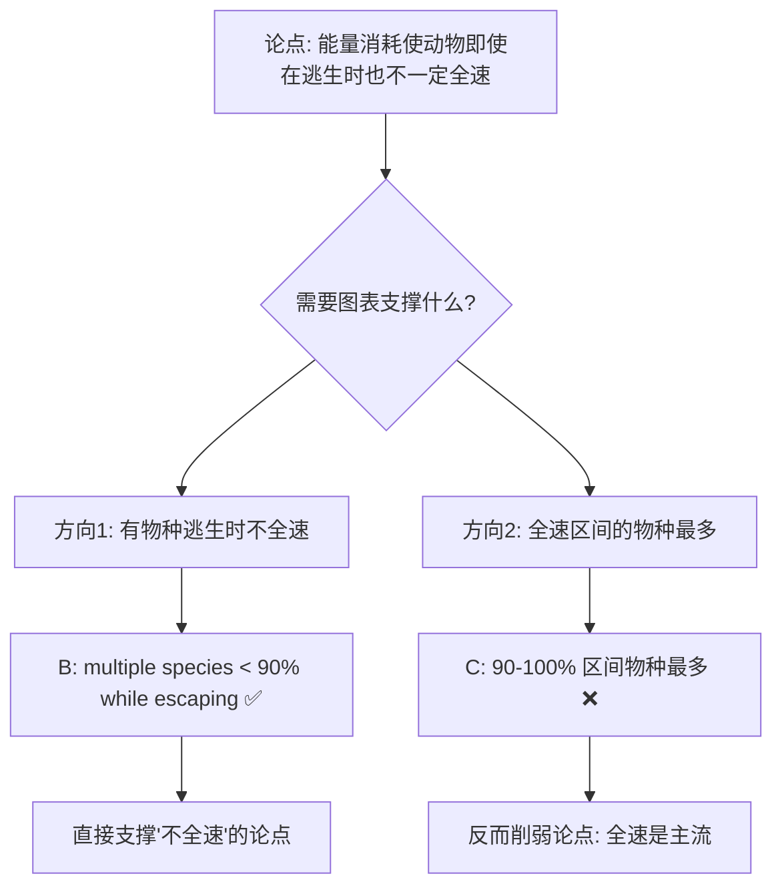
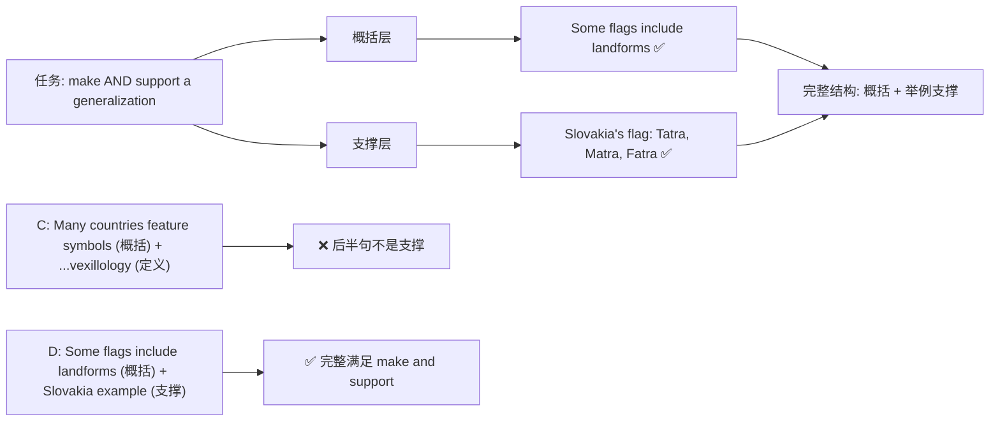
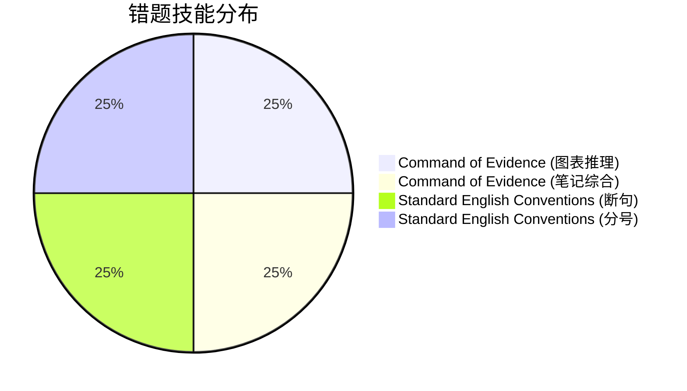

# SAT RW 2023年12月第一套 错题分析

> [!abstract] 试卷信息
> - **试卷**: 2023年12月第一套 SAT Reading & Writing
> - **来源**: `~/高一/英语/SAT/0719hw/0719hw.md`
> - **本次错题**: 4 道（全部在 Module 2）
> - **薄弱技能**: Standard English Conventions（断句/标点）, Command of Evidence（图表推理、笔记综合）

---

> [!danger] 分析原则
> 详见 [[SAT Reading - Analysis Principles]]。

## 目录

- [[#1. Module 2 Q12 — 图表推理（Lizard Escape Speed）]]
- [[#2. Module 2 Q17 — 语法：断句（Alma Lavenson）]]
- [[#3. Module 2 Q19 — 语法：分号 / Comma Splice（Canada; for example,）]]
- [[#4. Module 2 Q27 — 笔记综合：概括 + 支撑（Vexillology）]]

---

# 1. Module 2 Q12 — 图表推理

> [!info] 标记: `C` — 错误
> 正确答案: **B**

## 题干

**Number of Lizard Species by Average Percent of Maximal Speed Used When Pursuing Prey or Escaping Predators**

> [图表：横轴为 maximal speed 百分比区间，纵轴为 lizard species 数量，两组柱状图分别表示 escaping 和 pursuing。OCR 无法精确还原柱子高度，但关键分布模式可推断。]

It may seem that the optimal strategy for an animal pursuing prey or escaping predators is to move at maximal speed, but the energy expense of exploiting full speed capacity can disfavor such a strategy even in escape contexts, as evidenced by the fact that ___

Which choice most effectively uses data from the graph to complete the text?

**我的答案**: C

## 选项分析

| 选项 | 内容 | 评价 |
|:---|:---|:---|
| **A** | most lizard species use about the same percentage of their maximal speed when escaping predation as they do when pursuing prey. | ❌ 论证的是"逃生和捕食速度相近"，与题干"不全速"无关 |
| **B** ✅ | multiple lizard species move at an average of less than 90% of their maximal speed while escaping predation. | ✅ 直接证明：即使逃生也不全速（<90%） |
| **C** ✏️ | more lizard species use, on average, 90%–100% of their maximal speed while escaping predation than use any other percentage of their maximal speed. | ❌ 说明多数物种在 90–100% 区间——这与"不全速"的论点方向相反 |
| **D** | at least 4 lizard species use, on average, less than 100% of their maximal speed while pursuing prey. | ❌ 讨论捕食（pursuing）而非逃生（escaping），偏离题干语境 |

## 解题思路

### 考点：Command of Evidence — 图表数据补全论点

### 推理过程

论点的核心是：**"even in escape contexts"（即使在逃生时），能量消耗会让人不选全速。** 因此，图表需要提供的证据是：**有相当数量的蜥蜴物种在逃生时使用的速度低于 90%（即并非全速）**。

选项 B 精确命中这一点：**"multiple lizard species move at an average of less than 90% of their maximal speed while escaping predation"**——存在多个物种在逃生时也没有用全速，直接支撑了"不全速"的论点。

### 为什么 C 不对

C 说"90–100% 区间物种最多"——这意味着大部分物种在逃生时使用的是接近全速的速度。这对论点构成了**反向证据**：如果绝大多数物种逃生时都用 90–100% 速度，那"不全速"的论点反而缺乏数据支持。论点需要的是例外（不全速的案例），而不是主流趋势（全速是常态）。

### 为什么 D 不对

D 讨论的是"pursuing prey"（捕食）而非"escaping predation"（逃生）。题干论证明确限定在 **"even in escape contexts"**，捕食场景不在此论证范围内。虽然 D 在数据上可能正确，但无法支撑关于逃生行为的论点。

> [!warning] 陷阱识别
> **论点方向误判**：题干论点是"不全速"（反面/例外论证），而不是"全速是主流"（正面/主流论证）。正确选项应提供"不全速"的正面证据。C 虽然数据上可能成立（全速区间物种确实最多），但它支持的是与论点**相反**的方向——不要被"数据本身正确"迷惑，关键在于数据是否支撑论点。

---

# 2. Module 2 Q17 — 语法：断句

> [!info] 标记: `B` — 错误
> 正确答案: **A**

## 题干

Featured in *The New Woman Behind the Camera* (2021) is a photograph taken in 1932 by Alma ___ "Self-Portrait," Lavenson's image contributes to the exhibition's goal of showcasing the diverse, innovative, often aesthetically daring work of female photographers from the 1920s through the 1950s.

Which choice completes the text so that it conforms to the conventions of Standard English?

**我的答案**: B (Lavenson titled)

## 选项分析

| 选项 | 内容 | 评价 |
|:---|:---|:---|
| **A** ✅ | Lavenson. Titled | ✅ 句号断句；"Titled" 作为过去分词短语修饰 "Lavenson's image" |
| **B** ✏️ | Lavenson titled | ❌ Comma splice + 歧义："Alma Lavenson titled 'Self-Portrait'" 可被误读为"Alma 被命名为'自画像'" |
| **C** | Lavenson, titled | ❌ 同样产生 comma splice；逗号后 "titled 'Self-Portrait,' Lavenson's image contributes..." 两个独立句用逗号连接 |
| **D** | Lavenson and titled | ❌ "and" 连接不对称成分，语法不通 |

## 解题思路

### 考点：Standard English Conventions — 句子边界 / Comma Splice / 分词修饰

### 推理过程

**句子结构拆解**：

原文骨架：
> "Featured... is a photograph taken in 1932 by Alma Lavenson. Titled 'Self-Portrait,' Lavenson's image contributes to..."

两句都是**独立句**（independent clauses）：
- 句1：*Featured... is a photograph... by Alma Lavenson.*（完整主谓结构：is）
- 句2：*Titled 'Self-Portrait,' Lavenson's image contributes to...*（完整主谓结构：contributes）

独立句之间不能用逗号连接，必须用**句号**（或分号）。

**选项 B 的问题（双层）**：

1. **Comma splice**：如果选 B，句子变为"...by Alma Lavenson titled 'Self-Portrait,' Lavenson's image contributes..."——"is a photograph... by Alma Lavenson titled 'Self-Portrait'" 是一个完整的独立句（主语："a photograph"，谓语："is"），后面 "Lavenson's image contributes" 是另一个独立句。两个独立句之间只有一个逗号 → comma splice，语法错误。

2. **歧义**：B 中 "Alma Lavenson titled 'Self-Portrait'" 读起来像 "Alma Lavenson 被命名为'自画像'"（title 作动词，Alma 作主语），产生歧义——读者可能误以为 Alma Lavenson 这个人被命名为 "Self-Portrait"，而非她的照片以此命名。

**选项 A 如何解决**：

A 用句号断开：**"...by Alma Lavenson. Titled 'Self-Portrait,' Lavenson's image contributes..."**

- 句号明确分隔两个独立句，消除 comma splice
- "Titled 'Self-Portrait'" 成为一个过去分词短语（participial phrase），正确修饰后面的名词 "Lavenson's image"
- 不再有歧义：因为句号后 "Titled" 没有主语，读者自然将其解读为修饰紧随的名词短语 "Lavenson's image"

### 为什么 C 也不对

C（Lavenson, titled）在 "Lavenson" 后加逗号，同样面临 comma splice 问题。此外，连续两个逗号（"Lavenson, titled 'Self-Portrait,' Lavenson's image..."）使句子结构过于破碎。

> [!warning] 陷阱识别
> **分词结构误判**：当 "titled" 作为过去分词修饰名词时，读者容易将其误认为谓语动词。本题的关键在于识别句中存在**两个独立句**，需要用句号分隔。同时注意 B 中 "Alma Lavenson titled" 可能引发歧义，将人误解为被命名的对象。

---

# 3. Module 2 Q19 — 语法：分号 / Comma Splice

> [!info] 标记: `A` — 错误
> 正确答案: **C**

## 题干

Photographer Maria Svarbova has reached audiences well beyond her home country of Slovakia. In 2021, her work was featured at Galerie LeRoyer in ___ the exhibited photographs, with their vivid pastel colors, overexposed tones, and mirrorlike symmetry, captivated audiences.

Which choice completes the text so that it conforms to the conventions of Standard English?

**我的答案**: A (Canada, for example,)

## 选项分析

| 选项 | 内容 | 评价 |
|:---|:---|:---|
| **A** ✏️ | Canada, for example, | ❌ Comma splice：两个独立句用逗号相连 |
| **B** | Canada, for example | ❌ 缺少闭合逗号（"for example" 作插入语需要前后逗号），且仍为 comma splice |
| **C** ✅ | Canada; for example, | ✅ 分号正确分隔两个独立句；"for example" 后用逗号符合插入语规范 |
| **D** | Canada, for example; | ❌ 分号放在最后破坏了句子结构，且仍为 comma splice |

## 解题思路

### 考点：Standard English Conventions — 分号分隔独立句 / Comma Splice / 插入语标点

### 推理过程

**句子结构拆解**：

- **句1**（独立句）：*In 2021, her work was featured at Galerie LeRoyer in Canada.*
  - 主语：her work | 谓语：was featured
- **句2**（独立句）：*For example, the exhibited photographs, with their vivid pastel colors, overexposed tones, and mirrorlike symmetry, captivated audiences.*
  - 主语：the exhibited photographs | 谓语：captivated

两个都是完整的独立句（independent clauses），各有自己的主语和谓语。SAT 语法中，**两个独立句之间不能用逗号连接**——这是 comma splice，是 SAT 标点题的高频考点。

### 选项逐项分析

- **A**：`Canada, for example,` → 逗号连接两个独立句 → comma splice ❌
- **B**：`Canada, for example` → 缺少 "for example" 后的闭合逗号（插入语应前后都有逗号），且仍为 comma splice ❌
- **C**：`Canada; for example,` → 分号正确分隔两个独立句 ✅；"for example" 是插入语，前后标点正确 ✅
- **D**：`Canada, for example;` → 分号位置错误——插在 "for example" 和 "the exhibited photographs" 之间，破坏了句子结构 ❌

### 为什么学生可能选 A

A 看起来"流畅"——"in Canada, for example, the exhibited photographs..." 读起来不卡顿。在口语或非正式写作中，这种用法可能被接受。但 SAT 语法对 comma splice 有严格的零容忍政策：**两个独立句必须用句号或分号分隔**，不能仅用逗号。

> [!warning] 陷阱识别
> **流畅性伪装**：有些 comma splice 在口语中听起来自然（如 "I went to the store, I bought milk"），SAT 会利用这种流畅感设置陷阱。标准书面英语中，两个独立句永远不能只靠逗号连接。识别方法：检查逗号两侧是否各有完整的主谓结构 → 如果是 → 必须改用句号或分号。

---

# 4. Module 2 Q27 — 笔记综合：概括 + 支撑

> [!info] 标记: `C` — 错误
> 正确答案: **D**

## 题干

While researching a topic, a student has taken the following notes:

- Vexillology is the study of flags.
- The flags of many countries include symbols like animals, plants, or landforms.
- These symbols often represent an aspect of the region's history, culture, or landscape.
- The flag of Slovakia includes the Tatra, Matra, and Fatra mountains.
- The flag of Kiribati includes a frigatebird.

The student wants to **make and support a generalization** about symbols on flags. Which choice most effectively uses relevant information from the notes to accomplish this goal?

**我的答案**: C

## 选项分析

| 选项 | 内容 | 评价 |
|:---|:---|:---|
| **A** | Vexillology is the study of flags; accordingly, vexillologists are interested in flags from around the world. | ❌ 仅定义 vexillology，既无概括也无支撑 |
| **B** | Slovakia's flag includes the Tatra, Matra, and Fatra mountains, a symbol that is important to that country's national identity. | ❌ 只有具体例子，没有概括（缺少 generalization） |
| **C** ✏️ | Many countries feature symbols on their flags, and the study of these designs is known as vexillology. | ❌ 前半句做了概括（many countries feature symbols），但后半句是定义而非支撑 |
| **D** ✅ | The flags of some countries include symbols of landform; Slovakia's, for example, includes the Tatra, Matra, and Fatra mountains. | ✅ 概括（some include landforms）+ 支撑（Slovakia example） |

## 解题思路

### 考点：Command of Evidence — 笔记综合（Rhetorical Synthesis）

### 关键要求拆解

题干要求 **"make and support a generalization"** ——包含两个动作：
1. **Make a generalization**：提出概括性的陈述
2. **Support**：用笔记中的具体信息支撑这个概括

### 为什么 C 不对

C 的句子结构是：**"Many countries feature symbols on their flags（概括）, and the study of these designs is known as vexillology（定义）."**

- 前半句 "Many countries feature symbols on their flags" 确实是一个概括 → 满足 "make a generalization"
- 但后半句 "the study of these designs is known as vexillology" 是对 vexillology 这一术语的**定义**，而不是对前半句概括的**支撑/举例**
- 定义 ≠ 支撑：支撑需要说明"**为什么**这个概括成立"或"**举例说明**这个概括"，而非"这个领域叫什么"

SAT 笔记综合题中，"support" 必须有**论证或举例功能**，纯粹的背景信息或定义不算 support。

### 为什么 D 正确

D 的句子结构：**"The flags of some countries include symbols of landform（概括）; Slovakia's, for example, includes the Tatra, Matra, and Fatra mountains（举例支撑）."**

- 前半句 "The flags of some countries include symbols of landform" → 概括（generalization）
- 后半句 "Slovakia's, for example, includes the Tatra, Matra, and Fatra mountains" → 用笔记中的 Slovakia 具体例子支撑概括

结构完整、精确地实现了题干要求的两个动作：make（概括）和 support（举例支撑）。

> [!warning] 陷阱识别
> **定义伪装支撑**：笔记综合题中，选项常在后半句放入"看起来相关但实际不构成支撑"的内容（如定义、背景信息、无关事实）。判断方法：问自己"后半句是否让前半句的概括**更有说服力**？"——如果后半句只是补充信息而非论证或举例，则不构成 support。

---

## 总结：薄弱技能分布

| # | 题目 | 模块 | 技能类别 | 学生错误 | 优先级 |
|:---|:---|:---:|:---|:---|:---:|
| 1 | Q12 Lizard Speed | Mod2 | Command of Evidence — 图表推理 | 选 C（全速区间物种最多）→ 论点方向误判 | ⭐⭐⭐ |
| 2 | Q17 Alma Lavenson | Mod2 | Standard English Conventions — 断句 | 选 B（Lavenson titled）→ comma splice + 歧义 | ⭐⭐⭐ |
| 3 | Q19 Canada Semicolon | Mod2 | Standard English Conventions — 分号 | 选 A（逗号）→ comma splice 未识别 | ⭐⭐ |
| 4 | Q27 Vexillology | Mod2 | Command of Evidence — 笔记综合 | 选 C（定义伪支撑）→ 未满足 "support" 要求 | ⭐⭐⭐ |

### 技能分布汇总

### 行动建议

1. **Comma Splice 专项突破** — Q17 和 Q19 均涉及 comma splice，是 SAT 语法最高频考点之一
   - ⚠️ 同一错误模式在后续练习中反复出现：[[SAT RW Four Parts Practice Boundaries 错题分析#2. P2 Q18]]（Machu Picchu dating — `earlier, which in`）。跨卷已累计 3 次
   - 核心判断法：检查逗号两侧是否各有完整的主谓结构 → 如果是，必为 comma splice
   - 两种正确修复法：① 改逗号为句号（断句）、② 改逗号为分号
   - Q17 选用句号（因为前后句意群独立），Q19 选用分号（因为前后句有逻辑关联："for example"）

2. **Command of Evidence — 笔记综合** — Q27 暴露了对 "make AND support" 要求的不够敏感
   - 做笔记题时，先圈出题干中的动作要求（present/explain/make and support/emphasize 等）
   - 检查每个选项是否**完整覆盖**所有动作要求
   - "support" 必须有论证或举例功能，定义/背景信息不算

3. **Command of Evidence — 图表推理** — Q12 暴露了论点方向判断问题
   - 先明确题干的论点方向（正面论证 vs. 反面/例外论证）
   - 然后判断选项的数据是否与论点方向一致
   - 不要只关注数据"对错"，更要关注数据与论点的**逻辑关系方向**

---

## 待创建的相关笔记

- [[SAT Grammar - Comma Splice 与分号用法]]
- [[SAT Reading - 笔记综合题策略]]
- [[SAT Reading - 图表推理题解题方法]]
