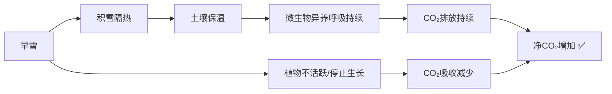

# SAT RW 25.5-4 错题分析

> [!abstract] 试卷信息
> - **试卷**: 25年5月第4套 阅读语法（Reading only）
> - **来源**: `~/高一/英语/SAT/25.5-4_answers.md`
> - **本次错题/标记题**: 4 道
> - **薄弱技能**: Command of Evidence (Rhetorical Purpose / Scientific Reasoning), Words in Context

---

> [!danger] 分析原则
> **原文中没有明确提及的字句绝对不要自己推断** — 所有分析必须严格基于题干、选项和原文的明确信息，不得添加任何原文未直接支持的推理或细节。

## 目录

- [[#1. Module 1 Q24 — Begin a Narrative（Merle Oberon）]]
- [[#2. Module 2 Q2 — Words in Context（Pungue River）]]
- [[#3. Module 2 Q9 — Scientific Reasoning（Grande Terre Beeches）]]
- [[#4. Module 2 Q11 — Supporting a Conclusion（Alaska CO₂ Snow Cover）]]

---

# 1. Module 1 Q24 — Begin a Narrative

> [!info] 标记: `B (?)` — 不确定

## 题干

While researching a topic, a student has taken the following notes:

- Merle Oberon (1911–1979) was an actress born in Mumbai (then known as Bombay), India.
- She was of Indian, Maori, and Irish heritage.
- She was the first Indian-born actress to be nominated for an Academy Award.
- Early in her career, she played many nameless, uncredited roles, such as her role in *Aren't We All?* (1932).
- Later, she played many named, credited roles, such as Sue Mayberry in *Affectionately Yours* (1941).

The student wants to **begin a narrative** about Merle Oberon's life. Which choice most effectively uses relevant information from the notes to accomplish this goal?

**我的答案**: B

## 选项分析

| 选项 | 内容 | 评价 |
|:---|:---|:---|
| **A** ✅ | Merle Oberon's story begins in Mumbai (then known as Bombay), India, in 1911. | ✅ **正确** — 从出生开始，自然叙事起点 |
| **B** ✏️ | Merle Oberon appeared in many films, including *Aren't We All?* (1932) and *Affectionately Yours* (1941), and was the first Indian-born actress to be nominated for an Academy Award. | ❌ 总结性概述，不是叙事开头 |
| **C** | In 1941, Merle Oberon played the role of Sue Mayberry in the film *Affectionately Yours*. | ❌ 跳到职业生涯中期 |
| **D** | Though she would go on to receive many films, Merle Oberon also played nameless, uncredited roles… | ❌ "receive many films"搭配不当 |

## 解题思路

### 考点：Command of Evidence — Rhetorical Purpose

**关键判断**：题目明确说 "begin a narrative"（开始一段叙事），这要求从**时间起点**开始讲述故事，而非**总结**人物生平的成就。

- **A**: "Merle Oberon's story begins in Mumbai… in 1911" — 直接从出生开始，是最自然的叙事开头
- **B**: 列举电影作品和奖项提名 → 适合作为传记摘要或引言，但不是一段"叙事"的开端

> [!tip] 区分写作目的
> - **Introduce a topic**（介绍主题）→ 可以用总结性陈述
> - **Begin a narrative**（开始叙事）→ 必须从时间起点开始

### 解题步骤

1. 看到 "begin a narrative" → 立即定位**最早的时间点**
2. 排除中间切入的选项（C: "In 1941"）
3. 排除总结性选项（B）
4. 排除措辞不当的选项（D）
5. 剩下即为正确的叙事开端

---

# 2. Module 2 Q2 — Words in Context

> [!info] 标记: `A (?)` — 不确定

## 题干

For most of its length, the Pungue River has sufficiently high flow velocity to suspend sedimentary particles; but when the river reaches the calmer waters of the Indian Ocean, its channel widens and divides, reducing flow velocity and thereby ___ sedimentary particle suspension. Particles are thus deposited, eventually forming deltaic lobes.

Which choice completes the text with the most logical and precise word or phrase?

**我的答案**: A (compounding)

## 选项分析

| 选项 | 释义 | 评价 |
|:---|:---|:---|
| **A** ✏️ | **compounding** — 加剧、使恶化 | ❌ "流速降低"会"加剧悬浮"？逻辑矛盾 |
| **B** | **obscuring** — 使模糊 | ❌ 与因果链条无关 |
| **C** ✅ | **interrupting** — 中断、打断 | ✅ 流速降低打断了悬浮 → 颗粒沉积 |
| **D** | **expediting** — 加速、促进 | ❌ 与"流速降低"的因果关系相反 |

## 解题思路

### 考点：Words in Context（逻辑语境题）

### 因果链分析

核心线索在句尾：**"Particles are thus deposited"**。要使颗粒沉积，悬浮过程必须被**打断（interrupted）**。

### 为什么 A 不对

"Compound" = 使恶化、加重。如果流速降低会"compound"悬浮，意味着颗粒会更多/更久地悬浮——这与后文"颗粒沉积"完全矛盾。

> [!warning] 常见陷阱
> SAT 词汇题的典型陷阱是**因果倒置**。看到 "reducing flow velocity **and thereby** ___" 时：
> - 流速降低 = **原因**
> - 空白 = **结果**（由 thereby 连接）
> - 颗粒沉积 = **最终结果**
> - 三者必须逻辑一致

---

# 3. Module 2 Q9 — Scientific Reasoning

> [!info] 标记: `C (?, high difficulty)` — 高难度

## 题干

Some researchers posit that species on the South Pacific island of Grande Terre are the surviving members of clades that inhabited other islands in the region before the complete emergence of Grande Terre 37 million years ago. In a 2012 study, however, Hervé Sauquet et al. found that the crown age (the age of the most recent common ancestor of all living and extinct species in the clade) of the clade of southern beeches on Grande Terre is 16.4 million years; Sauquet et al. further found that the crown age of the clade of southern beeches in the South Pacific generally is also approximately 16.4 million years.

As presented in the text, the findings of Sauquet et al. best support which statement?

**我的答案**: C

## 选项分析

| 选项 | 内容 | 评价 |
|:---|:---|:---|
| **A** | The beeches on Grande Terre are members of a clade that likely originated outside the South Pacific. | ❌ 数据未涉及"南太平洋之外" |
| **B** | The MRCA of the beeches on Grande Terre lived at least 37 million years ago. | ❌ 冠龄 16.4 mya，远小于 37 mya |
| **C** ✅ | The beeches on Grande Terre are **not** members of a clade that existed before the island completely emerged. | ✅ 冠龄 < 岛龄，逻辑一致 |
| **D** | The ancestors of most species on Grande Terre arrived earlier than the MRCA of the beeches. | ❌ 其他物种超出数据范围 |

## 解题思路

### 考点：Command of Evidence — Scientific Reasoning

### 关键数据

| 数据点 | 数值 |
|:---|:---:|
| Grande Terre 完全露出海面 | **37 mya** |
| Grande Terre 山毛榉冠龄 | **16.4 mya** |
| 整个南太平洋山毛榉冠龄 | **≈16.4 mya** |

### 推理

**假说**：Grande Terre 的物种是某些古老 clade 的幸存者，这些 clade 在岛屿出现前就已存在。

**发现**：
1. 山毛榉的冠龄（16.4 mya）**远小于**岛屿年龄（37 mya）
2. 冠龄与南太平洋整体一致

**结论**：如果 clade 在岛屿出现前就存在，其冠龄应 ≥ 37 mya。但实际只有 16.4 mya → **该 clade 不可能在岛屿出现前就已存在** → 选项 C 正确。同时，冠龄与南太平洋一致，说明该 clade 可能是在岛屿形成后才在此演化的。

> [!tip] 难点剖析
> **Crown age（冠龄）** = clade 中最近共同祖先（MRCA）的年龄。
> - 冠龄 < 岛龄 → clade 在岛屿出现**之后**才起源
> - 冠龄 ≥ 岛龄 → clade 可能（但不必然）在岛屿出现**之前**已存在

### 解题步骤

1. 理解关键词：不认识 crown age 没关系，通过上下文推测是"年代测量值"
2. **比较数字**：37 mya（岛龄）vs. 16.4 mya（冠龄）→ 冠龄更小
3. **注意 however**：这个词暗示 Sauquet 的发现**挑战**了前面的假说
4. **排除过度推断**：A（南太平洋之外）、D（其他物种）超出数据范围

---

# 4. Module 2 Q11 — Supporting a Conclusion

> [!info] 标记: `A (?, high difficulty)` — 高难度

## 题干

Periods of subfreezing temperatures in Alaska have been growing shorter as a result of climate changes, potentially enabling increased carbon dioxide (CO₂) absorption through greater productivity of sidebells wintergreen (*Orthilia secunda*) plants and other vegetation, but also potentially enabling increased CO₂ output through greater heterotrophic respiration (CO₂ generated by the activity of soil microorganisms). Hydrologist Yonghong Yi and her colleagues developed a model incorporating numerous inputs — years of soil moisture and snow cover data among them — to evaluate the effects of climate changes on the CO₂ balance in Alaska, concluding that **net CO₂ is likely to increase if seasonal snow cover arrives earlier relative to the onset of soil surface freezing**.

Which finding, if true, would most **directly support** the researchers' conclusion?

**我的答案**: A

## 选项分析

| 选项 | 内容 | 评价 |
|:---|:---|:---|
| **A** ✏️ | Early snow cover reduces soil moisture for plant growth **and** lowers heterotrophic respiration rate. | ❌ 同时降低吸收和排放，净效应不明确 |
| **B** ✅ | Snow insulation enables heterotrophic respiration to continue while plants are not growing. | ✅ **直接解释了净 CO₂ 为何增加** |
| **C** | Effect of soil moisture on vegetation and respiration is stronger during snow cover. | ❌ 谈效应强度，未涉及净 CO₂ 方向 |
| **D** | Snow persists longer in areas of low vegetation growth and high respiration. | ❌ 描述相关性，非因果机制 |

## 解题思路

### 考点：Command of Evidence — Supporting a Conclusion

### 结论拆解

> **"Net CO₂ is likely to increase if seasonal snow cover arrives earlier relative to the onset of soil surface freezing."**

隐含因果关系：

### 为什么 B 正确

选项 B 直接补上了缺失的因果环节：**积雪的隔热作用使异养呼吸在植物不生长的时期仍能持续**。

- 积雪像毯子隔绝土壤与冷空气 → 微生物持续活动 → CO₂ 持续排放
- 同时植物已不生长 → 无 CO₂ 吸收
- 结果：**净 CO₂ 增加**

### 为什么 A 不对

选项 A 说早雪**同时**降低了植物生长（减少吸收）**和**异养呼吸（减少排放）——两者互相抵消，无法判断净 CO₂ 是否增加，因此**不能直接支持结论**。

> [!warning] 陷阱识别
> A 看似"相关"（确实涉及早雪对植物和微生物的影响），但支持结论需要指明**净效应方向**，而非仅仅描述两个相反方向的变化。

### 解题策略

1. **精确提取结论**：标出因果条件（"如果早雪 → 净 CO₂ 增加"）
2. **识别缺失环节**：从"早雪"到"净 CO₂ 增加"之间有逻辑跳跃，正确选项补上这座桥
3. **用净效应检验**：如果选项同时提及正反两方面效应，计算净效应是否与结论方向一致
4. **区分"相关"与"因果"**：D 只说"积雪在低植被/高呼吸区持续更久"（相关性），不是因果机制

---

## 总结：薄弱技能分布

| # | 题目 | 技能类别 | 优先级 |
|:---|:---|:---|:---:|
| 1 | Mod1 Q24 Merle Oberon | Command of Evidence — Rhetorical Purpose | ⭐⭐⭐ |
| 2 | Mod2 Q2 Pungue River | Words in Context — Causal Logic | ⭐⭐ |
| 3 | Mod2 Q9 Grande Terre | Command of Evidence — Scientific (数字比较) | ⭐⭐⭐⭐ |
| 4 | Mod2 Q11 Alaska CO₂ | Command of Evidence — Scientific (支持结论) | ⭐⭐⭐⭐ |

### 行动建议

1. **优先攻克 Command of Evidence 大类**（Q24, Q9, Q11 都属于此类）— 这是 SAT RW 的核心技能
2. 科学类文本中注意**数字比较法**和**假说-证据关系**的识别
3. 词汇题注意**因果链条的一致性**，避免选"看起来相关但逻辑方向相反"的选项

---

## 待创建的相关笔记

- [[SAT Reading - Command of Evidence 全解]]
- [[SAT Reading - Words in Context 逻辑关系分类]]
- [[SAT Reading - 科学文本阅读策略]]
