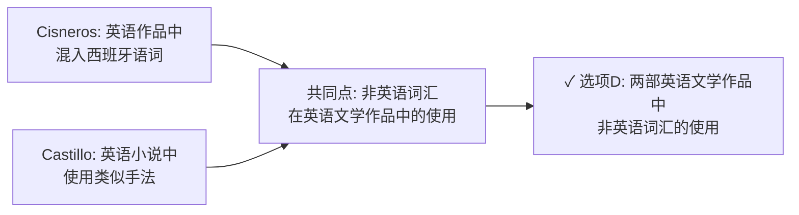
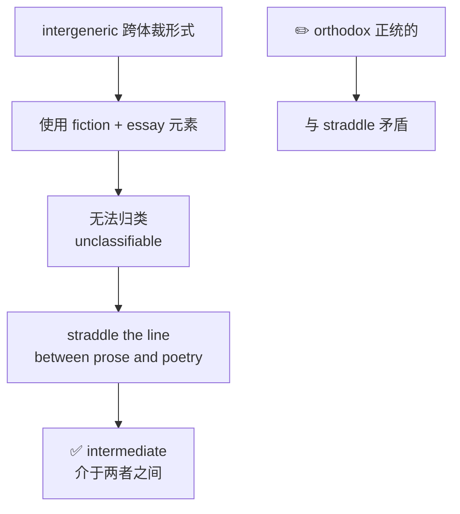
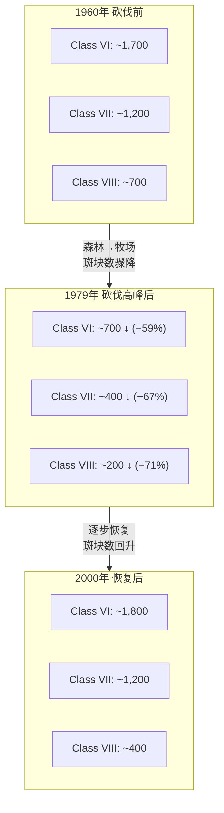
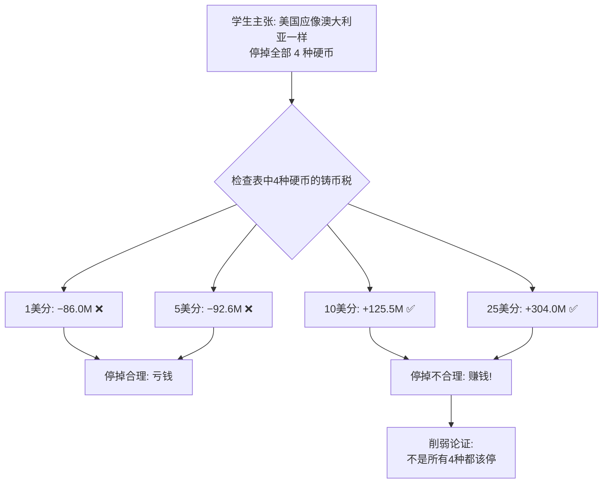

# SAT RW 25.5-4 错题分析

> [!abstract] 试卷信息
> - **试卷**: 2025年5月第4套 SAT Reading & Writing
> - **来源**: `0715_ocr_raw.txt` / `0715_answer_key.md` / `25.5-4_answers.md`
> - **本次实际错题**: 7 道（Module 1: Q9, Q10, Q17；Module 2: Q1, Q11, Q12, Q13）
> - **Module 1 正确率**: 24/27 (88.9%)
> - **Module 2 正确率**: 8/13 (61.5%)（含1题未作答）
> - **薄弱技能**: Central Ideas and Details, Words in Context, Command of Evidence (Scientific & Quantitative), Standard English Conventions
> - **说明**: 本版为修正版——根据标准答案 `0715_answer_key.md` 重新核对，覆盖所有**实际错误**的题目。原样本中 M1Q24、M2Q2、M2Q9 经自修正后实际正确，本版不再纳入。

---

> [!danger] 分析原则
> 详见 [[SAT Reading - Analysis Principles]]。

## 目录

- [[#1. Module 1 Q9 — 主旨题（Cisneros & Castillo 非英语词汇使用）]]
- [[#2. Module 1 Q10 — 主旨题（蝴蝶颜色与天气影响行为）]]
- [[#3. Module 1 Q17 — 标点符号（分号连接独立分句）]]
- [[#4. Module 2 Q1 — 词汇题（intermediate = 介于两种文体之间）]]
- [[#5. Module 2 Q11 — 支持结论（阿拉斯加早雪与净CO₂增加）]]
- [[#6. Module 2 Q12 — 图表数据解读（哥斯达黎加森林砍伐）]]
- [[#7. Module 2 Q13 — 削弱论证（美国硬币铸币税）]]

---

# 1. Module 1 Q9 — 主旨题（Cisneros & Castillo 非英语词汇使用）

> [!info] 标记: `A` — 错选

## 题干

Sandra Cisneros's English-language short story "Eyes of Zapata" occasionally includes words and phrases from the Mexican dialect of Spanish. While the story doesn't translate the Spanish text into English, the meaning can be inferred from the surrounding English text. Ana Castillo adopts a comparable approach to Spanish in her English language novel *So Far from God*. Both works thus remain accessible to all readers of English, not just those who can also read Spanish.

What is the main topic of the text?

**我的答案**: A &nbsp;&nbsp; **正确答案**: D

## 选项分析

| 选项 | 内容 | 评价 |
|:---|:---|:---|
| **A** ✏️ | The difficulty of translating Sandra Cisneros's works into languages other than English | ❌ 文本未讨论翻译难度，且只提了 Cisneros，忽略 Castillo |
| **B** | The commercial success of English-language literature around the world | ❌ 与商业成功完全无关 |
| **C** | The enduring popularity of Ana Castillo's works in Mexico | ❌ 未讨论受欢迎程度，亦未限定墨西哥 |
| **D** ✅ | The use of non-English vocabulary in two English-language literary works | ✅ 准确概括：两位作家在英语作品中融入西班牙语词汇 |

## 解题思路

### 考点：Central Ideas and Details — Main Topic

本文核心结构：

> Cisneros 作品中使用西班牙语词汇（不翻译，依赖上下文推断）→ Castillo 采用类似做法 → 两部作品的英语读者都无需懂西班牙语即可理解。

### 推理过程



### 为什么 D 正确

文本的**共同主题**是两位作家的共同做法：在英语文学作品中保留非英语（西班牙语）词汇，不翻译。最后一句 "Both works thus remain accessible to all readers of English" 再次聚焦于英语读者与非英语词汇的关系——**这正是跨语言文学创作手法**。

### 为什么 A 不对

- **范围错误**：A 说 "translating Cisneros's works into languages other than English"——文本从未讨论把 Cisneros 的作品翻译成其他语言。
- **对象片面**：A 仅提 Cisneros，忽略 Castillo。主旨题的正确选项必须覆盖文本**所有**核心内容。

> [!warning] 陷阱识别
> **主旨题常见陷阱**：选项只覆盖文本**部分**内容或**一个人物**，而非两人的共同点。看到 "Cisneros ... Ana Castillo adopts a comparable approach" 这样的对比句式时，主旨必然涉及**二者的共性**。错误选项往往只提其中一人或引入文本未讨论的新话题（翻译难度、商业成功、受欢迎程度）。

---

# 2. Module 1 Q10 — 主旨题（蝴蝶颜色与天气影响行为）

> [!info] 标记: `A` — 错选

## 题干

In a large community science effort, biologist Grace Herzel and colleagues collaborated with hundreds of students and other amateur science enthusiasts for more than three years to study how butterfly color and weather conditions relate to butterfly behavior. They found that butterfly color might influence behavior more than butterfly size does, and that butterflies tended to prefer orange and red flowers on cloudy days and multicolor flowers on partly cloudy days.

Which choice best states the main idea of the text?

**我的答案**: A &nbsp;&nbsp; **正确答案**: D

## 选项分析

| 选项 | 内容 | 评价 |
|:---|:---|:---|
| **A** ✏️ | Collaboration between professional scientists and members of the public is especially useful when studying the behavior of butterflies and other flying insects. | ❌ 协作方式只是研究**背景/手段**，不是研究发现本身 |
| **B** | A recent study suggested that butterflies' coloring seems to be less relevant to their behavior than weather conditions. | ❌ 原文说 color 的影响可能 > size，但未与 weather 比较高低 |
| **C** | Weather conditions and butterfly color seem to have less influence on butterfly behavior than the location where the butterflies are studied does. | ❌ location 完全未提及 |
| **D** ✅ | A large study suggested that butterfly color and weather conditions might influence the behavior of certain butterflies. | ✅ 准确概括研究发现的两个核心变量 |

## 解题思路

### 考点：Central Ideas and Details — Main Idea

判定标准：**研究发现了什么？** 不是**研究怎么做的**。

关键证据句：
> "They found that **butterfly color might influence behavior** more than butterfly size does, and that **butterflies tended to prefer orange and red flowers on cloudy days** and multicolor flowers on partly cloudy days."

两个发现分别对应：颜色影响行为 + 天气条件影响行为 → 选项 D 完美概括。

### 为什么 A 不对

A 把**研究执行方式**（community science / collaboration）误当作**研究发现**（main idea）。"Collaboration between professionals and the public" 只是研究背景——第一句中的 "collaborated with hundreds of students" ——并非研究结论。

> [!warning] 陷阱识别
> **"研究方式 ≠ 研究结论"** 是 SAT 主旨题的经典陷阱。当题干开头用大量笔墨描述研究方法/参与方式时，正确选项应聚焦于 **"They found that..."** 之后的内容，而非之前的背景叙述。

---

# 3. Module 1 Q17 — 标点符号（分号连接独立分句）

> [!info] 标记: `A` — 错选

## 题干

Drummer Dennis Chambers's distinguished career includes many memorable achievements, such as working on the Brecker Brothers' album *Return of the Brecker Brothers*. However, as house drummer at Sugar Hill Records, a record label that was a pioneer of early hip hop ______ Chambers joined too late to play drums on the label's classic song "Rapper's Delight."

Which choice completes the text so that it conforms to the conventions of Standard English?

**我的答案**: A &nbsp;&nbsp; **正确答案**: B

## 选项分析

| 选项 | 内容 | 评价 |
|:---|:---|:---|
| **A** ✏️ | `music,` | ❌ 逗号无法连接两个独立分句 → comma splice |
| **B** ✅ | `music;` | ✅ 分号正确连接两个独立分句 |
| **C** | `music, which` | ❌ "which" 会让 "Chambers joined..." 变成修饰 "hip hop music" 的定语从句，逻辑荒谬（音乐自己加入？） |
| **D** | `Music` | ❌ 大写 M 且无标点 → run-on sentence |

## 解题思路

### 考点：Standard English Conventions — Punctuation (Semicolons)

分析句子结构：

- **分句 1**（完整独立句）：However, as house drummer at Sugar Hill Records, a record label that was a pioneer of early hip hop **music**
- **分句 2**（完整独立句）：Chambers joined too late to play drums on the label's classic song "Rapper's Delight."

两个都是**独立分句**（independent clauses），各有主语和谓语。连接两个独立分句的正确方式是**分号（`;`）**。

```
[独立分句1: ...hip hop music] ; [独立分句2: Chambers joined too late...]
```

### 为什么 A 不对

逗号 (`music, Chambers...`) 在连接两个独立分句时构成 **comma splice**（逗号拼接错误），是 SAT 语法题的高频考点。

> [!tip] SAT 标点速记
> 连接两个**独立分句**只有三种合法方式：
> 1. **句号** `.` → `...music. Chambers...`
> 2. **分号** `;` → `...music; Chambers...`
> 3. **逗号 + FANBOYS 连词** `, and/but/or...` → `...music, and Chambers...`
>
> **逗号单独使用 (`music, Chambers`) → comma splice → 错误。**

---

# 4. Module 2 Q1 — 词汇题（intermediate = 介于两种文体之间）

> [!info] 标记: `D → B`（自修正后 B）— 仍错

## 题干

Writer Lydia Davis observed that while literary forms, such as the short story, are recognizable as such even as they evolve, there are rarer "intergeneric" forms that might, for example, use elements of both fiction and essays to create something unclassifiable. The very short publications of Diane Williams arguably fit in this category, since they straddle the line between prose and poetry.

Which choice completes the text with the most logical and precise word or phrase?

**我的答案**: B（orthodox）&nbsp;&nbsp; **正确答案**: C（intermediate）

## 选项分析

| 选项 | 释义 | 评价 |
|:---|:---|:---|
| **A** | **equivocal** — 模棱两可的、含糊的 | ❌ 含贬义/不确定性，非"介于之间"的中性描述 |
| **B** ✏️ | **orthodox** — 正统的、传统的 | ❌ 与上下文矛盾：Diane Williams 的作品 straddle the line between prose and poetry，显然**不**正统 |
| **C** ✅ | **intermediate** — 中间的、介于两者之间的 | ✅ 精准对应 "intergeneric" / "straddle the line between" / "between fiction and essays" |
| **D** | **neutral** — 中立的 | ❌ 语义不匹配（neutral 指立场/态度中立，非文体居中） |

## 解题思路

### 考点：Words in Context — Precision

上下文到处是"介于之间"的信号：

```
"intergeneric" forms → uses elements of BOTH fiction and essays
→ straddle the line BETWEEN prose and poetry
→ something unclassifiable
```

**intermediate** = situated between two points, stages, or categories → 完美匹配所有上下文线索。

### 推理过程



### 为什么 B 不对

"Orthodox" = 正统的、传统的。如果 Williams 的作品是 orthodox，它应该属于**可清晰归类**的传统文学形式。但原文明确说它 "straddle the line between prose and poetry"（横跨散文与诗歌之间）——这种**跨界/模糊**特质恰恰与 "orthodox" 完全相反。

> [!warning] 陷阱识别
> **词汇题的反义词陷阱**：正确选项往往可以从上下文的**同义替换**或**结构平行**推出。"intergeneric" 的前缀 "inter-"（之间）直接对应 "intermediate" 的词根。当你看到 "straddle the line between X and Y" 时，正确答案大概率是一个表示"中间/过渡"的词汇。

---

# 5. Module 2 Q11 — 支持结论（阿拉斯加早雪与净CO₂增加）

> [!info] 标记: `A (?, high difficulty)` — 高难度错选

## 题干

Periods of subfreezing temperatures in Alaska have been growing shorter as a result of climate changes, potentially enabling increased carbon dioxide (CO₂) absorption through greater productivity of sidebells wintergreen (*Orthilia secunda*) plants and other vegetation, but also potentially enabling increased CO₂ output through greater heterotrophic respiration (CO₂ generated by the activity of soil microorganisms). Hydrologist Yonghong Yi and her colleagues developed a model incorporating numerous inputs — years of soil moisture and snow cover data among them — to evaluate the effects of climate changes on the CO₂ balance in Alaska, concluding that **net CO₂ is likely to increase if seasonal snow cover arrives earlier relative to the onset of soil surface freezing**.

Which finding, if true, would most **directly support** the researchers' conclusion?

**我的答案**: A &nbsp;&nbsp; **正确答案**: B

## 选项分析

| 选项 | 内容 | 评价 |
|:---|:---|:---|
| **A** ✏️ | Early snow cover reduces soil moisture for plant growth **and** lowers heterotrophic respiration rate. | ❌ 同时降低吸收和排放，两个效应方向相反 → 净效应不明确 |
| **B** ✅ | The soil insulation provided by snow cover enables heterotrophic respiration to continue during a period in which plant species are typically not growing. | ✅ **直接解释净CO₂为何增加**：排放持续，吸收停止 |
| **C** | The effect of soil moisture on vegetation and respiration is stronger during snow cover. | ❌ 仅谈效应强度，未涉及净CO₂**方向** |
| **D** | Snow cover persists longer in areas of relatively low vegetation growth and high heterotrophic respiration. | ❌ 描述相关性（哪里雪持久），不构成因果机制 |

## 解题思路

### 考点：Command of Evidence — Supporting a Conclusion (Scientific Reasoning)

### 结论拆解

> **"Net CO₂ is likely to increase if seasonal snow cover arrives earlier relative to the onset of soil surface freezing."**

```
净CO₂增加 = CO₂排放 − CO₂吸收
要使净CO₂增加，必须:
  ① CO₂排放 持续/增加（异养呼吸）
  ② CO₂吸收 减少/停止（植物光合作用）
```

### 推理过程


### 为什么 B 正确

B 精准补上了结论中的**逻辑缺口**：为什么早雪会导致净CO₂增加？

- **积雪像毯子** → 隔绝冷空气 → 土壤不冻结 → 微生物异养呼吸持续 → CO₂ 持续排放
- **同时** → 植物在积雪期间不生长 → 无光合作用 → CO₂ 零吸收
- **结果** → 排放 > 吸收 → 净CO₂增加

### 为什么 A 不对（关键）

A 的问题是**双向效应互相抵消**：

| A 描述的效果 | 对净CO₂的影响 |
|:---|:---|
| 早雪降低植物生长 | 吸收减少 → 净CO₂ ↑ |
| 早雪降低异养呼吸速率 | 排放减少 → 净CO₂ ↓ |

两个效应方向相反，**无法判断净CO₂是增加还是减少** → 不能直接支持结论。

> [!warning] 陷阱识别
> **净效应抵消陷阱**：支持结论必须说明净效应的**方向**。若选项同时包含正反两面效应且未说明哪方更强，则无法支持结论。遇到此类选项时问自己：这句话能否让我推断出**净CO₂增加**？如果不能，就不是正确选项。

### 解题策略

1. **精确提取结论**：圈出因果关键词（"if...net CO₂ is likely to increase"）
2. **识别逻辑缺口**：从"早雪"到"净CO₂增加"之间缺什么机制？
3. **用净效应检验**：选项是否明确说明排放 > 吸收？
4. **区分相关与因果**：D 只描述现象，B 提供机制

---

# 6. Module 2 Q12 — 图表数据解读（哥斯达黎加森林砍伐）

> [!info] 标记: `C` — 错选

## 题干

Annual Number of Forest Patches for Three Land Use Capability Classes in the Chorotega Region, Costa Rica

| Year | Class VI | Class VII | Class VIII |
|:---:|:---:|:---:|:---:|
| 1960 | ~1,700 | ~1,200 | ~700 |
| 1979 | ~700 | ~400 | ~200 |
| 1986 | ~1,400 | ~800 | ~300 |
| 2000 | ~1,800 | ~1,200 | ~400 |

To understand the extent of deforestation in the Chorotega region of Costa Rica, Juan Pablo Arroyo Mora and colleagues used historical aerial photography and remote sensing data to track changes in the total number of forest patches in areas of different land use capability classes (categories that indicate possible uses of forest land). Due to the Chorotega region's accessibility, various types of forested areas were converted to cattle pasture as rising international meat prices drove a cattle ranching boom in the **1960s and 1970s**: this conversion is evident in the ______

Which choice most effectively uses data from the graph to complete the assertion?

**我的答案**: C &nbsp;&nbsp; **正确答案**: D

## 选项分析

| 选项 | 内容 | 评价 |
|:---|:---|:---|
| **A** | high number of patches in class VII and class VIII in 1986. | ❌ 1986 年斑块数已在回升（恢复期），非砍伐高峰期证据 |
| **B** | difference between the number of patches in Class VII and in Class VI in 2000. | ❌ 2000 年的差异与 1960s-1970s 的砍伐无关 |
| **C** ✏️ | increase in the number of patches for all classes from 1979 to 2000. | ❌ 这是**恢复期**（砍伐后斑块数回升），不是砍伐的证据 |
| **D** ✅ | decrease in the number of patches for all classes from 1960 to 1979. | ✅ 1960→1979 三个类别斑块数**全部减少**，直接对应砍伐高峰期 |

## 解题思路

### 考点：Command of Evidence — Quantitative (Graph Interpretation)

### 关键数据比较



**核心时序**：
- 1960s-1970s：砍伐高峰期（森林 → 牧场）
- 1979-2000：恢复期（斑块数逐渐回升）

### 为什么 D 正确

题干明确说砍伐发生在 "1960s and 1970s"，因此砍伐证据必须出现在 **1960→1979** 这个时间段。图表显示三类斑块在此期间**全部减少**（三个箭头全向下）→ 完美匹配。

### 为什么 C 不对

C 说 "increase from 1979 to 2000" —— 这段时间斑块数确实在增加，但那是**砍伐高峰期过后森林恢复**的结果。题干问的是"**砍伐（deforestation）的证据**"，增斑块数恰恰说明砍伐已经停止、森林在恢复，无法证明砍伐的存在。

> [!warning] 陷阱识别
> **时间窗口错位陷阱**：题干中 "1960s and 1970s" 明确限定了考察的时间窗口。选项 C 的 1979→2000 虽然数据为真，但时间窗口错位——这是砍伐**之后**的恢复期数据，不能作为砍伐的证据。解题时必须将选项描述的**时间段**与题干指定的**时间段**严格对齐。

### 解题策略

1. **圈出时间信号**：题干 "1960s and 1970s" → 对应图表 1960→1979
2. **锁定指标方向**：砍伐 → 斑块数减少（↓）
3. **验证全类覆盖**："all classes" —— 三个类别必须全部一致
4. **排除时间错位的选项**：C 和 B 涉及 2000 年，A 涉及 1986 年

---

# 7. Module 2 Q13 — 削弱论证（美国硬币铸币税）

> [!info] 标记: 未作答 — 空题

## 题干

| Denomination | Total value of units produced (in millions of dollars) | Gross cost (in millions of dollars) | Seigniorage (in millions of dollars) | Seigniorage per dollar issued (dollars) |
|:---|:---:|:---:|:---:|:---:|
| One-cent | 41.4 | 127.4 | −86.0 | −2.08 |
| Five-cent | 70.8 | 163.4 | −92.6 | −1.31 |
| Ten-cent | 266.6 | 141.1 | +125.5 | +0.47 |
| Quarter dollar | 568.4 | 264.4 | +304.0 | +0.53 |

Issuing a one-dollar coin yields positive seigniorage — profit generated when the face value of a coin exceeds the unit cost of producing it — for Singapore's government, which can be used to fund such services as education. Issuing coins can also result in negative seigniorage, however, and this phenomenon led Australia to stop producing certain coins. A student argues that it is in the financial interest of the United States to follow the example of Australia with regard to **each of the four coins** shown in the table.

Which choice best describes data from the table that **weaken** the student's argument?

**我的答案**: 未作答 &nbsp;&nbsp; **正确答案**: B

## 选项分析

| 选项 | 内容 | 评价 |
|:---|:---|:---|
| **A** | Seigniorage per dollar issued was slightly greater for quarter-dollar than for ten-cent, but seigniorage in millions was much greater for quarter-dollar. | ❌ 只比较两个正铸币税硬币之间的差异，未涉及削弱论证 |
| **B** ✅ | Although issuing one-cent and five-cent coins resulted in negative seigniorage in millions, issuing ten-cent and quarter-dollar coins resulted in **positive** seigniorage. | ✅ 10美分和25美分有正的铸币税 → 停掉它们会损失财政收入 → 削弱 |
| **C** | Negative seigniorage coins had lower gross cost than positive seigniorage coins. | ❌ 铸币税的关键是面值与成本之差，不是绝对成本 |
| **D** | Five-cent coins had greatest negative seigniorage in millions, but one-cent had greatest negative per dollar. | ❌ 只比较两个负铸币税硬币，不削弱"停掉全部四种"的论证 |

## 解题思路

### 考点：Command of Evidence — Weakening an Argument (Quantitative Data)

### 论证结构



### 关键概念

**Seigniorage（铸币税）** = 面值 − 制造成本

- **正铸币税**：面值 > 成本 → 政府赚钱 → **不该停**
- **负铸币税**：面值 < 成本 → 政府亏钱 → 该停（澳大利亚就是这样做的）

### 为什么 B 正确

学生的论证是**停掉全部四种**。但数据显示：
- 1美分和5美分：铸币税为负 → 停掉有理
- **10美分和25美分：铸币税为正（+125.5M, +304.0M）** → 停掉会损失大量财政收入

选项 B 精确指出了这个矛盾：有一半硬币是赚钱的，停掉它们**不符合财政利益** → 削弱学生论证。

### 解题策略


1. **表头速读**：Seigniorage 列最关键——正号 = 赚钱，负号 = 亏钱
2. **精确锁定论证范围**："each of the four coins" → 停掉全部
3. **找反例**：只要任意一个硬币有正铸币税，就削弱了"停掉全部"的合理性
4. **排除比较型选项**：A 和 D 在比较同类硬币内部的差异，不触及论证核心

> [!warning] 陷阱识别
> **削弱论证题的关键是攻击论证范围**。学生的论证是"停掉**全部四种**"，要削弱它只需证明**不是全部四种都该停**。选项 A、C、D 要么在正铸币税硬币之间比（A），要么在负铸币税硬币之间比（D），要么比较绝对成本（C）——都偏离了"是否有硬币不该停"这个核心问题。

---

## 总结：薄弱技能分布

| # | 题目 | 技能类别 | 错误类型 | 优先级 |
|:---|:---|:---|:---|:---:|
| 1 | M1 Q9 | Central Ideas — Main Topic | 选偏（只覆盖部分内容） | ⭐⭐⭐ |
| 2 | M1 Q10 | Central Ideas — Main Idea | 混淆"研究方式"与"研究发现" | ⭐⭐⭐ |
| 3 | M1 Q17 | Standard English Conventions | Comma splice（逗号连接独立分句） | ⭐⭐ |
| 4 | M2 Q1 | Words in Context | 选反义词（orthodox vs. intermediate） | ⭐⭐⭐ |
| 5 | M2 Q11 | Command of Evidence — Supporting Conclusion | 净效应抵消（双向效应无法判定方向） | ⭐⭐⭐⭐ |
| 6 | M2 Q12 | Command of Evidence — Quantitative | 时间窗口错位（选了恢复期数据） | ⭐⭐⭐ |
| 7 | M2 Q13 | Command of Evidence — Weakening | 未作答（可能时间不足/读表耗时） | ⭐⭐⭐ |

### 汇总

| 技能大类 | 错题数 | 占比 |
|:---|:---:|:---:|
| Central Ideas and Details | 2 | 29% |
| Words in Context | 1 | 14% |
| Standard English Conventions | 1 | 14% |
| Command of Evidence (Scientific/Quantitative) | 3 | 43% |

### 行动建议

1. **Command of Evidence 是最大短板**（3/7 = 43%）：Q11（支持结论）、Q12（图表解读）、Q13（削弱论证）分属不同子类型，说明需要系统训练科学论证的各类题型
2. **主旨题注意区分"背景手段"与"核心发现"**（Q10）：定位 "They found that..." 之后的内容
3. **主旨题注意覆盖全文所有主体**（Q9）：当文本讨论两个人物/事物的共同点时，正确选项必须涵盖二者
4. **词汇题利用上下文同义替换**（Q1）："intergeneric" → "intermediate"，"straddle the line" → "介于之间"
5. **语法题牢记 comma splice 规则**（Q17）：两个独立分句之间不能只用逗号
6. **图表题注意时间窗口对齐**（Q12）：题干中的时间段必须与选项描述的数据区间严格匹配

---

## 待创建的相关笔记

- [[SAT Reading - Command of Evidence 全解]]
- [[SAT Reading - Words in Context 逻辑关系分类]]
- [[SAT Reading - 科学文本阅读策略]]
- [[SAT Grammar - 标点符号速查（分号·逗号·冒号）]]
