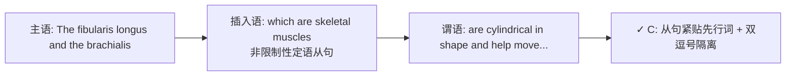
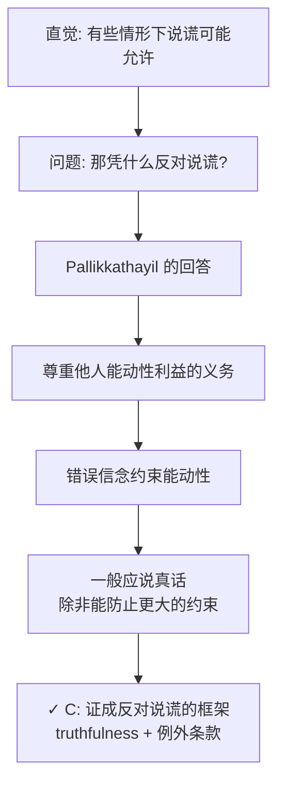

# SAT RW 2025年6月第1套（亚太A）错题分析

> [!abstract] 试卷信息
> - **试卷**: 2025年6月第1套（亚太A）SAT Reading & Writing（分享版，无数学）
> - **来源**: `~/高一/英语/SAT/0728hw/2025.6-1_answers.md` / `2025.6-1_亚太A_OCR.txt`
> - **本次错题/标记题**: 3 道（Module 1: 1 道, Module 2: 2 道）
> - **薄弱技能**: Standard English Conventions — 修饰语位置（非限制性定语从句）; Rhetorical Purpose — 句子功能分析; Central Ideas and Details — 主旨题
> - **说明**: 本笔记为积累式，后续错题可继续追加

---

> [!danger] 分析原则
> 详见 [[SAT Reading - Analysis Principles]]。

## 目录

- [[#1. Module 1 Q17 — 语法：非限制性定语从句位置（which 修饰语）]]
- [[#2. Module 2 Q7 — Rhetorical Purpose（划线句功能）]]
- [[#3. Module 2 Q9 — 主旨题（说谎的道德辩护）]]

---

# 1. Module 1 Q17 — 语法：非限制性定语从句位置（which 修饰语）

> [!info] 标记: `A` — 错误
> 正确答案: **C**

## 题干

The fibularis longus and the ___ move the fibula and humerus, respectively.

Which choice completes the text so that it conforms to the conventions of Standard English?

**我的答案**: A

## 选项分析

| 选项 | 内容 | 评价 |
|:---|:---|:---|
| **A** ✏️ | brachialis are cylindrical in shape, which are skeletal muscles, and help | ❌ "which are skeletal muscles" 被 "are cylindrical in shape" 隔开，离先行词 brachialis 太远 → which 误指就近成分（shape） |
| **B** | brachialis are cylindrical in shape and help, which are skeletal muscles, | ❌ which 从句被挪到句尾 "help" 之后，完全脱离先行词 brachialis |
| **C** ✅ | brachialis, which are skeletal muscles, are cylindrical in shape and help | ✅ 非限制性定语从句紧跟先行词 brachialis，双逗号隔离，主句完整且主谓一致 |
| **D** | brachialis are cylindrical, which are skeletal muscles, in shape and help | ❌ "in shape" 被拆到 which 从句之后，语序破碎 |

## 解题思路

### 考点：Standard English Conventions — 修饰语位置（非限制性定语从句）

### 推理过程



正确句子的骨架：

> The fibularis longus and the **brachialis**, which are skeletal muscles, **are** cylindrical in shape and **help** move the fibula and humerus, respectively.

关键规则：**非限制性 "which" 从句必须紧跟其修饰的名词（先行词），并用逗号成对隔开**。把插入语拿走之后，主句依然完整：复数主语（fibularis longus + brachialis）→ 谓语 are... and help，主谓一致。

### 为什么 C 正确

- "which are skeletal muscles" 紧跟在 "brachialis" 之后 → "which" 明确指代 brachialis（复数，所以谓语用 are）
- 双逗号把插入语与主句隔开，主句主干 "The fibularis longus and the brachialis are cylindrical in shape and help move..." 完整、通顺

### 为什么 A 不对

A 的语序是 "... brachialis **are cylindrical in shape, which are skeletal muscles**, and help ..." — "which" 从句被 "are cylindrical in shape" 挡在先行词后面。此时 "which" 只能就近指代 "shape"（单数名词却配 are，数不一致），语义也不通 → 典型的 **misplaced modifier（修饰语错位）**。B、D 犯的是同一类错误，只是把 which 从句挪到了更远的位置。

> [!warning] 陷阱识别
> **修饰语错位（Misplaced Modifier）**：见到 "which ... are ..." 的非限制性从句时，先锁定它修饰的名词——该从句必须**紧贴**名词并成对加逗号。A/B/D 的共同手法是把 which 从句挪到句子其他位置，让 which 就近误指。检查方法：① 划掉 which 从句，验证主句主干是否完整、主谓是否一致；② 确认 which 的先行词是谁。

---

# 2. Module 2 Q7 — Rhetorical Purpose（划线句功能）

> [!info] 标记: `D (?, high difficulty)` — 不确定 + 错误
> 正确答案: **B**

## 题干

Benjamin Prud'homme and colleagues have explored how convergent evolution—a phenomenon that occurs when the same trait evolves independently in two reproductively separate lineages—can result from a genetic mechanism shared by both lineages. Meanwhile, Cynthia C. Steiner and colleagues have investigated how convergence occurs through different genetic mechanisms. However, the relative prevalence of convergence through shared and different genetic processes is still poorly understood. This motivated biologists Delbert A. Green II and Cassandra G. Extavour to evaluate both types of convergence in a single study for their 2012 paper.

Which choice best states the function of the underlined sentence in the text as a whole?

**我的答案**: D

## 选项分析

| 选项 | 内容 | 评价 |
|:---|:---|:---|
| **A** | It introduces researchers who will be discussed in greater detail later in the text. | ❌ 划线句介绍的是 Prud'homme 等，但他们**并未**在后文被更详细地讨论——后文的主角是 Green & Extavour 的 2012 研究 |
| **B** ✅ | It gives an example of how some scientists had studied a phenomenon before another study mentioned later in the text was conducted. | ✅ 划线句 = 在 Green & Extavour 研究之前，科学家（Prud'homme 等）研究收敛进化的例子 |
| **C** | It outlines a study that was influenced by the researchers mentioned later in the text. | ❌ 因果方向颠倒——后文研究（Green & Extavour）是由研究空白**促成**的，不是被划线句中的人影响；且划线句并未 outline 一项研究 |
| **D** ✏️ | It clarifies a concept that is unclear in some of the studies mentioned in the text. | ❌ 划线句的功能是给出**先前研究的例子**，不是澄清概念；句内破折号定义只是附带成分 |

## 解题思路

### 考点：Rhetorical Purpose — 划线句功能分析

### 推理过程

```mermaid
flowchart LR
    A[Prud'homme 等: 共享机制<br>研究收敛进化] --> C[先前研究背景]
    B[Steiner 等: 不同机制<br>研究收敛进化] --> C
    C --> D[然而: 两种机制相对普遍性仍不清楚]
    D --> E[促成 Green & Extavour 2012 研究]<br>（后文提及的研究）
    E --> F[✓ B: 划线句 = 该研究之前<br>科学家研究此现象的例子]
```

文本的时间逻辑：

1. **Prud'homme 等**研究收敛进化（共享遗传机制）→ 划线句
2. **Steiner 等**研究收敛进化（不同机制）→ 并列背景
3. **However** — 相对普遍性仍不清楚 → 研究空白
4. **This motivated** Green & Extavour 在 2012 年把两种类型放进同一研究 → 后文的主角

划线句的角色：在整段中提供**先前研究的例子**——它服务于最后一句引入的 Green & Extavour 研究（后文唯一被详细讨论的对象），为理解该研究的动机铺垫背景。

### 为什么 B 正确

B 准确概括了划线句在整段中的角色：**给出一组科学家（Prud'homme 等）在另一项研究（Green & Extavour 2012）之前研究同一现象的例子**。段落的时间线是：先前研究（划线句 + Steiner 句）→ 仍不清楚的空白（However）→ 促成 Green & Extavour 的研究（This motivated）。

### 为什么 D 不对

D 说划线句 "clarifies a concept that is unclear"（澄清概念）——但划线句的功能是**举例说明先前研究**，不是澄清任何概念。容易误选 D 的原因：句中的破折号插入语 "a phenomenon that occurs when..." 确实给 convergent evolution 下了定义，但那是句内的附带说明，不是整句在段落中的功能。功能题要回答"这句话在段落中扮演什么角色"，而不是"句子里包含了什么信息"。

> [!warning] 陷阱识别
> **功能 vs. 内容混淆**：划线句内包含定义性插入语 ≠ 句子的功能是澄清概念。Rhetorical Purpose 题必须定位划线句与前后句的**逻辑关系**（这里是：为后文研究提供背景/先例），而非句内的局部信息。另注意因果方向——C 颠倒"谁影响谁"，A 虚构"后文详细讨论"，均与文本不符。

---

# 3. Module 2 Q9 — 主旨题（说谎的道德辩护）

> [!info] 标记: `D` — 错误
> 正确答案: **C**

## 题干

Philosophers note that many people have an intuitive sense that while we ought not to lie, there may be circumstances in which lying is permissible. If this intuition is correct and we lack an inviolable duty to speak truthfully, what grounds opposition to lying in the first place? Japa Pallikkathayil has advanced one answer by appealing to a duty to respect others' agential interests: the possession of false beliefs constrains agency, and thus we ought not to impede the formation of true beliefs unless doing so prevents a greater constraint on someone's agency or an otherwise impermissible end.

Which choice best states the main idea of the text?

**我的答案**: D

## 选项分析

| 选项 | 内容 | 评价 |
|:---|:---|:---|
| **A** | Pallikkathayil's argument suggests that ... we have an inviolable duty to speak truthfully. | ❌ "inviolable duty" 与文末 "**unless** doing so prevents a greater constraint" 的例外条款直接矛盾 |
| **B** | Pallikkathayil's argument shows that ... it is unclear whether there are any grounds for opposition to lying in the first place. | ❌ 与 Pallikkathayil 的实际作用相反——他**提供了**反对说谎的理由（尊重能动性），不是证明理由不清晰 |
| **C** ✅ | One potential means of justifying opposition to lying is Pallikkathayil's argument that we have an obligation to respect other people's agency that entails a commitment to truthfulness **except in certain circumstances**. | ✅ 准确概括：通过尊重他人能动性的义务来**证成反对说谎**，同时允许例外 |
| **D** ✏️ | Many people have an intuitive sense that lying is permissible in some circumstances but **lack a principled way to identify those circumstances**, and Pallikkathayil's argument may provide a means of resolving that problem. | ❌ 文本的中心问题不是"如何辨认哪些情形可以说谎"，而是"凭什么反对说谎"——Pallikkathayil 回答的是后者 |

## 解题思路

### 考点：Central Ideas and Details — 主旨题

### 推理过程



文本的论证结构：

1. **背景**: 很多人的直觉——不该说谎，但有些情形可能允许
2. **中心问题**（反诘句）: 如果真的没有绝对的诚实义务，"what grounds opposition to lying in the first place?"
3. **Pallikkathayil 的回答**: 尊重他人能动性利益的义务 → 错误信念约束能动性 → 我们不应阻碍真信念的形成 **unless** 这样做能防止更大的约束

C 完美映射这个结构："one potential means of justifying opposition to lying" 对应第 2 步（中心问题），"commitment to truthfulness except in certain circumstances" 对应第 3 步的 "unless" 例外。

### 为什么 D 不对

D 说文本的中心问题是"缺乏辨认哪些情形可以说谎的原则性方法"——但文本的**中心问题句**是 "what grounds opposition to lying in the first place?"（凭什么反对说谎？），不是"怎样锁定可以说谎的具体情形？"。Pallikkathayil 提供的是一套**证成反对说谎的道德框架**（尊重能动性 → 一般应诚实 → 例外条件），而不是一个帮人判断何时可以说谎的决策指南。D 把开头 set-up 当成了中心议题，答非所问。

> [!warning] 陷阱识别
> **问题焦点误判（Central Idea 题型）**：主旨题必须定位文本的**中心问题句**（通常为修辞性反问或核心论点标记，如 "what grounds opposition to lying?" 和 "Pallikkathayil has advanced one answer"），而非被开头的背景铺垫带偏。D 描述的是一个文本**没有提出**的问题（"如何辨认可以说谎的情形"），属于典型的**话题偷换**。另注意 A 的矛盾副词 "inviolable" 和 B 的反向解读。

---

## 总结：薄弱技能分布

| # | 题目 | 模块 | 技能类别 | 学生错误类型 | 优先级 |
|:---|:---|:---:|:---|:---|:---:|
| 1 | Q17 Brachialis | Mod1 | Standard English Conventions — 修饰语位置 | 未识别非限制性定语从句须紧贴先行词（选 A） | ⭐⭐⭐ |
| 2 | Q7 收敛进化 | Mod2 | Rhetorical Purpose — 句子功能 | 把"举例说明先前研究"误判为"澄清概念"（选 D） | ⭐⭐⭐⭐ |
| 3 | Q9 说谎道德 | Mod2 | Central Ideas and Details — 主旨题 | 把 set-up 背景误认为中心问题，话题偷换（选 D） | ⭐⭐⭐⭐ |

### 行动建议

1. **非限制性定语从句位置** — 复习 "N, which..., V" 结构：which 从句紧跟名词、双逗号隔离、删去后主句仍完整
2. **做题检查法** — ① 划掉 which 从句验证主句主干 ② 确认 which 的先行词（就近原则 + 数的一致）③ 检查主谓一致
3. **Rhetorical Purpose 功能题** — 划线句功能 = 它在段落逻辑链中的角色（背景举例 / 转折 / 结论），不是句内局部信息；重点看它与前后句的连接词（Meanwhile / However / This motivated）
4. **主旨题定位中心问题** — 文本开头往往只是 set-up / 背景，真正的中心问题通常在**修辞性反问或转折后**（如此处的 "what grounds opposition to lying?" + "Pallikkathayil has advanced one answer"）。D、A、B 分别偷换了 D 的话题 / A 的矛盾副词 / B 的结论方向

## 待创建的相关笔记

- [[SAT Grammar - 定语从句与修饰语位置]]
- [[SAT Reading - Rhetorical Purpose 功能题策略]]
- [[SAT Reading - Central Ideas and Details 主旨题策略]]
