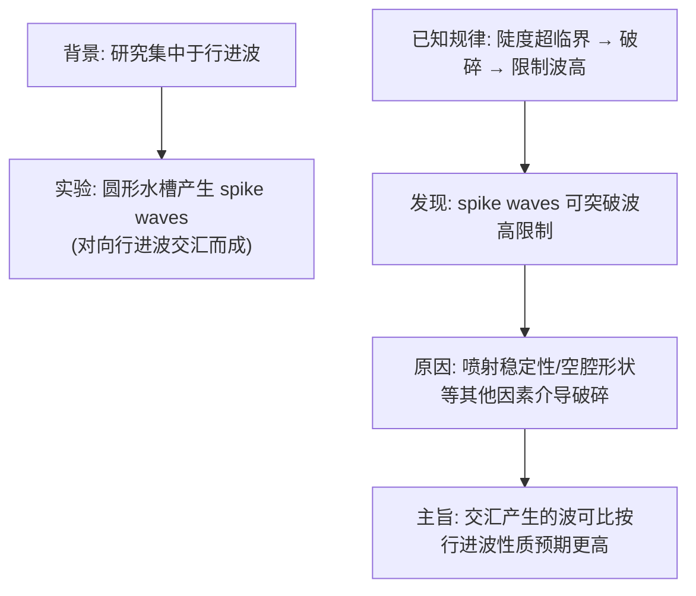
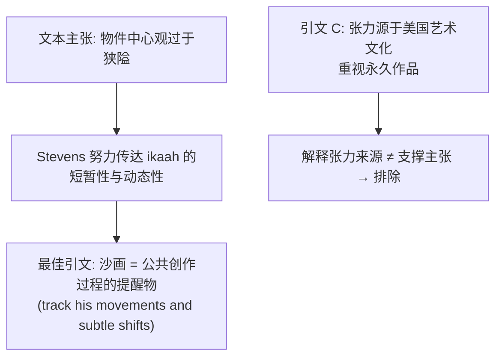
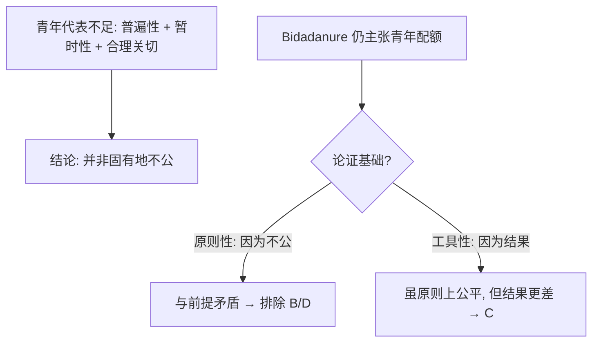
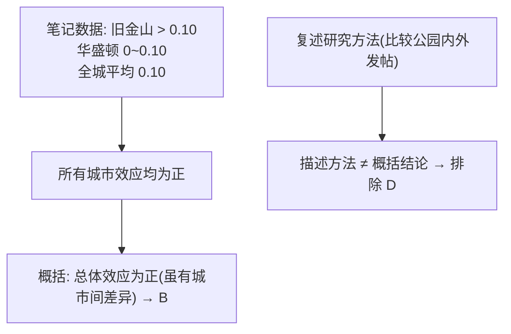
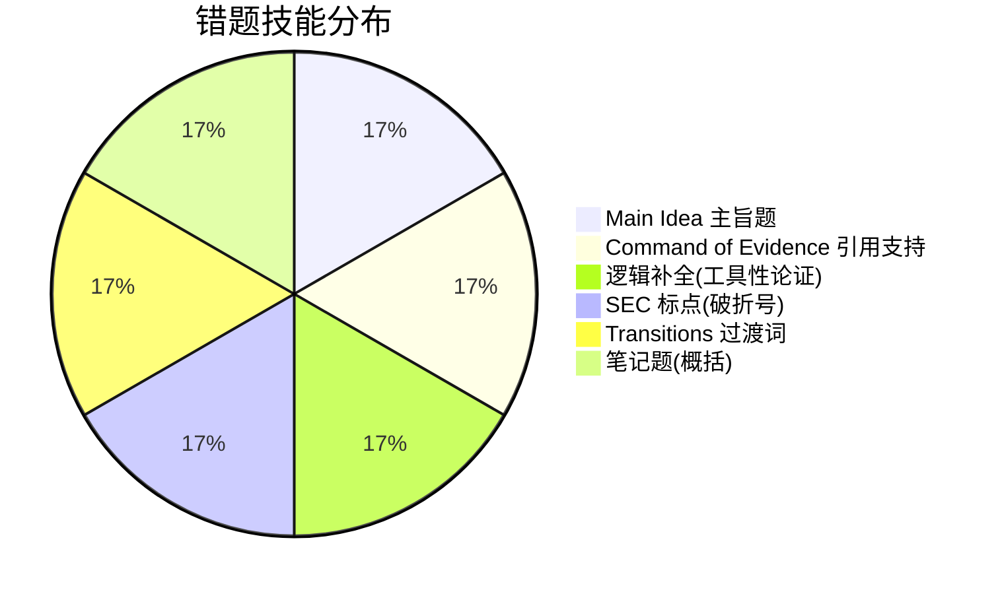

# SAT RW 2025年6月第2套（亚太B）错题分析

> [!abstract] 试卷信息
> - **试卷**: 2025年6月第2套（亚太B）SAT Reading & Writing
> - **来源**: `~/高一/英语/SAT/0728hw/2025年6月第2套/2025.6-2_answers.md`
> - **本次错题**: 6 道（Module 2: Q8, Q11, Q15, Q17, Q24, Q27）
> - **薄弱技能**: Main Idea（主旨题）, Command of Evidence（引用支持）, 逻辑补全（工具性论证）, Standard English Conventions（破折号成对）, Transitions（过渡词）, 笔记题（概括）
> - **备注**: 扫描版试卷，无官方 Question ID；据标准答案文档，M2 Q8 与 CB Practice Test 11 同题，可去 Bluebook 回查原题

---

> [!danger] 分析原则
> 详见 [[SAT Reading - Analysis Principles]]。

## 目录

- [[#1. Module 2 Q8 — 主旨题（行进波与 spike waves）]]
- [[#2. Module 2 Q11 — 引用支持题（Stevens 沙画）]]
- [[#3. Module 2 Q15 — 逻辑补全（工具性论证）]]
- [[#4. Module 2 Q17 — 标点：破折号成对闭合]]
- [[#5. Module 2 Q24 — 逻辑过渡词（indeed 强调佐证）]]
- [[#6. Module 2 Q27 — 笔记题（概括结论）]]

---

# 1. Module 2 Q8 — 主旨题（行进波与 spike waves）

> [!info] 标记: `D` — 错误
> 正确答案: **C**

## 题干

Studies of ocean wave breaking have predominantly focused on traveling waves (those propagating along the horizontal plane), so Mark McAllister et al. utilized a circular wave tank to produce and study spike waves, axisymmetric standing waves that can erupt vertically when traveling waves propagating in opposing directions intersect. Traveling waves break when wave steepness (height-to-length ratio) passes a critical threshold; breaking thus constrains wave height. McAllister et al. found that spike waves can exceed that constraint, as other factors than just steepness (e.g., jet stability and cavity shape) mediate spike-wave breaking.

Which choice best states the main idea of the text?

**我的答案**: D

## 选项分析

| 选项 | 内容 | 评价 |
|:---|:---|:---|
| **A** | McAllister et al. suggest that spike waves can form when traveling waves propagating in opposing directions intersect and that spike waves tend to be higher than traveling waves. | ❌ "tend to be higher" 过度断言——原文只说 spike waves **可以**突破限制（can exceed），未说"往往更高"；且交汇机制是研究前提而非研究发现 |
| **B** | The process of breaking limits the height of traveling waves, but the study by McAllister et al. suggests that spike waves can exceed those limits if their height-to-length ratio reaches a critical threshold. | ❌ 因果倒置——原文是"因喷射稳定性、空腔形状等**其他因素介导**而突破限制"，不是"达到临界陡度就能突破"（达到临界陡度是行进波破碎的原因） |
| **C** ✅ | The study by McAllister et al. suggests that when traveling waves intersect in specific ways, the resulting wave may be higher than would be expected based on the properties of traveling waves. | ✅ 完整概括核心发现：交汇产生的波可比"按行进波性质预期"的更高——对应原文 found that spike waves can exceed that constraint |
| **D** ✏️ | Previous studies have suggested that steepness mediates breaking in traveling waves, but the study by McAllister et al. shows that jet stability and cavity shape may also influence breaking in such waves. | ❌ "such waves" 紧跟 traveling waves 出现，指代 traveling waves——但喷射稳定性/空腔形状影响的是 **spike waves** 的破碎；且重心落在"先前研究 vs 新研究"的并列上，偏离核心发现 |

## 解题思路

### 考点：Main Idea（主旨题）

### 推理过程

文章结构：背景（研究集中于行进波）→ 实验（spike waves 如何产生）→ 已知规律（陡度限制波高）→ **发现**（spike waves 可突破限制 + 原因）。主旨题的答案必须落在"发现"上。

### 为什么 C 正确

C 完整保留核心对比——"按行进波性质预期的波高" vs "实际可更高"，且用 "may be higher" 精确对应原文 "can exceed" 的不确定语气。它同时覆盖了产生方式（intersect in specific ways）与超预期结果，是最完整的概括。

### 为什么 D 错误（我的错选）

D 有双重错位：

1. **指代错误**：D 说 "jet stability and cavity shape may also influence breaking **in such waves**"。原文中 "such waves" 若指代，最近的先行词是 traveling waves，但喷射稳定性与空腔形状是 spike-wave 破碎的中介因素，不是行进波的。指代对象张冠李戴。
2. **重心偏移**：D 把主旨框成"先前研究 vs 新研究"的对比，但文章的主旨不是学术史对照，而是"交汇产生的波可超出预期高度"这一发现。

我错选 D 说明只抓到了细节词（jet stability, cavity shape），没有检查指代对象，也没有把答案放回全文验证主旨重心。

> [!warning] 陷阱识别
> **指代陷阱 + 细节词≠主旨**：D 选项里出现了原文的关键细节词（jet stability, cavity shape），极具迷惑性，但 "such waves" 的指代错误使其整体偏离。主旨题要警惕"细节全对但重心偏了"的选项——回到"研究发现"句（found that...）检验。

## 解题策略

1. 先读首尾句把握研究问题（谁研究了什么）
2. 找到"发现"句（found that / suggests that）——主旨题的锚点
3. 检查选项中的代词（such waves / these / it）指代对象是否与原文一致
4. 排除只讲背景或机制的选项（本应排除 D）
5. 用"发现 + 原因"两个要素验证主旨选项的完整性

---

# 2. Module 2 Q11 — 引用支持题（Stevens 沙画）

> [!info] 标记: `C` — 错误
> 正确答案: **A**

## 题干

In Diné (Navajo) culture, ikaah (sandpaintings) are created and then erased as part of sacred healing ceremonies lasting no more than a few days, but Diné hataalii (chanter; healer; cultural guide) Fred Stevens developed fixatives to preserve desacralized sandpaintings. While on a US-sponsored cultural ambassadorial trip in Europe and the Americas in the 1960s, Stevens produced several such sandpaintings and gave them to cultural institutions. This may seem in tension with the role of cultural ambassador—how could static objects authentically represent an inherently ephemeral and dynamic practice?—but such a view is itself overly object-focused and neglects how Stevens strove to convey exactly those characteristics of ikaah as a cultural practice.

Which quotation from an art historian would most directly support the claim made in the text?

**我的答案**: C

## 选项分析

| 选项 | 内容 | 评价 |
|:---|:---|:---|
| **A** ✅ | "Stevens's ambassadorial sandpaintings are best understood not as self-contained objects but as reminders of the public creations of the sandpaintings, during which Stevens conducted appropriate ikaah rituals and encouraged viewers to closely track his movements and subtle shifts in the sand throughout the process." | ✅ 直接支撑主张：沙画是"公共创作过程的提醒物"（reminders of the public creations）——正是"以物件传达动态实践"的核心主张 |
| **B** | "...they should not be confused with authentic ikaah, which cannot be extricated from a practice that is intentionally and necessarily transitory nor condensed into a single persistent object." | ❌ 与文本立场相反——文本认为"物件中心"观点过于狭隘，B 恰恰强化了"物件 ≠ 真实实践"的对立 |
| **C** ✏️ | "The most compelling way to reconcile the apparent tension... is to recognize that Stevens was an ambassador not only of Diné culture but of a US art culture that tended to value permanent works over ephemeral ones." | ❌ 把张力归因于美国艺术文化重视永久作品——解释的是张力的文化来源，未说明沙画本身如何传达 ikaah 的动态性 |
| **D** | "...Stevens publicly enacted the transmission of knowledge of both traditional ikaah practices and cutting-edge chemistry... a hybrid that reflects the dynamism of Diné culture." | ❌ 强调送礼行为与知识传递，偏离"沙画如何传达动态实践特征"的主张核心 |

## 解题思路

### 考点：Command of Evidence — 引用支持题（Quotation Support）

### 推理过程

文本主张一句话：**"把沙画看作自我封闭的静态物件是过于以物为本的观点，因为 Stevens 恰恰致力于通过沙画传达 ikaah 作为文化实践的短暂性与动态性。"** 主张核心词：物件 → **动态实践的传达媒介**。

### 为什么 A 正确

A 中 "reminders of the public creations of the sandpaintings"（创作过程的提醒物）+ "encouraged viewers to closely track his movements and subtle shifts in the sand **throughout the process**" 完美对应主张：沙画的价值在于记录/提醒**创作过程**，而非作为静态物件存在。引文直接、正面地支撑主张。

### 为什么 C 错误（我的错选）

C 里 "reconcile the apparent tension" 与文本中提到的 tension（静态物件 vs 动态实践的张力）**话题重叠**，所以看起来相关。但 C 实际回答的是"张力从何而来"（美国艺术文化偏爱永久作品），而题目要的是支撑"Stevens 通过沙画传达动态实践特征"这一**主张**的引文。C 从头到尾没有触及 Stevens 的创作过程与沙画本身的动态性。

> [!warning] 陷阱识别
> **话题重叠 ≠ 支撑主张**：引用支持题常有"与文本话题相关但未触及主张"的选项。C 解释了 tension 的文化来源，看似在回应文本，实则绕开了主张本身。判断标准：提炼主张核心词，逐项检查引文是否**直接呼应**核心词。

## 解题策略

1. 用一句话写清文本的主张（谁做了什么 / 文本立场是什么）
2. 提炼主张核心词（如"物件 → 动态实践的提醒"）
3. 逐项检查引文是否直接呼应核心词，而非仅话题相关
4. 警惕"与文本立场相反"的选项（B 型）——即使措辞正确也要排除
5. 最后代入验证：若引文出现在文中，能否直接支持主张句

---

# 3. Module 2 Q15 — 逻辑补全（工具性论证）

> [!info] 标记: `A` — 错误
> 正确答案: **C**

## 题干

In the world's democracies, proportionally few elected representatives are young adults. While some philosophers argue that certain types of underrepresentation (of women, for example) are unfair in principle and should be remediated via quotas, there is broad agreement that youth underrepresentation is not inherently unfair since it is universal (all people are underrepresented when young), temporary (underrepresented young people become overrepresented older people), and reflective of a legitimate concern (lack of relevant experience). Accordingly, when philosopher Juliana Uhuru Bidadanure advocates for youth quotas for elected representatives, she does so on the basis of their instrumental value for promoting youth interests, arguing that ___

Which choice most logically completes the text?

**我的答案**: A

## 选项分析

| 选项 | 内容 | 评价 |
|:---|:---|:---|
| **A** ✏️ | young adults may lack certain kinds of experience but those experiences are not relevant to the question of whether youth underrepresentation is fair in principle. | ❌ 讨论"经验与原则公平"的关系——原文已用普遍性/暂时性/合理关切把原则问题讲完，空格需要的是"后果/利益"论证 |
| **B** | age-related quotas would alleviate the inherently unfair overrepresentation of older people that tends to occur in the world's democracies. | ❌ 与前提矛盾——原文明说青年代表不足"并非固有地不公"，B 却称老年人存在"固有的不公过度代表" |
| **C** ✅ | youth underrepresentation may be fair in principle but leads to worse outcomes for young adults than could be achieved with more proportionate youth representation. | ✅ 正是工具性论证："虽原则上公平，但因后果更差而值得纠正"——对应 instrumental value for promoting youth interests |
| **D** | it does not matter that youth underrepresentation is universal, temporary, and reflective of a legitimate concern since it is inherently unfair. | ❌ 与前提直接矛盾（"本质上不公"否定了原文的 broad agreement） |

## 解题思路

### 考点：逻辑补全 — 工具性论证（Instrumental Argument）

### 推理过程

空格前的引导词是关键：**"on the basis of their instrumental value for promoting youth interests, arguing that ___"**。instrumental value（工具性价值）= 看**后果**。所以空格必须给出"后果更差 / 结果导向"的理由，而不是继续讨论原则本身。

### 为什么 C 正确

C 的让步结构 "may be fair in principle **but** leads to worse outcomes for young adults than could be achieved with more proportionate youth representation" 与论证类型完美对齐：前半句接受前提（原则上公平），后半句给出工具性理由（结果更差）。这正是"虽然原则上不公无法成立，但从结果看仍值得配额"的论证。

### 为什么 A 错误（我的错选）

A 在谈"经验与原则公平的关系"——这是**原则性论证**的延伸。但空格前已经明确宣告论证基础是 instrumental value（工具性价值），需要的是"结果/利益"层面的理由。A 从头到尾没有提到任何"结果更差"或"促进青年利益"的内容，与引导词脱节。

> [!warning] 陷阱识别
> **论证类型识别陷阱**：原则论证（因为不公）vs 工具论证（因为后果）。关键词 instrumental value = 工具性 = 看后果。错选 A 说明我顺着前文"experience 是 legitimate concern"的思路走，没抓住空格前已切换的论证轨道。

## 解题策略

1. 定位空格前的引导词（on the basis of..., arguing that...）
2. 判断论证类型：原则性（fair/unfair in principle）还是工具性（outcomes/interests/effects）
3. 工具性论证 → 找"后果更差/更好"类表述
4. 排除与前提矛盾的选项（B/D 的"固有地不公"直接否定原文）
5. 检查让步结构是否呼应文本前提（may be fair in principle）

---

# 4. Module 2 Q17 — 标点：破折号成对闭合

> [!info] 标记: `B` — 错误
> 正确答案: **D**

## 题干

All member nations of the North Atlantic Treaty Organization, or NATO — including Iceland, which joined in 1949; Hungary, which joined in 1999; and Bulgaria, which joined in ___ are committed to NATO's principle of collective defense, each member pledging to defend all others.

Which choice completes the text so that it conforms to the conventions of Standard English?

**我的答案**: B

## 选项分析

| 选项 | 内容 | 评价 |
|:---|:---|:---|
| **A** | 2004; | ❌ 分号是插入语**内部**列表的分隔符，不能闭合破折号插入语；结尾分号使主句断裂 |
| **B** ✏️ | 2004, | ❌ 逗号同样不能闭合破折号插入语——开启用破折号，闭合也必须用破折号 |
| **C** | 2004 | ❌ 无任何标点，插入语未闭合，句子杂糅 |
| **D** ✅ | 2004 — | ✅ 第二个破折号闭合以 "— including" 开头的插入语，主句 "All member nations... are committed" 完整贯通 |

## 解题思路

### 考点：Standard English Conventions — 破折号成对闭合（Dash Pairing）

### 推理过程

句子主干：**All member nations of NATO ... are committed to...**。第一个破折号开启插入语（including Iceland...；Hungary...；and Bulgaria...），插入语内部的分号只是列举三个国家时的**内部分隔符**，与闭合无关。插入语必须以与开启标点同类的标点闭合 → 破折号。

### 为什么 D 正确

D（2004 —）用第二个破折号闭合插入语，主句完整贯通：All member nations... are committed to NATO's principle of collective defense。破折号成对规则（dash—dash）是 SAT 高频考点。

### 为什么 B 错误（我的错选）

我选了逗号（2004,），可能把插入语内部的分号列表当成了需要"不同层级标点"来闭合的信号。但规则是：**开启标点决定闭合标点**。第一个破折号只能由破折号闭合，逗号、分号都无法闭合它。

> [!warning] 陷阱识别
> **标点成对规则 + 内部列表干扰**：插入语内部的分号列表（Iceland...; Hungary...; and Bulgaria...）极具迷惑性，让人以为末尾需要另一个"非逗号"标点来区分层级。但分号只负责列表内部，闭合必须回到开启标点（破折号）。

> [!note] 复核提示
> 标准答案文档将此题列为"需复核"题目之一。按破折号成对闭合规则，D 无误："All member nations of NATO — including... — are committed" 是标准结构，可对照 CB 官方 dash 规则复核。

## 解题策略

1. 先删掉插入语，找到句子主干（主语 + 谓语）
2. 识别插入语的开启标点（逗号 / 破折号 / 括号）
3. 闭合标点必须与开启标点**同类成对**
4. 插入语内部的分号/逗号只是内部分隔，不参与闭合
5. 代入后通读主干，验证句子完整

---

# 5. Module 2 Q24 — 逻辑过渡词（indeed 强调佐证）

> [!info] 标记: `D` — 错误
> 正确答案: **B**

## 题干

Upper-atmospheric jets — phenomena whereby electrical discharges cause narrow cones of blue light to briefly burst upward from the tops of thunderclouds — have been observed reaching the ionosphere. The extreme altitudes involved (the ionosphere begins about 80 km above Earth) mark these gigantic jets as outliers; ___ the majority of jets reach heights of only 20 to 50 km.

Which choice completes the text with the most logical transition?

**我的答案**: D

## 选项分析

| 选项 | 内容 | 评价 |
|:---|:---|:---|
| **A** | consequently, | ❌ 因果错误——"多数喷流只有 20–50 km"不是"成为异类"的**结果**，而是佐证 |
| **B** ✅ | indeed, | ✅ 强调性佐证：用具体数据（20–50 km）确认"异类"判断 |
| **C** | in addition, | ❌ 并列附加——后句不是新话题，是对前句判断的支撑 |
| **D** ✏️ | nevertheless, | ❌ 转折——前后无对立，后句恰恰支持前句的"异类"判断 |

## 解题思路

### 考点：Transitions — 强调佐证 vs 转折

### 推理过程

前句给出判断：巨型喷流是 outliers（异类）。后句给出具体数据：多数喷流只有 20–50 km 高——**用数据印证**"异类"判断。前后方向一致，需要强调/佐证类过渡词。

### 为什么 B 正确

indeed（确实）的作用是"用后句强化前句的判断"。"巨型喷流是异类——确实，多数喷流只有 20–50 km 高"：后句数据精确印证了 outliers 的判断，indeed 是最贴切的衔接。

### 为什么 D 错误（我的错选）

nevertheless 要求后句与前句构成让步或对立。但"多数喷流只有 20–50 km"并不削弱"巨型喷流是异类"的判断——恰恰相反，它**强化**了这个判断。我错选 D 说明把"具体数据"误判成了"反面信息"：数据本身是中性的，要判断的是它相对于前句判断的**方向**（印证 or 反驳）。

> [!warning] 陷阱识别
> **数据佐证误判为转折**：看到具体数字（20 to 50 km）就以为是与前句的"对比"，从而选转折词。正确做法：判断后句是"印证前句判断"（→ indeed）还是"推翻前句判断"（→ nevertheless）。

## 解题策略

1. 判断前后句方向：一致（佐证/强化）还是相反（对立/让步）
2. 方向一致 → indeed / thus / in addition 类中选最贴合逻辑关系的
3. 方向相反 → however / nevertheless / by contrast 类
4. 检查后句是否"印证"前句的**判断**（而非新话题）
5. 代入通读，验证语义通顺

---

# 6. Module 2 Q27 — 笔记题（概括结论）

> [!info] 标记: `D` — 错误
> 正确答案: **B**

## 题干

While researching a topic, a student has taken the following notes:

- A 2022 study analyzed geotagged social media posts to assess the effect of parks on happiness in 25 US cities.
- The happiness benefit of a city's parks was the numeric difference between the calculated happiness scores of posts made in parks and posts made elsewhere.
- A benefit above 0 indicates a positive effect.
- The park happiness benefit in San Francisco, California, was greater than 0.10.
- The park happiness benefit in Washington, DC, was greater than 0 but less than 0.10.
- The average happiness benefit of parks across all cities was 0.10.

The student wants to make a generalization based on the study's findings. Which choice most effectively uses relevant information from the notes to accomplish this goal?

**我的答案**: D

## 选项分析

| 选项 | 内容 | 评价 |
|:---|:---|:---|
| **A** | Geotagged social media posts were analyzed for expressed happiness in both San Francisco and Washington. | ❌ 只复述研究方法/城市，非概括结论 |
| **B** ✅ | Though it can vary from city to city, the overall effect of parks on happiness is a positive one. | ✅ 基于"所有城市均为正 + 平均 0.10 > 0"的准确概括：虽有差异，总体效应为正 |
| **C** | San Francisco's parks had a positive effect on happiness, but this was not true of Washington's parks, which had a below-average effect. | ❌ 与笔记矛盾——华盛顿特区也是正效应（>0），只是低于平均；"not true of Washington" 错误 |
| **D** ✏️ | By comparing the happiness scores of posts made in parks and posts made elsewhere, the study determined the effect of parks on happiness. | ❌ 复述研究方法（笔记第 1、2 条），未作任何概括 |

## 解题思路

### 考点：笔记题 — 概括（Generalization）

### 推理过程

题目的 goal 动词是 **make a generalization**（作概括）。概括 = 从数据中提炼**一般性结论**：所有城市幸福收益均为正、平均为 0.10 → "公园对幸福的总体效应是正面的"。

### 为什么 B 正确

B 的让步结构 "Though it can vary from city to city"（承认城市间差异）+ "the overall effect... is a positive one"（总体为正）精确对应笔记：各城市数值不同但均为正，平均 0.10 > 0。这是唯一作出概括性判断的选项。

### 为什么 D 错误（我的错选）

D 只是把笔记第 1、2 条复述成"方法描述"（how the study determined the effect），没有任何概括性判断。笔记题的 goal 动词决定答题方向：generalization 要求"结论"，不是"方法复述"。我错选 D 说明把"完整复述笔记"当成了"完成任务"，忽略了 goal 的要求。

> [!warning] 陷阱识别
> **目的混淆（goal verb 错位）**：generalize ≠ describe method。笔记题的每个 goal 动词（generalize / compare / explain / emphasize）对应不同的答案形态；复述笔记原文的选项几乎永远是干扰项（如 A/D）。另注意 C 型陷阱：与笔记数据矛盾的选项。

## 解题策略

1. 读 goal 动词，确定答案形态（概括=总体判断；比较=并列对比；解释=定义/身份）
2. 概括题 → 找"总体性判断"表述（overall / in general / 让步结构+总结）
3. 排除复述笔记原文的选项（方法描述、城市列举）
4. 排除与笔记数据矛盾的选项（如 C 说华盛顿非正效应）
5. 检查概括是否超出数据范围（如"所有城市都..."需笔记支持）

---

## 总结：薄弱技能分布

| # | 题目 | 模块 | 技能类别 | 学生错误类型 | 优先级 |
|:---|:---|:---:|:---|:---|:---:|
| 1 | Q8 行进波 | Mod2 | Main Idea — 主旨题 | 指代张冠李戴 + 主旨重心偏移（选 D） | ⭐⭐⭐⭐ |
| 2 | Q11 Stevens 沙画 | Mod2 | Command of Evidence — 引用支持 | 话题重叠误判为支撑主张（选 C） | ⭐⭐⭐ |
| 3 | Q15 青年配额 | Mod2 | 逻辑补全 — 工具性论证 | 未识别论证类型转换（选 A） | ⭐⭐⭐⭐ |
| 4 | Q17 破折号 | Mod2 | SEC — 标点成对闭合 | 用逗号闭合破折号插入语（选 B） | ⭐⭐⭐ |
| 5 | Q24 巨型喷流 | Mod2 | Transitions — 过渡词 | 数据佐证误判为转折（选 D） | ⭐⭐⭐ |
| 6 | Q27 公园幸福 | Mod2 | 笔记题 — 概括 | 方法复述代替概括结论（选 D） | ⭐⭐⭐ |

### 技能分布汇总

### 行动建议

1. **主旨题（Q8）** — 锚定"发现句"（found that / suggests that），排除只讲背景或机制的选项；逐项检查选项中代词的指代对象（such waves 型陷阱）。

2. **引用支持题（Q11）** — 先一句话写清文本主张，提炼主张核心词；引文必须**直接呼应**核心词，"与文本话题相关但未触及主张"的选项（如解释张力来源）一律排除。

3. **逻辑补全（Q15）** — 识别空格前引导词宣告的论证类型：instrumental value → 工具性论证 → 答案必须含"后果/结果"；同时排除与前提矛盾的选项（固有地不公型）。

4. **标点成对规则（Q17）** — 开启标点决定闭合标点：破折号插入语必须 dash—dash 闭合；插入语内部的分号列表只负责内部，不参与闭合。

5. **过渡词（Q24）** — 先判断前后句方向：数据**印证**前句判断 → indeed；数据**推翻**前句判断 → nevertheless。不要把"具体数据"误认为"对比"。

6. **笔记题（Q27）** — 严格对齐 goal 动词：generalization 要"总体判断"，不要方法复述；复述笔记原文的选项几乎永远是干扰项。

---

## 待创建的相关笔记

- [[SAT Reading - Main Idea 主旨题策略]]
- [[SAT Reading - Command of Evidence 引用支持]]
- [[SAT Reading - 逻辑补全与论证类型]]
- [[SAT Grammar - 破折号与插入语]]
- [[SAT Grammar - 逻辑过渡词]]
- [[SAT Reading - 笔记题 goal 动词匹配]]

