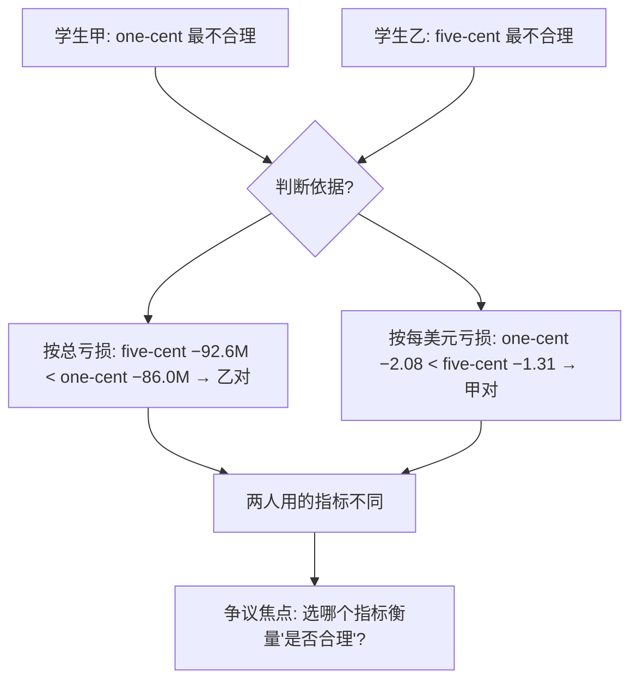
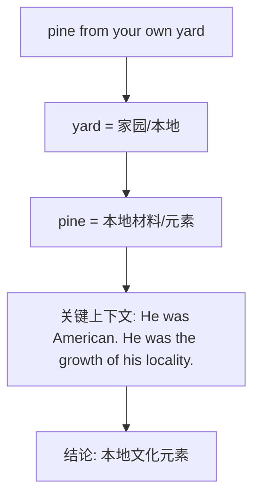
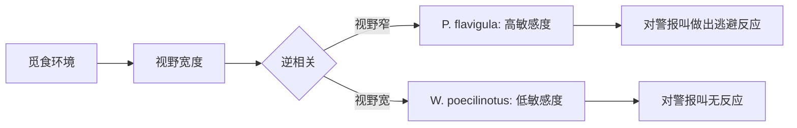
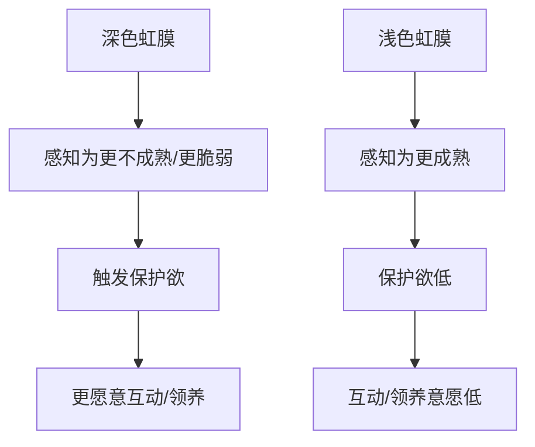
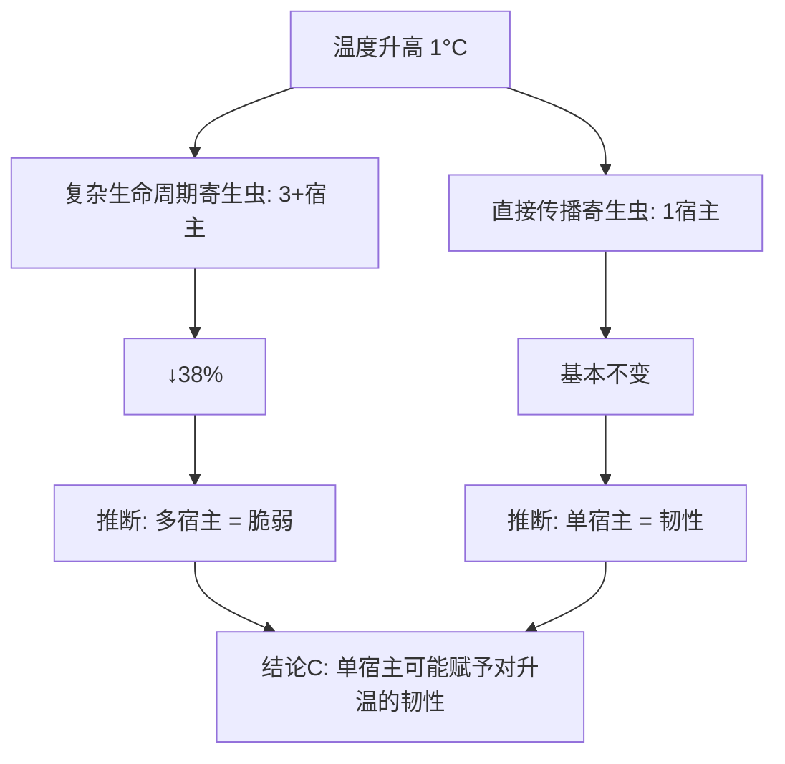
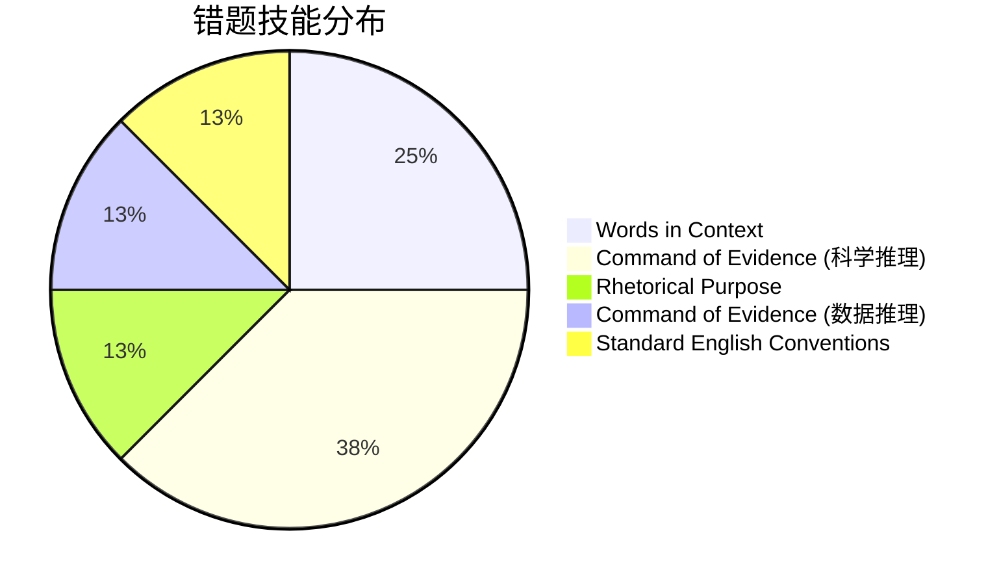

# SAT RW 25.6-3 错题分析

> [!abstract] 试卷信息
> - **试卷**: 2025年6月第3套（北美）SAT Reading & Writing
> - **来源**: `~/高一/英语/SAT/0717hw/0717answers.md`
> - **本次错题/标记题**: 8 道（Module 1: 2 道, Module 2: 6 道）
> - **薄弱技能**: Words in Context, Command of Evidence (Scientific Reasoning), Standard English Conventions, Rhetorical Purpose

---

> [!danger] 分析原则
> 详见 [[SAT Reading - Analysis Principles]]。

## 目录

- [[#1. Module 1 Q11 — 数据争议（Seigniorage 指标分歧）]]
- [[#2. Module 1 Q19 — 语法：主谓一致 / 代词指代]]
- [[#3. Module 2 Q4 — Words in Context（discerning vs. capacious）]]
- [[#4. Module 2 Q5 — Words in Context（文学作品解读）]]
- [[#5. Module 2 Q8 — Rhetorical Purpose（下划线功能）]]
- [[#6. Module 2 Q12 — Scientific Reasoning（逆相关假设）]]
- [[#7. Module 2 Q14 — Scientific Reasoning（数据表格 + 结论补全）]]
- [[#8. Module 2 Q16 — Scientific Reasoning（逻辑补全：寄生虫与温度）]]

---

# 1. Module 1 Q11 — 数据争议

> [!info] 标记: `D (?)` — 不确定
> 正确答案: **A**

## 题干

Issuing a one-dollar coin yields positive seigniorage — the profit generated when the face value of a coin exceeds the unit cost of producing it — for Singapore's government, which in turn can be used to fund such services as transportation. Some countries, such as the Netherlands, have ceased manufacturing certain coins because their production created negative seigniorage. In an economics class discussing the data in the table, one student argues that in 2023, the one-cent coin was the least financially sensible for the US to produce, while another student argues that the five-cent coin was.

**Value, Cost, and Seigniorage of US Coins by Denomination, 2023**

| Denomination | Total value of units produced (millions of dollars) | Gross cost (millions of dollars) | Seigniorage (millions of dollars) | Seigniorage per $1 issued (dollars) |
|:---|:---:|:---:|:---:|:---:|
| One-cent | 41.4 | 127.4 | −86.0 | −2.08 |
| Five-cent | 70.8 | 163.4 | −92.6 | −1.31 |
| Ten-cent | 266.6 | 141.1 | +125.5 | +0.47 |
| Quarter-dollar | 568.4 | 264.4 | +304.0 | +0.53 |

Based on the information in the text and the table, the two students most likely disagree about the answer to which question?

**我的答案**: D

## 选项分析

| 选项 | 内容 | 评价 |
|:---|:---|:---|
| **A** ✅ | When evaluating the financial implications of issuing a coin, which is more important, the total seigniorage from issuing that coin or the seigniorage per dollar when issuing that coin? | ✅ **正确** — 争议焦点：总量 vs. 单位比率 |
| **B** | If issuing a given coin results in negative seigniorage per dollar issued, can that be changed to positive seigniorage per dollar issued by reducing the cost of issuing the coin? | ❌ 讨论"能否改变"，非两人分歧所在 |
| **C** | If issuing a given coin results in positive seigniorage per dollar but not as much positive seigniorage per dollar as issuing a different coin does, does it make financial sense to continue issuing the first coin? | ❌ 争议的是负 seigniorage 硬币，不涉及正 seigniorage 硬币的比较 |
| **D** ✏️ | When determining whether it makes financial sense to issue a given coin, which is more important, the total value of the units of that coin produced or the gross cost of issuing that coin? | ❌ 混淆了争议维度 — 争议的是 seigniorage 的两个度量，而非面值 vs. 成本 |

## 解题思路

### 考点：Command of Evidence — 数据推理 / 争议焦点识别

### 推理过程

关键比较：

| 指标 | One-cent | Five-cent | "更不合理"的一方 |
|:---|:---:|:---:|:---|
| 总 seigniorage（$M） | −86.0 | **−92.6**（更差） | Five-cent |
| 每 $1 发行的 seigniorage | **−2.08**（更差） | −1.31 | One-cent |

两人得出不同结论的根源：**对"合理性"的判断使用了不同的财务指标**。因此他们争论的根本问题是：**到底应按总 seigniorage 还是按每美元 seigniorage 来评判？**

### 为什么 D 不对

D 问的是"总面值 vs. 总成本"哪个更重要——这两列数据都已是原始输入，不涉及任何一方使用的推理逻辑。两人的分歧不是数据源的选择，而是对同一个数据的不同**聚合方式**（总量 vs. 比率）。

> [!warning] 陷阱识别
> **指标混淆**：表格有多列数据（面值、成本、总 seigniorage、单位 seigniorage），学生需精确锁定争议双方各自使用的指标。D 指向了无关的两列（面值 vs. 成本），而真正的分歧在于对同一现象（seigniorage）的**两个角度的度量**。

---

# 2. Module 1 Q19 — 语法：主谓一致 / 代词指代

> [!info] 标记: `C` — 错误
> 正确答案: **D**

## 题干

In the Persian language, people commonly begin a folktale with a phrase that roughly translates to "there was and there was not." In English, beginning with the phrase "once upon a time" is common. Indeed, how a folktale begins depends largely on the language in which ___ being told.

Which choice completes the text so that it conforms to the conventions of Standard English?

**我的答案**: C (they are)

## 选项分析

| 选项 | 内容 | 评价 |
|:---|:---|:---|
| **A** | they were | ❌ 时态错误（过去时）+ 数不一致 |
| **B** | these are | ❌ "these" 指代不清且无先行词 |
| **C** ✏️ | they are | ❌ 复数代词 "they" 无复数先行词 |
| **D** ✅ | it is | ✅ 单数 "it" 指代前面的 "a folktale"（单数） |

## 解题思路

### 考点：Standard English Conventions — 代词-先行词一致 (Pronoun-Antecedent Agreement)

### 推理过程

关键句子拆解：
> "how a folktale begins depends largely on the language **in which ___ being told**."

1. 定位先行词：整个句子的主语部分是 "**a folktale**"（单数名词）
2. 关系代词 "which" 指代 "the language"
3. 在 "in which" 从句中，主语需要指代 "a folktale" → 必须用单数代词 **it**
4. 时态：主句用一般现在时（depends），从句也应用一般现在时 → **it is** being told
5. 选项 C "they are" 的 "they" 找不到复数先行词——这是本句唯一的错误

### 为什么容易选 C

中文思维干扰：上一句提到 "people commonly begin a folktale..."，人（people）是复数，容易下意识将 "they" 关联到 "people"。但语法上 "they" 必须指代前文出现过的**名词短语**，而 "people" 不在当前从句的作用域内——"in which" 从句的主体是 "a folktale"。

> [!warning] 陷阱识别
> **远距离先行词误判**：代词应与最近的、逻辑上一致的名词短语保持数和人称一致。不要被前文较远处的人称/数干扰。

---

# 3. Module 2 Q4 — Words in Context

> [!info] 标记: `A` — 错误
> 正确答案: **D**

## 题干

The 2023 anthology *The Big Book of Cyberpunk* contains 108 stories, including Fritz Leiber's "Coming Attraction" (1950) and Erica Satifka's "Act of Providence" (2021). With its chronological scope, it is more comprehensive than the much shorter 1986 cyberpunk anthology *Mirrorshades*, but *Mirrorshades*'s **careful selection** of stories makes that anthology more ___.

Which choice completes the text with the most logical and precise word or phrase?

**我的答案**: A (capacious)

## 选项分析

| 选项 | 释义 | 评价 |
|:---|:---|:---|
| **A** ✏️ | **capacious** — 容量大的、宽敞的 | ❌ 与前面的 "more comprehensive" 重复，且无法与 "careful selection" 搭配 |
| **B** | **outmoded** — 过时的、陈旧的 | ❌ 与 "careful selection" 构成矛盾 |
| **C** | **cursory** — 粗略的、草率的 | ❌ 与 "careful selection" 完全相反 |
| **D** ✅ | **discerning** — 有眼光/辨别力的 | ✅ "careful selection → discerning" 因果一致 |

## 解题思路

### 考点：Words in Context（逻辑语境 + 词汇精确义）

### 推理过程

文本逻辑是**对比两个选集的各自优势**：
- *The Big Book* 更大更全 → "more comprehensive"
- *Mirrorshades* 精心挑选 → 更 "discerning"（有辨别力的、精选的）

### 为什么 A 不对

"Capacious" 意为"容量大的、能装很多东西的"，这与前半句 "more comprehensive"（覆盖面更广）高度重叠。如果选 A，等于在说"Mirrorshades 更大"，但这与 "much shorter" 直接冲突。文本的对比逻辑是：Big Book 赢在**量**，Mirrorshades 赢在**质**（精挑细选）。

> [!warning] 陷阱识别
> **近义混淆 + 逻辑矛盾**：看到 "more" 就下意识填一个同类比较级的词（capacious），但忽略了 "careful selection" 这个关键限定——它指向的是**品质/眼光**而非**数量/容量**。

---

# 4. Module 2 Q5 — Words in Context（文学作品解读）

> [!info] 标记: `D` — 错误
> 正确答案: **C**

## 题干

The following text is from William Carlos Williams's 1925 creative nonfiction book *In the American Grain*. Williams is discussing how works by nineteenth-century US poet and fiction writer Edgar Allan Poe were received by American readers.

> Poe must suffer by his originality. Invent that which is new, even if it be made of **pine from your own yard**, and there's none to know what you have done. It is because there's no name. This is the cause of Poe's lack of recognition. He was American. He was the astounding, inconceivable growth of his locality.

As used in the text, what does the underlined figurative phrase most nearly mean?

**我的答案**: D (Inspiration you received while reading independently)

## 选项分析

| 选项 | 内容 | 评价 |
|:---|:---|:---|
| **A** | Personal experiences that are hard for others to comprehend | ❌ 强调"难以理解"，但原文重点是"本土/本地" |
| **B** | Ideas you have never previously expressed | ❌ 侧重"首创性"，与 "locality" 无关联 |
| **C** ✅ | Elements of the culture in which you live | ✅ "pine from your own yard" = 你所在文化中的元素 |
| **D** ✏️ | Inspiration you received while reading independently | ❌ "yard" 指家园/本地，非阅读活动 |

## 解题思路

### 考点：Words in Context — 文学文本中比喻含义解读

### 推理过程

核心线索在紧接着的几句话：
- **"He was American."** — Poe 的独特性源自他的美国身份
- **"He was the astounding, inconceivable growth of his locality."** — 他是本地文化不可思议的产物

因此 "pine from your own yard" 比喻的是 **你自己所处文化中的素材/元素**——用自家院子里的松木（本地材料）创造出新东西。Poe 的问题是：他的原创性植根于美国本土文化，而这在当时缺乏一个被认可的"名号"。

### 为什么 D 不对

"Yard" 和 "pine" 都是关于**地点/空间**的意象（家、院子、树木），没有任何"阅读"的暗示。D 将 "pine" 误读为 "pine for"（渴望），也误将 "yard" 联系到书房/阅读空间——这是对意象的过度引申和误读。

> [!warning] 陷阱识别
> **脱离上下文解读比喻**：文学文本中的比喻必须结合最近的上文（"What is the cause of Poe's lack of recognition? He was American. He was the growth of his locality."）来解释。孤立看 "pine from your own yard" 容易误读。

---

# 5. Module 2 Q8 — Rhetorical Purpose（下划线功能）

> [!info] 标记: `A` — 错误
> 正确答案: **D**

## 题干

*The Truelove*, first published in 1992, is a novel in Patrick O'Brian's Aubrey/Maturin series, which includes twenty books plus an unfinished fragment of a twenty-first. **Some critics have found fault with the abrupt endings of** ***The Truelove*** **and other books in the series, saying that they do not finish conclusively but arbitrarily stop.** But other critics argue that the books should not be thought of as discrete texts with traditional beginnings and endings but as a single incredibly long work, similar to other multivolume stories, such as Anthony Powell's *A Dance to the Music of Time*.

Which choice best describes the function of the underlined portion in the text as a whole?

**我的答案**: A

## 选项分析

| 选项 | 内容 | 评价 |
|:---|:---|:---|
| **A** ✏️ | It explains why many critics find the Aubrey/Maturin novels to be entertaining despite flaws in the novels' structures. | ❌ 划线部分未提及 "entertaining"，且说的是 "found fault"（找茬）而非"尽管有缺陷也觉得有趣" |
| **B** | It argues that the unusual structure that O'Brian uses for *The Truelove* makes it one of his least entertaining books. | ❌ 划线部分陈述批评家的意见，并非文章作者自己的论断 |
| **C** | It presents a reason most critics think the Aubrey/Maturin series should not have the literary renown of similar works like *A Dance to the Music of Time*. | ❌ 内容完全捏造——文本从未说该系列不应享有文学声誉 |
| **D** ✅ | It describes a characteristic of the Aubrey/Maturin novels and summarizes a negative assessment of it. | ✅ 描述特征（突兀结尾）+ 总结批评家的负面评价 |

## 解题思路

### 考点：Rhetorical Purpose — 句子/段落功能分析

### 推理过程

划线部分的**实际内容**：
1. **描述特征**：这些书的结尾是 "abrupt"（突然的）、"do not finish conclusively but arbitrarily stop"（不是有结论地结束，而是任意停止）
2. **总结批评**："Some critics have found fault"（一些批评家找出了问题）

这正是 D 所说的：**"describes a characteristic + summarizes a negative assessment of it"**。

### 为什么 A 不对

A 说划线部分解释了"为什么批评家觉得这些小说 entertaining"——但划线部分根本没有提到 "entertaining" 这个词或任何相关的正面评价。划线部分讲的是批评家对突兀结尾的**负面看法**（found fault），而不是"虽有缺陷但仍有趣"。

> [!tip] 功能题策略
> 修辞功能题必须严格对齐划线部分**字面说了什么**。不要脑补未出现的内容（如 "entertaining"、"least entertaining"），也不要将后续不同观点的内容归到划线部分的功能中。"But other critics..." 是新观点，不属于划线部分。

> [!warning] 陷阱识别
> **张冠李戴**：A 中的 "entertaining" 可能来自对后半句 "other critics argue..." 的误读——那是不同批评家的反驳意见，不属于划线部分的功能范畴。

---

# 6. Module 2 Q12 — Scientific Reasoning（逆相关假设）

> [!info] 标记: `B` — 错误
> 正确答案: **A**

## 题干

The bird species *Piculus flavigula* (the yellow-throated woodpecker), which forages in relatively dense vegetation, and *Willisornis poecilinotus* (the common scale-backed antbird), which forages in open areas or low density vegetation, share territory in French Guiana with *Thamnomanes caesius* (the cinereous antshrike), which emits a loud alarm call when it detects predators. Biologist Ari Martinez and colleagues, who studied the ecological community the species share, hypothesized that there is an **inverse relationship between birds' field of vision while foraging and their sensitivity to alarm calls** from neighboring species.

Which finding, if true, would most directly support Martinez and colleagues' hypothesis?

**我的答案**: B

## 选项分析

| 选项 | 内容 | 评价 |
|:---|:---|:---|
| **A** ✅ | *W. poecilinotus* displayed no reaction when Martinez and colleagues played *T. caesius* alarm calls, whereas *P. flavigula* displayed predator-avoidance behavior in response to the calls. | ✅ 视野开阔（open areas）→ 不依赖警报；视野受限（dense vegetation）→ 依赖警报 → **逆相关成立** |
| **B** ✏️ | Many local bird species with similar foraging habits to those of *P. flavigula* displayed no reaction when Martinez and colleagues played *T. caesius* alarm calls, whereas *P. flavigula* displayed predator-avoidance behavior. | ❌ 同时提到"与 P.f. 习性相似的其他鸟种无反应"，扰乱了逆相关逻辑 |
| **C** | Some individuals of *W. poecilinotus* displayed predator-avoidance behavior when Martinez and colleagues played *T. caesius* alarm calls, whereas nearly all did when *P. flavigula* alarm calls were played. | ❌ 使用 *P. flavigula* 的警报叫声（而非 *T. caesius*），偏离关键变量 |
| **D** | When Martinez and colleagues played *T. caesius* alarm calls, *P. flavigula* and *W. poecilinotus* displayed no reaction, whereas *T. caesius* displayed predator-avoidance behavior. | ❌ 两种鸟都无反应 → 无法体现视野与敏感度的逆相关 |

## 解题思路

### 考点：Command of Evidence — Scientific Reasoning（支持假设）

### 关键变量拆解

| 鸟种 | 觅食环境 | 视野 | 假设预测的警报敏感度 |
|:---|:---|:---|:---|
| *P. flavigula* | 密植被 | **窄**（受限） | **高** |
| *W. poecilinotus* | 开阔/低密度植被 | **宽** | **低** |

假设：**视野越窄 → 越依赖警报叫声**（逆相关 = 负相关）。

### 推理过程

选项 A 精确匹配了这个预测：
- *W. poecilinotus*（视野宽）→ 无反应
- *P. flavigula*（视野窄）→ 逃避行为

### 为什么 B 不对

B 说"许多与 P.f. 习性相似的鸟种无反应，但 P.f. 有反应"。这看起来像是 P.f. 比较 odd，但没有提供**对比**——即没有将两种视野不同的鸟进行对比。假设是关于**两个方向**的逆相关，需要**同时验证两端**。

而且 B 引入 "many local bird species with similar foraging habits to P.f." 反而弱化了论证力：如果与 P.f. 习性相似的其他鸟无反应，那 P.f. 的反应可能不是由视野/习性导致的。

> [!warning] 陷阱识别
> **单向验证 vs. 双向验证**：逆相关假设需要同时验证两端的预测。B 只验证了一端（P.f. 有反应），但另一端被"相似习性其他鸟无反应"混淆了。选 A 能看到清晰的双向对比。

---

# 7. Module 2 Q14 — Scientific Reasoning（数据表格 + 结论补全）

> [!info] 标记: `B` — 错误
> 正确答案: **D**

## 题干

Interested in how differences in the color of dogs' irises affect human responses to dogs, Akitsugu Konno et al. showed close-up images of dogs' faces to human participants and asked them to rate the dogs' traits and their own attitudes toward the dogs. Konno et al. suggest that differences in iris color led participants to view some dogs as **more vulnerable and in need of protection** than others and that this phenomenon could help explain the association the researchers observed between iris color and participants' inclinations to interact with or keep dogs, **as illustrated by the finding that** ___

**Average Ratings — Dog Images & Human Responses**

| Image ID | Iris Color | Friendly (0–5) | Mature (0–5) | Would Keep (0–3) | Would Interact (0–3) |
|:---:|:---:|:---:|:---:|:---:|:---:|
| 24 | light | 2.67 | 4.03 | 1.40 | 1.70 |
| 14 | light | 2.11 | 3.27 | 1.55 | 1.85 |
| 3 | dark | 3.52 | 2.91 | 1.90 | 2.45 |
| 8 | dark | 3.88 | 2.51 | 2.35 | 2.65 |

**我的答案**: B

## 选项分析

| 选项 | 内容 | 评价 |
|:---|:---|:---|
| **A** | participants rated the dog in image 3 as less mature than the dog in image 8 and rated the dog in image 14 as less mature than the dog in image 24. | ❌ 仅比较了成熟度，未涉及"互动/领养意愿" |
| **B** ✏️ | dogs that participants rated as friendlier were also dogs that participants indicated a stronger willingness to interact with or keep. | ❌ 仅陈述 friendliness 与 willingness 的相关性，未触及 iris color 这一核心变量 |
| **C** | the more mature a dog was perceived to be, the more likely participants were to rate it as having light irises. | ❌ 因果方向倒置，且与"vulnerability → willingness"机制不符 |
| **D** ✅ | participants favored the dogs in images 3 and 8, which they rated as less mature than the dogs in images 24 and 14. | ✅ 深色虹膜 → 更低成熟度 → 更愿意互动/领养 |

## 解题思路

### 考点：Command of Evidence — Scientific Reasoning（数据补全结论）

### 推理过程

**关键数据对比**：

| 维度 | 深色虹膜（3, 8） | 浅色虹膜（24, 14） |
|:---|:---:|:---:|
| **成熟度评分** | **较低**（2.91, 2.51） | 较高（4.03, 3.27） |
| **友好度评分** | 较高（3.52, 3.88） | 较低（2.67, 2.11） |
| **领养意愿** | **较高**（1.90, 2.35） | 较低（1.40, 1.55） |
| **互动意愿** | **较高**（2.45, 2.65） | 较低（1.70, 1.85） |

### 为什么 D 正确

D 直接关联了三个关键环节：**iris color → maturity → willingness**。它指出深色虹膜狗（#3, #8）被评为更不成熟（less mature），而这些狗正是参与者更愿意互动/领养的——这恰好印证了"看似脆弱 → 保护欲 → 更愿互动"的解释路径。

### 为什么 B 不对

B 只说"更友好的狗也更愿意互动"——这是一个几乎废话级别的陈述（friendly → like to interact），并没有引入本研究的核心发现：**虹膜颜色**如何通过"感知脆弱度"这一中间机制影响人的偏好。B 完全绕开了 iris color 这个自变量。

> [!warning] 陷阱识别
> **丢失关键变量**：SAT 数据补全题需要选最**直接支持研究者结论**的选项。结论中包含因果链 "iris color → vulnerability → willingness"，正确选项必须体现 iris color 这个起点。B 只选了中间环节（friendly → willingness），丢失了最关键的因果变量。

---

# 8. Module 2 Q16 — Scientific Reasoning（逻辑补全：寄生虫与温度）

> [!info] 标记: `（未作答）`
> 正确答案: **C**

## 题干

To measure changes in parasite abundance over time, Chelsea Wood and colleagues counted parasite individuals preserved on specimens of striped sea perch, surf smelt, and six other fish species collected from Puget Sound between 1880 and 2019. Using statistical models to estimate historical populations, the researchers determined that for every 1°C increase in annual average sea surface temperature, the abundance of **complex life cycle parasites** like *Lecithaster* sp. that require at least three unique host species throughout their life cycle **decreased by 38%**. However, the abundance of *Bomolochus bellones* and other **directly transmitted parasites**, which require only one host species, was **essentially unchanged**. These findings suggest that ___

Which choice most logically completes the text?

**我的答案**: （未作答）

## 选项分析

| 选项 | 内容 | 评价 |
|:---|:---|:---|
| **A** | *Lecithaster* sp. abundance decreased by 38% over the period studied, whereas *B. bellones* abundance did not. | ❌ 仅重复数据，不是"结论/推断" |
| **B** | parasites that rely exclusively on either striped sea perch or surf smelt are more sensitive to rising temperatures than are parasites that can infect both species throughout their life cycles. | ❌ 引入"鱼种特异性"，原文数据分的是"宿主数量"而非"鱼种" |
| **C** ✅ | dependency on only a single host species may confer on parasites some resilience to rising sea surface temperatures. | ✅ 直接推论：单宿主 → 不受温度影响 → 具有韧性 |
| **D** | as the number of hosts that complex life cycle parasites require increases, the parasites' tolerance for rising sea surface temperatures decreases proportionally. | ❌ "proportionally" 过度推断——数据只给了3+宿主 vs. 1宿主两组对比 |

## 解题思路

### 考点：Command of Evidence — Scientific Reasoning（逻辑补全/结论推导）

### 推理过程

### 关键数据

| 寄生虫类型 | 所需宿主数 | 温度升高 1°C 的影响 |
|:---|:---:|:---|
| 复杂生命周期（如 *Lecithaster* sp.） | ≥3 | **减少 38%** |
| 直接传播（如 *B. bellones*） | 1 | **基本不变** |

### 为什么 C 正确

两组对比的核心差异：**宿主数量**。单宿主 → 不受温度影响；多宿主 → 显著减少。由此可直接推出：**依赖单个宿主可能赋予寄生虫对海水升温的韧性**。

### 为什么 D 不对

D 中 "proportionally"（成正比地）是一个危险的过度推断。数据显示的是两组对比（1宿主 vs. 3+宿主），而非连续的剂量-反应关系。没有数据支持 2 宿主、4 宿主、5 宿主各自对温度的响应成比例变化。

> [!warning] 陷阱识别
> **过度推断（Overgeneralization）**：从"两类对比"不能推出"连续渐变关系"。SAT 科学类题目的正确结论应严格不超出数据范围。D 中的 "proportionally" 和 "as the number increases" 都暗示了数据未覆盖的连续区间。

---

## 总结：薄弱技能分布

| # | 题目 | 模块 | 技能类别 | 学生错误类型 | 优先级 |
|:---|:---|:---:|:---|:---|:---:|
| 1 | Q11 Seigniorage | Mod1 | Command of Evidence — 数据推理 | 指标混淆（选 D：面值 vs. 成本） | ⭐⭐⭐ |
| 2 | Q19 Folktale | Mod1 | Standard English Conventions — 主谓一致 | 代词指代错误（选复数 they） | ⭐⭐ |
| 3 | Q4 Discerning | Mod2 | Words in Context | 语境理解不当（选 capacious） | ⭐⭐ |
| 4 | Q5 Pine | Mod2 | Words in Context — 比喻解读 | 脱离上下文（选 reading inspiration） | ⭐⭐⭐ |
| 5 | Q8 Truelove | Mod2 | Rhetorical Purpose — 功能分析 | 张冠李戴（选 entertaining） | ⭐⭐⭐ |
| 6 | Q12 Birds | Mod2 | Scientific Reasoning — 支持假设 | 单向验证误选（选 B） | ⭐⭐⭐⭐ |
| 7 | Q14 Dog Iris | Mod2 | Scientific Reasoning — 数据补全 | 丢失关键变量（选 B: friendliness 相关性） | ⭐⭐⭐⭐ |
| 8 | Q16 Parasites | Mod2 | Scientific Reasoning — 逻辑补全 | 未作答 | ⭐⭐⭐ |

### 技能分布汇总

### 行动建议

1. **优先攻克 Command of Evidence 大类** — 8 题中有 4 题（Q11, Q12, Q14, Q16）属于此类，是 SAT RW 最核心的技能
   - 科学推理题：练习识别假设中的因果变量、对比组、以及"支持/削弱"的逻辑方向
   - 数据补全题：注意不要丢失**研究结论中的关键自变量**（如 Q14 的 iris color）
   - 过度推断陷阱：任何时候看到 "proportionally"、"all"、"solely" 等绝对化用词都要警惕

2. **Words in Context 重视上下文** — 不要只盯着空白附近的词，要读完整句甚至前后句来锁定逻辑关系（因果、对比、递进）

3. **语法代词指代** — 复习 SAT 语法中的 Pronoun-Antecedent Agreement，特别注意远距离先行词的识别

4. **Rhetorical Purpose** — 功能题严格对齐划线部分的字面内容，不脑补、不跨越到后文

---

## 待创建的相关笔记

- [[SAT Reading - Command of Evidence 科学推理]]
- [[SAT Reading - Words in Context 策略]]
- [[SAT Reading - 数据表格题解题方法]]
- [[SAT Grammar - 代词指代与主谓一致]]
