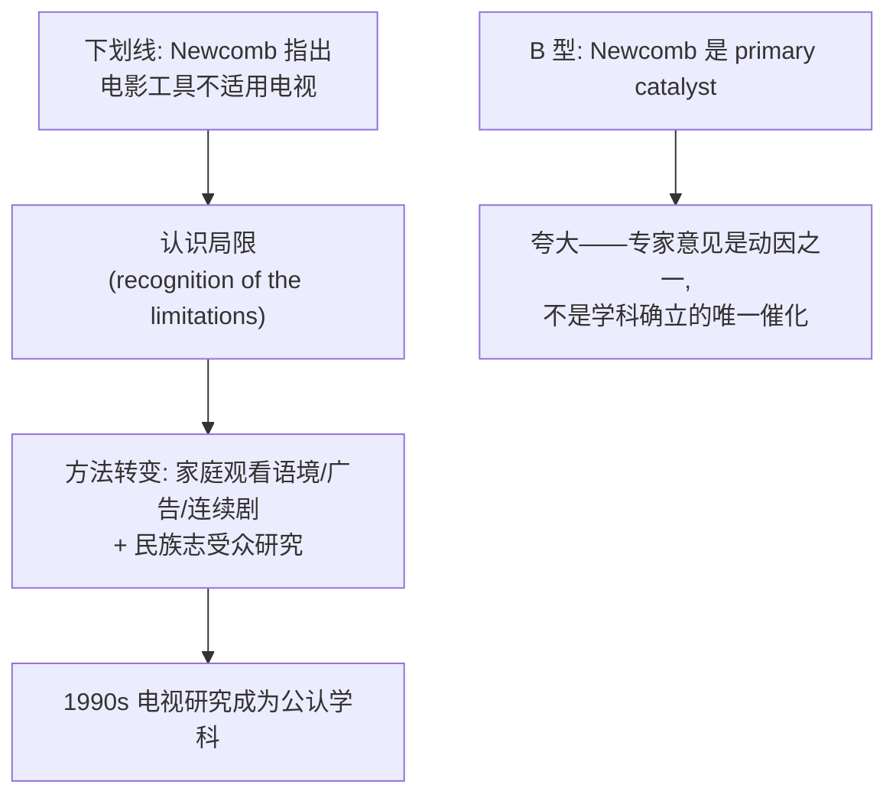
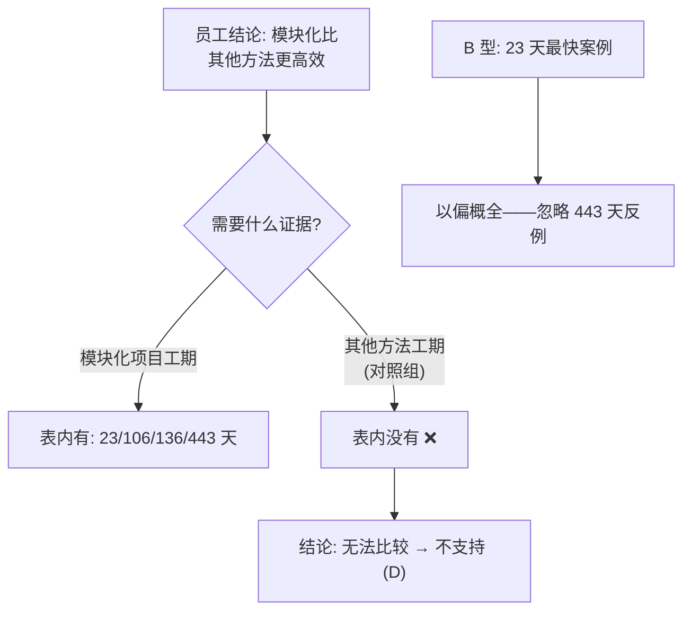
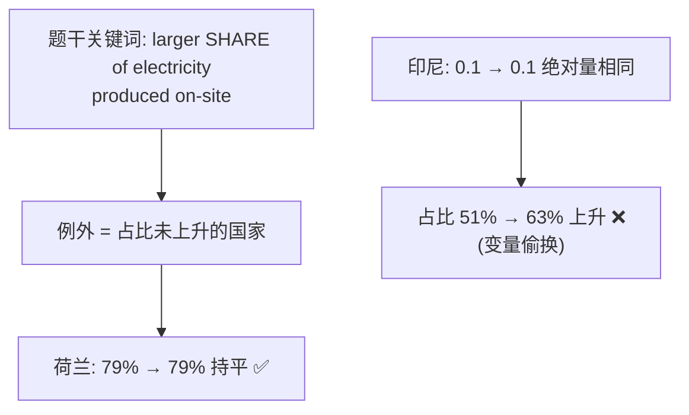
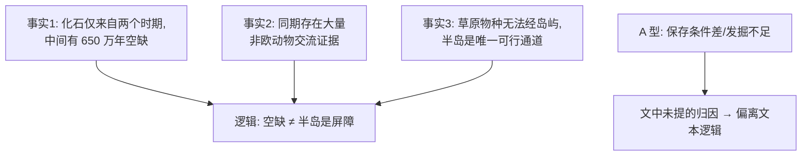
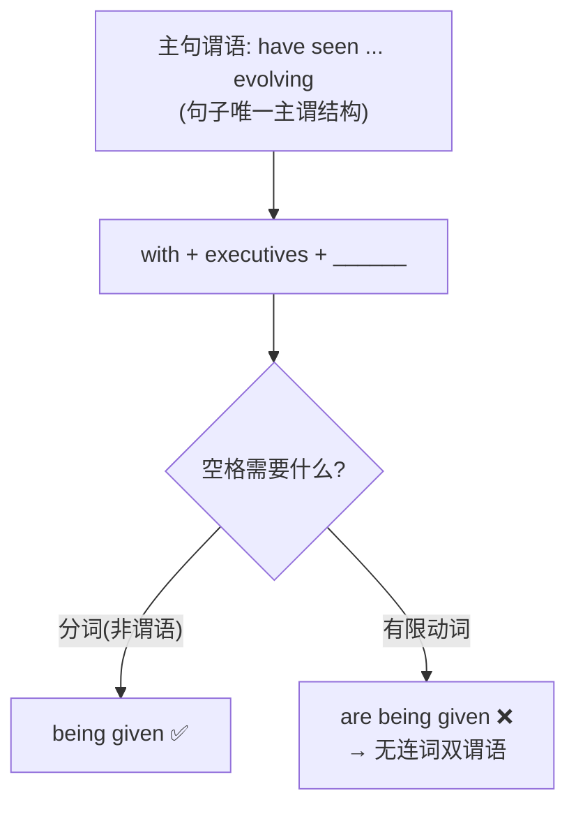
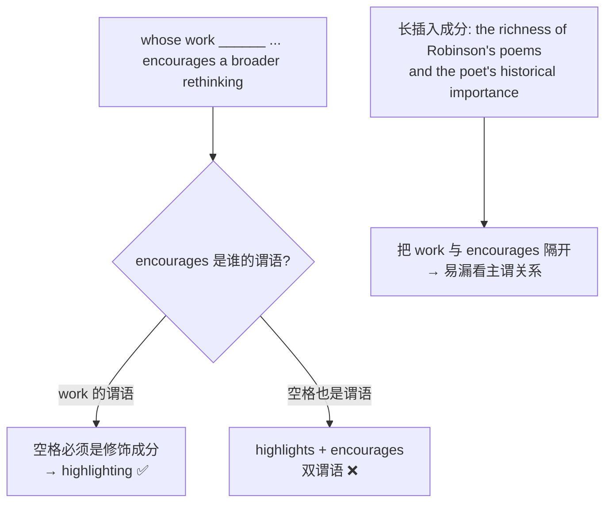
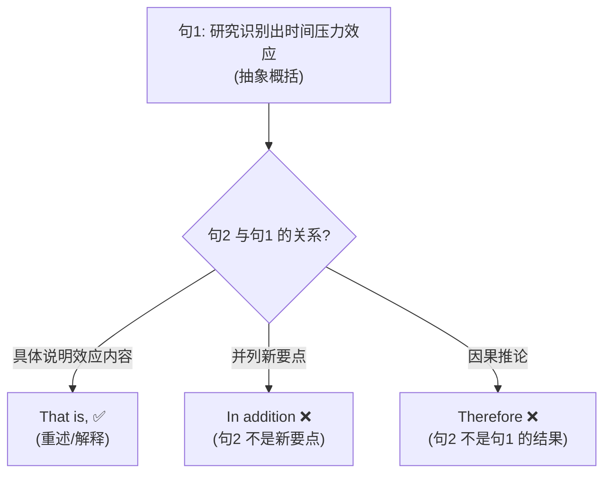
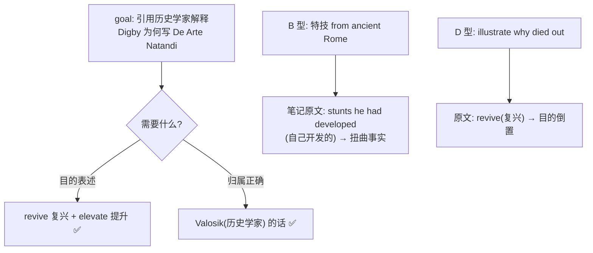
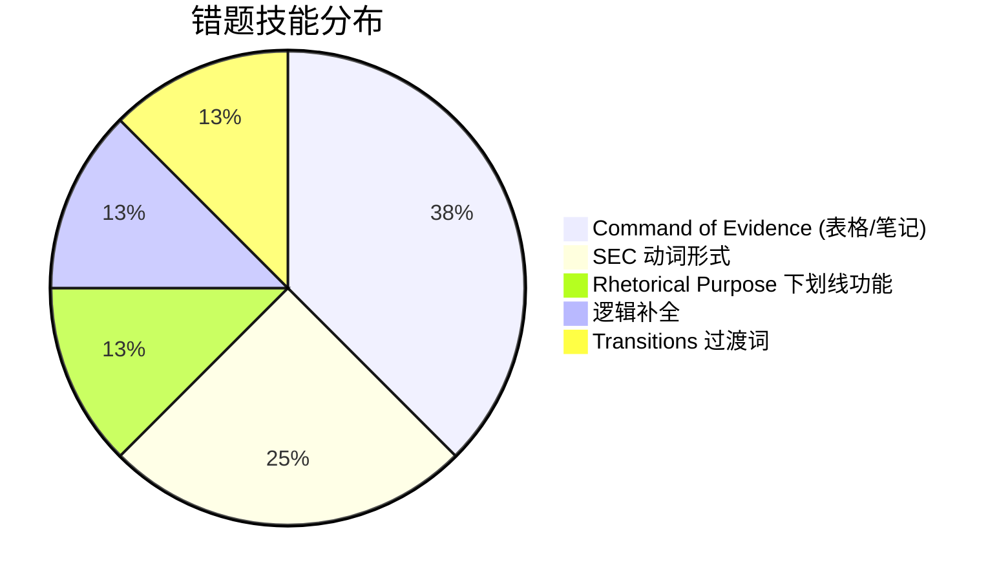

# SAT RW 2026年6月第1套 错题分析

> [!abstract] 试卷信息
> - **试卷**: 2026年6月第1套 SAT Reading & Writing（仅做 Module 2，27 分钟）
> - **来源**: `~/高一/英语/SAT/0811hw/26年6月SAT第一套阅读.pdf`
> - **本次错题**: 8 道（Module 2: Q5, Q11, Q12, Q15, Q16, Q20, Q25, Q27）
> - **薄弱技能**: Rhetorical Purpose（下划线功能）, Command of Evidence（表格数据/科学推理/笔记题）, 逻辑补全, Standard English Conventions（分词/独立主格）, Transitions（过渡词）
> - **备注**: 扫描版试卷，无官方 Question ID；M2 Q17/Q24 原卷缺题。答案键经 AI 三轮独立求解并与原卷答案页核对 52/52 一致。重判卷曾记 12 道错题（Q2, Q3, Q5, Q7, Q10, Q11, Q12, Q15, Q16, Q20, Q25, Q27），其中 **Q2/Q3/Q7/Q10 答题记录已订正为正确答案**，未收入本笔记，建议回 Bluebook 自行复查一遍。

---

> [!danger] 分析原则
> 详见 [[SAT Reading - Analysis Principles]]。

## 目录

- [[#1. Module 2 Q5 — 下划线功能题（Newcomb 专家意见）]]
- [[#2. Module 2 Q11 — 表格数据题（模块化施工）]]
- [[#3. Module 2 Q12 — 表格数据题（绿氢直接用电占比）]]
- [[#4. Module 2 Q15 — 逻辑补全（阿拉伯半岛化石缺口）]]
- [[#5. Module 2 Q16 — SEC 动词形式（with 独立主格）]]
- [[#6. Module 2 Q20 — SEC 动词形式（分词 vs 谓语）]]
- [[#7. Module 2 Q25 — 逻辑过渡词（That is 解释说明）]]
- [[#8. Module 2 Q27 — 笔记题（引文支持目的）]]

---

# 1. Module 2 Q5 — 下划线功能题（Newcomb 专家意见）

> [!info] 标记: `B` — 错误
> 正确答案: **C**

## 题干

Early television analysis in the 1970s and 1980s was shaped by film studies, though media scholar Horace Newcomb notes that tools borrowed from that field often proved inadequate when applied to TV. **<u>media scholar Horace Newcomb notes that tools borrowed from that field often proved inadequate when applied to TV</u>**（下划线部分）. A recognition of the limitations led researchers to approaches that accounted for a domestic viewing context, embedded advertisements, and serialized narratives, and to a shift in audience research toward ethnographic methods that emphasized viewer engagement. By the 1990s, television studies had emerged as a widely recognized academic field, with scholars founding dedicated journals.

Which choice best states the function of the underlined portion in the text as a whole?

- **A** It implies that the development of television studies as a discipline was slowed by scholars' early reluctance to accept that television and film have different characteristics.
- **B** It suggests that Newcomb's observations were the primary catalyst for the emergence of television studies as a formal academic field.
- **C** It introduces an expert opinion that establishes the impetus for a change in scholarly methods of studying television.
- **D** It questions the extent to which the methodologies of film studies informed methodologies in the emerging field of television studies.

## 选项分析

| 选项 | 内容 | 评价 |
|:---|:---|:---|
| **A** | 暗示电视研究学科发展因学者不愿承认影视差异而被拖延 | ❌ 文本从未说学科发展"被拖延"；且"学者不愿承认差异"无文本依据 |
| **B** ✏️ | Newcomb 的观察是电视研究成为正式学科的 **primary catalyst**（首要催化剂） | ❌ 程度夸大——下划线只是引入一位专家的观点；"学科最终确立"是后文的多因素结果，不是 Newcomb 一人之功 |
| **C** ✅ | 引入专家意见，为电视研究方法转变提供了动因（impetus） | ✅ 精确定位：下划线句提供"工具不适用"的专家判断 → 后文"对局限的认识"（recognition of the limitations）正是方法转变的动因 |
| **D** | 质疑电影研究方法论对电视研究的影响程度 | ❌ 下划线句不是"质疑"，而是直接陈述工具不适用；且 D 与后文"转向新方法"的推进方向不符 |

## 解题思路

### 考点：Rhetorical Purpose — 下划线句功能

### 推理过程

下划线句处于"背景（电影研究主导）→ **转折（工具不适用）** → 反应（方法转变）→ 结果（学科确立）"链条的转折点上。功能题答案必须回答"这句话在文中**做什么**"：它引入专家判断，为后文的方法转变提供**动因**。

### 为什么 C 正确

C 的 "introduces an expert opinion"（引入专家意见）精确描述了句子的动作；"establishes the impetus for a change in scholarly methods"（为方法转变确立动因）精确对应后文 "A recognition of the limitations led researchers to..."——下划线句正是那个"被认识到的局限"的来源。功能与后果完全对位。

### 为什么 B 错误（我的错选）

B 里 "primary catalyst"（首要催化剂）是程度夸大：下划线句只是说"工具常显不足"（often proved inadequate），是方法转变的**一个**动因；而"电视研究成为正式学科"（By the 1990s... emerged）是更宏观的结果，不能归因于 Newcomb 一个人的观察。功能题对"因果力度"敏感——原文是"促成"（contributed），选项说成"首要原因"（primary）就是过度断言。

> [!warning] 陷阱识别
> **程度夸大陷阱**：功能/目的题中，把"专家意见作为动因之一"偷换为"primary catalyst / 直接导致学科确立"的选项极具迷惑性。判断标准：原文的因果词（led to / recognition / emerged）是谁发出的？选项的因果主体和力度必须与原文一致。

## 解题策略

1. 先定位下划线句在"背景→转折→反应→结果"链条中的位置
2. 用一句话说出下划线句的动作（引入/质疑/支持/对比…）
3. 检查选项的因果力度：原文 led to ≠ 选项 primary catalyst
4. 验证后果指向：下划线句的"结果"是否与后文实际描述一致（方法转变，而非学科确立本身）

---

# 2. Module 2 Q11 — 表格数据题（模块化施工）

> [!info] 标记: `B` — 错误
> 正确答案: **D**

## 题干

The rapid completion of the Specialty Granules Field Office, a modular structure (a structure built in pieces elsewhere and assembled on site) located in the United States, led an employee at another company to collect data on other facilities built using modular construction methods. The employee concluded that modular construction is more efficient than other construction methods.

| Retail facilities | Construction company | Days to complete construction | Location |
|:---|:---|:---|:---|
| Constitutional Hill Coffee Shop | Modular Site Solutions | 23 | Johannesburg, South Africa |
| Harrison Street Oasis | UrbanBloc | 106 | California, USA |
| Sundance Ridge Sales Center | WillScot | 136 | Kansas, USA |
| St. Regis Residences—Rye | Cassone Leasing | 443 | New York, USA |

Based on the text and the table, is the employee's conclusion supported?

- **A** No, because the data in the table show that modular construction projects vary considerably in their number of construction days
- **B** Yes, because the Constitutional Hill Coffee Shop was completed in only 23 days
- **C** Yes, because even the project with the longest construction time shown in the table was completed more quickly than it would have been if a different method had been used
- **D** No, because not enough information has been provided to allow a comparison of different construction methods' efficiency

## 选项分析

| 选项 | 内容 | 评价 |
|:---|:---|:---|
| **A** | 否：表中模块化项目工期差异很大 | ❌ 数据确实差异大，但这本身不构成"结论不成立"的理由——结论是"比其他方法更高效"，与模块化项目之间的差异无关 |
| **B** ✏️ | 是：因为 Constitutional Hill 只用了 23 天 | ❌ **以偏概全**——用单个最快案例（23 天）证明"模块化更高效"，但 443 天的反例同样在表中；单点数据无法支撑一般性结论 |
| **C** | 是：最慢的项目也比其他方法快 | ❌ 表格根本没有"其他方法"的对照数据，"比不同方法更快"无从判断 |
| **D** ✅ | 否：没有足够信息比较不同施工方法的效率 | ✅ 结论是**比较性**的（modular vs other methods），但表格只有模块化项目（23/106/136/443 天），缺对照组 → 无法支持 |

## 解题思路

### 考点：Command of Evidence — 科学推理（数据支持结论）

### 推理过程

这类题的核心：**结论需要什么数据，表格给没给**。员工结论是比较句（A 比 B 高效），比较就必须有 B 方的数据。

### 为什么 D 正确

D 直接指出证据缺口：表内全是模块化项目（且彼此工期差异巨大：23~443 天），没有任何非模块化项目的对照数据。"not enough information... to allow a comparison" 精确对应题干结论的比较结构。

### 为什么 B 错误（我的错选）

B 抓住表中最亮眼的数字（23 天）就下结论"是"，犯了**以偏概全**：同一张表里还有 443 天的 St. Regis Residences，如果模块化"一定"更高效，为何自身差异如此之大？单点数据（尤其最有利的点）不能支持一般性结论。同时 B 忽略了结论的**比较对象**——没有其他方法的数据，任何"更快"的说法都无锚点。

> [!warning] 陷阱识别
> **单点 cherry-pick 陷阱**：数据题中最常见的错误选项 = 用表格里的"最好看的单个数字"直接支持结论。正确做法：① 先看结论是描述性还是比较性；② 比较性结论必须有对照组数据；③ 检查选项是否忽略反例（如 443 天）。

## 解题策略

1. 把结论改写成"需要什么证据"的问句（比较 → 需要双方数据）
2. 检查表格是否包含对照组——缺对照组 = 结论无法支持
3. 警惕用单个数据点（尤其最有利的点）下结论的选项
4. 注意反例：结论若要成立，表内不应存在明显矛盾的数据

---

# 3. Module 2 Q12 — 表格数据题（绿氢直接用电占比）

> [!info] 标记: `D` — 错误
> 正确答案: **B**

## 题干

In 2020, most hydrogen was produced through steam methane reforming, which emits carbon gases. Using electricity from renewable sources to produce green hydrogen sourced from water would enable countries to reduce industrial carbon emissions, but doing so depends on countries' capacity for direct-use electricity (electricity produced and used at the same facility). Researchers estimated the amount of electricity needed in 2020 if green hydrogen had been adopted and the amount needed to meet projected green hydrogen demand in 2050. Comparison between these estimates and estimates of capacity suggests that in most countries, projected green hydrogen production would require a larger share of electricity produced on-site. One exception is ______.

| Country | Electricity 2020 | % 2020 | Electricity 2050 | % 2050 |
|:---|:---:|:---:|:---:|:---:|
| Indonesia | 0.1 | 51 | 0.1 | 63 |
| Netherlands | 0.6 | 79 | 0.8 | 79 |
| South Africa | 0.0 | 9 | 0.3 | 30 |
| Taiwan | 0.0 | 1 | 0.5 | 17 |

*Note: Estimated electricity for green hydrogen production data are rounded to the first decimal place (kilowatts per capita).*

Which choice most effectively uses data from the table to complete the statement?

- **A** Taiwan, since the percentage of direct-use electricity needed to produce green hydrogen there in 2050 is the lowest of the countries listed.
- **B** the Netherlands, since the percentage of direct-use electricity needed to produce green hydrogen in 2050 is expected to be the same as it was in 2020.
- **C** South Africa, since the estimated electricity needed for green hydrogen production in 2050 is expected to be lower there than in any other country listed.
- **D** Indonesia, since the estimated electricity needed for green hydrogen production in 2050 is expected to be the same as it was in 2020.

## 选项分析

| 选项 | 内容 | 评价 |
|:---|:---|:---|
| **A** | 台湾：2050 年直接用电占比最低 | ❌ 台湾 2050 占比 17% 确实最低，但"最低"不是"例外"——题目要的是**占比不上升**的国家，台湾 1%→17% 是大幅上升 |
| **B** ✅ | 荷兰：2050 年直接用电占比与 2020 年相同 | ✅ 题干"多数国家占比上升，一个例外"→ 例外 = 占比未升的国家；荷兰 79% → 79% 持平，唯一例外 |
| **C** | 南非：2050 年所需电量比其他国家都低 | ❌ 变量错误——南非 0.3 并非最低（印尼 0.1 更低）；且题目问的是占比变化，不是绝对电量 |
| **D** ✏️ | 印尼：2050 年所需电量与 2020 年相同 | ❌ **变量偷换**——印尼绝对电量 0.1 = 0.1 确实相同，但题干说的是"share of electricity produced on-site"（**占比**）；印尼占比 51%→63% 在上升，不是例外 |

## 解题思路

### 考点：Command of Evidence — 定量数据（表格补全）

### 推理过程

关键在读题：题干说 "require a **larger share** of electricity produced on-site"——比较的是**占比（%）**，不是绝对电量（kWh per capita）。例外 = 2050 占比不高于 2020 占比的国家。

### 为什么 B 正确

荷兰是唯一 2050 占比（79%）与 2020 占比（79%）相同的国家，即唯一不需要更大占比的例外。B 完整复述了这个数据关系，且用了与题干一致的变量（percentage of direct-use electricity）。

### 为什么 D 错误（我的错选）

D 与 B 结构对称，但偷换了变量：印尼的**绝对电量**（0.1 → 0.1 kW/capita）持平，但**占比**（51% → 63%）在上升——按题干的"占比"标准，印尼恰恰是"非例外"的典型。错选 D 说明只盯着数字相同的表面（0.1=0.1），没有核对表格的**列名**与题干的核心变量。

> [!warning] 陷阱识别
> **变量偷换陷阱**：表格题的干扰项常把"绝对量相同/最低"包装成与"占比变化"同构的表述。对策：① 圈出题干的核心变量（share / percentage / total…）；② 逐列核对选项引用的数字属于哪一列；③ 用题干变量重述选项，看是否成立（"印尼占比是否持平？"→ 否）。

## 解题策略

1. 圈出题干关键词：比较的是哪个变量（占比 vs 绝对量）
2. 明确"例外"的定义（本题 = 占比未上升）
3. 逐列扫描表格，找出满足"例外"条件的行（荷兰 79=79）
4. 反向验证干扰项：它引用的数字是否属于题干变量所在列（印尼 0.1=0.1 是绝对量列）

---

# 4. Module 2 Q15 — 逻辑补全（阿拉伯半岛化石缺口）

> [!info] 标记: `A` — 错误
> 正确答案: **D**

## 题干

Animal fossils from the Arabian Peninsula come primarily from two time periods and locations: a late Miocene (7.0-7.7 million years ago) site in the Baynunah Formation and a Pleistocene (12,000-500,000 years ago) site in the Nefud Desert. The 6.5-million-year gap between these fossil assemblages occurs in the context of considerable evidence of concurrent African-Eurasian faunal exchange. While limited exchange may have occurred via island hopping across the 5.3-million-year-old Mediterranean Sea, many of the species that moved between the continents were adapted to grasslands that could not have existed in sufficient size on Mediterranean islands, leaving only the Peninsula as a viable exchange route, a fact suggesting that ______.

Which choice most logically completes the text?

- **A** the gap in the fossil record between 7.0 million years ago and 500,000 years ago could be reflective of poor preservation conditions in the Arabian Peninsula at that time, inadequate fossil recovery efforts, or both.
- **B** even though grasslands likely flourished on the Arabian Peninsula between 7.0 million years ago and 500,000 years ago, the Peninsula was not the only route by which grassland-adapted animals traveled between Africa and Eurasia.
- **C** conditions in the Arabian Peninsula were likely more conducive to fossilization before 7.7 million years ago and after 500,000 years ago than they were in the intervening period.
- **D** the absence of any evidence for African-Eurasian faunal exchange between 7.7 million years ago and 500,000 years ago should not be taken as evidence that the Arabian Peninsula formed a barrier to such exchange.

## 选项分析

| 选项 | 内容 | 评价 |
|:---|:---|:---|
| **A** ✏️ | 化石缺口可能反映保存条件差、发掘不足或两者兼有 | ❌ **无关归因**——文本逻辑链是"交换存在 + 半岛是唯一通道 → 缺口不该视为屏障"；A 转向文中从未提及的"保存条件/发掘努力"，是凭空引入的新解释 |
| **B** | 即便草原在半岛繁盛，半岛也不是唯一通道 | ❌ 与文本直接矛盾——原文明确"leaving only the Peninsula as a viable exchange route"（半岛是唯一可行通道） |
| **C** | 7.7 Ma 之前和 500 ka 之后的条件更利于化石形成 | ❌ 无文本依据——文本没有比较不同时期的化石形成条件 |
| **D** ✅ | 7.7 Ma–500 ka 之间缺乏交流证据，不应视为半岛构成屏障的证据 | ✅ 完整承接逻辑链：有交流证据 + 半岛唯一通道 → 中间 650 万年的化石空白**恰恰说明**空白不等于屏障（absence of evidence ≠ evidence of absence） |

## 解题思路

### 考点：逻辑补全 — 科学推理（化石证据缺口）

### 推理过程

逻辑补全题的答案必须**紧跟前文给出的理由**，不能引入新原因。前文三个事实全部指向同一结论：交流在发生、通道只有半岛，那么"半岛没有交流化石"只能说明化石记录不完整——而非半岛阻隔了交流。

### 为什么 D 正确

D 用 "absence of any evidence... should not be taken as evidence that the Peninsula formed a barrier" 完整概括了"证据缺口 ≠ 屏障"的推理，且与题干 "a fact suggesting that ___" 的预期结论严丝合缝——前文的"事实"（exchange + only route）直接支持的就是 D。

### 为什么 A 错误（我的错选）

A 看上去在"解释缺口成因"（保存条件、发掘不足），听起来合理，但：① 这些原因在文中**从未出现**——逻辑补全只能使用文本给出的信息；② A 把论证方向从"缺口不能证明什么"（D）偷换成"缺口可能由什么造成"（A）。两句话都在谈缺口，但 A 是对缺口的新解释，D 是对缺口**逻辑含义**的收束——题目要的是后者。

> [!warning] 陷阱识别
> **无关归因陷阱**：逻辑补全题中，"貌似合理的背景解释"（保存条件/气候/人为因素）若是文中未提及的，就是干扰项。铁律：空格只能由前文的因果链推出，任何引入新信息源的选项先怀疑。

## 解题策略

1. 把前文拆成事实清单（化石分布 / 交流证据 / 通道唯一性）
2. 找出三个事实共同指向的结论（缺口 ≠ 屏障）
3. 检查选项是否引入文中未提及的信息（A 的保存条件/发掘）→ 排除
4. 用"因此"把选项接回原文读一遍，语感通顺且不引入新前提的才是答案

---

# 5. Module 2 Q16 — SEC 动词形式（with 独立主格）

> [!info] 标记: `D` — 错误
> 正确答案: **C**

## 题干

According to Roxana Silbert, former artistic director of Hampstead Theatre, the past five decades have seen UK theater companies—once operated as artist cooperatives like the Royal Exchange (with its five founding artistic directors)—evolving toward increasingly corporate structures, with executives rather than creatives ______ decision-making power over programming.

Which choice completes the text so that it conforms to the conventions of Standard English?

- **A** have been given
- **B** been given
- **C** being given
- **D** are being given

## 选项分析

| 选项 | 内容 | 评价 |
|:---|:---|:---|
| **A** | have been given | ❌ 有限动词（现在完成时）——with 结构内不能出现谓语，且与主句时态体系冲突 |
| **B** | been given | ❌ 缺助动词的裸过去分词——不构成合法的 with 结构 |
| **C** ✅ | being given | ✅ with + 名词（executives）+ 现在分词（being given）构成**独立主格**（absolute construction），作伴随状语修饰主句 |
| **D** ✏️ | are being given | ❌ 有限动词（现在进行时被动）——在 with 之后形成第二个谓语，与主句 "have seen... evolving" 构成无连词的双谓语错误 |

## 解题思路

### 考点：Standard English Conventions — 独立主格（with + 名词 + 分词）

### 推理过程

"with + 名词 + 分词"是 SAT 常考的**独立主格**结构：with 之后不能放有限动词（am/is/are/has/have 类），只能放分词/介词短语等非谓语成分。全句已有主谓（companies have seen... evolving），空格若再放谓语即成病句。

### 为什么 C 正确

C "with executives rather than creatives being given decision-making power" = with + 名词短语 + 现在分词被动式，构成合法的独立主格，作主句的伴随状语（描述公司结构演变的伴随状态）。句子完整、单主谓、语法正确。

### 为什么 D 错误（我的错选）

D "are being given" 是完整的有限动词短语（现在进行时被动）。放进句中后，"the past five decades have seen UK theater companies... evolving..." 与 "with executives are being given..." 形成**双谓语**——with 结构内的成分必须是非谓语。错选 D 说明对"with + 名词后只能接分词"这一结构不熟，被 "are being given" 的完整被动语态"语感正确"所吸引，忽略了它制造了第二个谓语。

> [!warning] 陷阱识别
> **双谓语陷阱（with 结构）**：见到 "with + 名词 + 空格"，空格处**绝不可能是**有限动词（am/is/are/was/were/has/have 开头）。同理可推广：介词后（with/without/despite 等）的动词一律非谓语化。

## 解题策略

1. 先找主句的主谓（have seen... evolving），确认句子已有谓语
2. 空格前的结构词（with/without/despite）决定后面只能是非谓语
3. 在 A–D 中先淘汰所有"有限动词"选项（have been given / are being given）
4. 剩余选项中选结构合法的分词形式（being given）

---

# 6. Module 2 Q20 — SEC 动词形式（分词 vs 谓语）

> [!info] 标记: `A` — 错误
> 正确答案: **C**

## 题干

In recent years, the English writer Mary Robinson (1758-1800), whose poetry was widely read during her lifetime, has been rediscovered by contemporary audiences—a resurgence of interest that is largely due to literary scholars such as Anne Janowitz, whose work ______ the richness of Robinson's poems and the poet's historical importance to the Romantic literary movement encourages a broader rethinking of British Romanticism itself.

Which choice completes the text so that it conforms to the conventions of Standard English?

- **A** highlights
- **B** has highlighted
- **C** highlighting
- **D** is highlighting

## 选项分析

| 选项 | 内容 | 评价 |
|:---|:---|:---|
| **A** ✏️ | highlights | ❌ 有限动词（一般现在时第三人称单数）——与后面的 encourages 形成**双谓语**：whose work highlights... encourages... |
| **B** | has highlighted | ❌ 有限动词（现在完成时）——同样制造双谓语，且时态与句子框架不匹配 |
| **C** ✅ | highlighting | ✅ 分词短语作定语修饰 work：whose work **highlighting** the richness... and the importance... **encourages** a broader rethinking——encourages 才是关系从句的谓语 |
| **D** | is highlighting | ❌ 有限动词（现在进行时）——双谓语错误 |

## 解题思路

### 考点：Standard English Conventions — 分词短语 vs 谓语动词

### 推理过程

句子骨架：... scholars such as Anne Janowitz, **whose work** ______ the richness... and the importance... **encourages** a broader rethinking. 关系从句主语是 work，谓语是 encourages（被长宾语成分隔开）。空格只能是修饰 work 的分词。

### 为什么 C 正确

C "whose work highlighting the richness... and the historical importance... encourages a broader rethinking" 结构完整：highlighting 短语作 work 的后置定语，encourages 作关系从句谓语。长句的"主语（work）+ 定语（highlighting...）+ 谓语（encourages）"正是 SAT 高频考法。

### 为什么 A 错误（我的错选）

A "highlights" 与后文 "encourages" 构成**两个并列谓语**却无连词（and 连接的是 the richness... and the historical importance，不是两个谓语）→ 双谓语病句。错选 A 说明被 "whose work highlights..." 的局部语感带跑，没有看到句子末尾的 encourages 才是真正谓语——长插入成分（the richness of Robinson's poems and the poet's historical importance）把 work 和 encourages 隔开，是本题设计的"视线陷阱"。

> [!warning] 陷阱识别
> **长句双谓语陷阱**：当句子包含长宾语/插入成分时，先找全句（或从句）真正的谓语，再判断空格该填谓语还是分词。标志词：空格后远处还有一个明显的谓语动词（encourages）→ 空格大概率是分词。

## 解题策略

1. 通读全句，先圈出主句/从句的谓语动词（has been rediscovered / encourages）
2. 若空格前后已各有谓语，空格处只能是分词/介词短语等修饰成分
3. 留意"主语 + 长修饰语 + 谓语"结构——谓语常被宾语成分隔开
4. 把选中的形式代入，画出句子主干验证单谓语

---

# 7. Module 2 Q25 — 逻辑过渡词（That is 解释说明）

> [!info] 标记: `B` — 错误
> 正确答案: **A**

## 题干

In a 2003 study, Hall and Fransson identified a distinct time-pressure effect on avian molting behaviors in lesser whitethroats, with potential implications for migration fitness. ______ the researchers observed that birds exposed to shifted daylight patterns suggesting a more imminent departure molted quicker and grew shorter wing feathers than did the controls, likely resulting in decreased migration speeds.

Which choice completes the text with the most logical transition?

- **A** That is,
- **B** In addition,
- **C** Granted,
- **D** Therefore,

## 选项分析

| 选项 | 内容 | 评价 |
|:---|:---|:---|
| **A** ✅ | That is, | ✅ 前句提出抽象判断（identified a distinct time-pressure effect），后句用具体观察**解释/重述**该效应是什么 → 解释说明关系 |
| **B** ✏️ | In addition, | ❌ 后句不是"额外的另一件事"，而是对前句所提效应的**具体展开**——Addition 需要两个并列的独立要点 |
| **C** | Granted, | ❌ Granted 引出"承认/让步"（虽然后句确实如此…），后文没有转折回应 |
| **D** | Therefore, | ❌ Therefore 表示因果推论（因为 A 所以 B）——但观察结果不是从前句"推出"的，前句本身就是"发现了这个效应"的概括，后句是它的内容 |

## 解题思路

### 考点：Transitions — 逻辑过渡词（解释说明）

### 推理过程

判断过渡词的唯一方法：弄清**两句之间的真实关系**。句1 说"识别出一个效应"，句2 说"研究人员观察到……"——句2 就是在具体化句1 提到的效应（到底发生了什么），这是典型的**解释/重述**（That is / In other words）。

### 为什么 A 正确

A "That is," 的功能 = "换句话说，具体来说"。前句的抽象主张（a distinct time-pressure effect）由后句的具体观察（molted quicker, grew shorter wing feathers）展开说明，正是 That is 的经典用法。

### 为什么 B 错误（我的错选）

B "In addition," 要求后句是与前句**并列的独立信息**。但后句并非独立要点，而是前句"效应"的展开内容——两者是同一信息的不同粒度，不是两个并列点。错选 B 说明只看"前后都有内容"就当作并列，没有判断**内容层级**（概括 vs 具体展开）。

> [!warning] 陷阱识别
> **概括-展开误判为并列**：前句给抽象结论、后句给具体细节时，常被误选 In addition / Furthermore。区分标准：把后句替换为"例如/具体来说"是否通顺？通顺 → That is 型（解释），不通顺 → 再看并列/因果/让步。

## 解题策略

1. 分别用一句话概括前句与后句的核心内容
2. 判断关系：解释（That is）/ 并列（In addition）/ 因果（Therefore）/ 让步（Granted）
3. 特征词法：前句出现 identified/concluded/claimed 等抽象动词，后句给观察/数据 → 解释说明
4. 代入验证：用"换句话说/具体来说"替换该过渡词读一遍，通顺即对

---

# 8. Module 2 Q27 — 笔记题（引文支持目的）

> [!info] 标记: `B` — 错误
> 正确答案: **C**

## 题干

While researching a topic, a student has taken the following notes:

- Swimming was celebrated in ancient Rome but fell out of favor throughout Europe's Dark Ages.
- English theologian Everard Digby wrote the first modern swimming manual, *De Arte Natandi*, in 1587.
- Digby's manual described and illustrated a variety of aquatic stunts that he had developed (e.g., "ringing the bells," "the leap of the goat").
- Historian Vicki Valosik claims, "In providing instructions for these aquatic 'refinements,' Digby hoped to revive swimming—a once revered skill that had all but died out during Europe's Dark Ages—and elevate it from a crude, mechanical function of the hands and feet to an artful science."

The student wants to cite a historian to explain why Digby wrote *De Arte Natandi*. Which choice most effectively uses relevant information from the notes to accomplish this goal?

- **A** In *De Arte Natandi*, Digby wrote that he "hoped to... elevate [swimming] from a crude, mechanical function of the hands and feet" by "providing instructions for... aquatic 'refinements.'"
- **B** According to Valosik, Digby wrote *De Arte Natandi* to describe and illustrate "once revered" aquatic stunts from ancient Rome, such as "ringing the bells" and "the leap of the goat"
- **C** Valosik claims that, by writing *De Arte Natandi*, "Digby hoped to revive swimming... and elevate it from a crude, mechanical function... to an artful science."
- **D** As Valosik claims, with *De Arte Natandi*, Digby developed the first modern swimming manual in order to illustrate why "a once revered skill... had all but died out during Europe's Dark Ages."

## 选项分析

| 选项 | 内容 | 评价 |
|:---|:---|:---|
| **A** | 引用 Digby 本人"希望把游泳提升为艺术科学" | ❌ 引文归属错误——"hoped to... elevate" 是 **Valosik 对 Digby 的论断**，不是 Digby 自己写的；且题干要求 cite a **historian** |
| **B** ✏️ | 据 Valosik，Digby 写此书是为了描述并图解"古罗马时代备受推崇的"水上特技 | ❌ **目的错位 + 事实扭曲**——特技是 Digby **自己开发的**（stunts that he had developed），不是"from ancient Rome"；且"描述图解特技"不是 Valosik 给出的写作目的（目的是复兴+提升） |
| **C** ✅ | Valosik 声称，写《论游泳技艺》时 Digby 希望复兴游泳并将其从粗陋机械技能提升为艺术科学 | ✅ 直接回答"why"：目的 = revive + elevate；引用出自历史学家 Valosik；引文与笔记原文一致 |
| **D** | 据 Valosik，Digby 写此书是为了说明游泳为何在黑暗时代消亡 | ❌ **目的倒置**——Valosik 说的是 Digby 想**复兴**游泳（revive），不是"illustrate why... had died out"（说明为何消亡） |

## 解题思路

### 考点：Command of Evidence — 笔记题（引文支持目的）

### 推理过程

笔记题的黄金法则：**goal 动词决定答案形态**。goal = explain **why** Digby wrote → 答案必须包含"写作目的"（revive + elevate），且必须是历史学家 Valosik 的话。

### 为什么 C 正确

C 三要素齐全：① 归属（Valosik claims）；② 目的（hoped to revive swimming... and elevate it... to an artful science——直接回答 why）；③ 与笔记原文一致（未篡改引文）。是唯一完整达成 goal 的选项。

### 为什么 B 错误（我的错选）

B 有双重问题：① **目的错位**——"to describe and illustrate stunts" 是笔记里 Digby 书的内容描述，不是 Valosik 给出的写作目的；② **事实扭曲**——笔记明确说特技是 Digby "that he had developed"（自己开发的），B 却说 "from ancient Rome"（源自古罗马），把笔记信息改错了。错选 B 说明被 "According to Valosik" 的归属正确性迷惑，没有核对目的与笔记细节。

> [!warning] 陷阱识别
> **笔记题三查**：查归属（引文是否出自目标身份）、查目的（是否匹配 goal 动词）、查细节（是否与笔记原文一致）。B 型干扰项 = 归属对、目的偏、细节错；D 型 = 目的倒置。复述笔记"内容"（describe/illustrate）的选项几乎总不是"目的"题的答案。

## 解题策略

1. 读 goal 动词，确定答案必须包含什么（explain why → 目的表述）
2. 核对引文归属：历史学家的话 vs 作者自己的话（A 型排除）
3. 核对目的方向：revive（复兴）≠ illustrate why died out（说明消亡）
4. 核对细节：stunts that he had developed ≠ from ancient Rome
5. 三者都通过才选；只满足归属的选项（B）不选

---

## 总结：薄弱技能分布

| # | 题目 | 模块 | 技能类别 | 学生错误类型 | 优先级 |
|:---|:---|:---:|:---|:---|:---:|
| 1 | Q5 Newcomb 电视研究 | Mod2 | Rhetorical Purpose — 下划线功能 | 因果力度夸大（primary catalyst，选 B） | ⭐⭐⭐ |
| 2 | Q11 模块化施工 | Mod2 | Command of Evidence — 表格数据 | 单点 cherry-pick 以偏概全（选 B） | ⭐⭐⭐⭐ |
| 3 | Q12 绿氢占比 | Mod2 | Command of Evidence — 表格数据 | 变量偷换：绝对量当占比（选 D） | ⭐⭐⭐⭐ |
| 4 | Q15 半岛化石 | Mod2 | 逻辑补全 — 科学推理 | 无关归因：引入未提及的保存/发掘原因（选 A） | ⭐⭐⭐⭐ |
| 5 | Q16 独立主格 | Mod2 | SEC — 动词形式 | with 结构内放有限动词 → 双谓语（选 D） | ⭐⭐⭐ |
| 6 | Q20 Robinson 分词 | Mod2 | SEC — 动词形式 | 长插入语遮蔽 → 双谓语（选 A） | ⭐⭐⭐ |
| 7 | Q25 换羽时间压力 | Mod2 | Transitions — 过渡词 | 概括-展开误判为并列（选 B） | ⭐⭐⭐ |
| 8 | Q27 Valosik 笔记 | Mod2 | Command of Evidence — 笔记题 | 归属对但目的错位 + 细节扭曲（选 B） | ⭐⭐⭐⭐ |

### 技能分布汇总

### 行动建议

1. **表格数据题（Q11, Q12）** — 两大铁律：① 结论是比较性就必须有对照组，缺对照 = 不支持；② 先圈题干变量（占比 vs 绝对量），选项引用的数字必须属于该变量所在列。警惕"最亮眼的单点数字"与"数字相同但变量不同"两类干扰。

2. **SEC 动词形式（Q16, Q20）** — 同一陷阱的两种变体：空格前有 with（独立主格，只能接分词）或空格后远处已有谓语（encourages）。做题先找全句唯一谓语，再决定空格填谓语还是分词；"双谓语"是最常见的 SEC 结构错误。

3. **逻辑补全（Q15）** — 空格只能由前文因果链推出；选项引入文中未提及的原因（保存条件/发掘不足）一律排除；"证据缺口 ≠ 屏障"型收束（absence of evidence ≠ evidence of absence）是高频正确形态。

4. **过渡词（Q25）** — 判断两句是解释/并列/因果/让步：前句抽象结论 + 后句具体观察 = That is（解释），不是 In addition（并列）。可用"换句话说"代入验证。

5. **笔记题（Q27）** — 三查流程：查归属（历史学家 vs 作者）、查目的（匹配 goal 动词）、查细节（与笔记逐字一致）。"According to 正确身份 + 目的/细节错误"是最高频干扰组合。

6. **下划线功能（Q5）** — 功能题答案必须落在"这句话在文中做什么"（引入/质疑/对比），并核对因果力度：原文 led to ≠ 选项 primary catalyst。

---

## 待创建的相关笔记

- [[SAT Reading - Command of Evidence 表格数据题]]
- [[SAT Reading - 逻辑补全与论证类型]]
- [[SAT Grammar - 分词与独立主格]]
- [[SAT Grammar - 逻辑过渡词]]
- [[SAT Reading - 笔记题 goal 动词匹配]]
