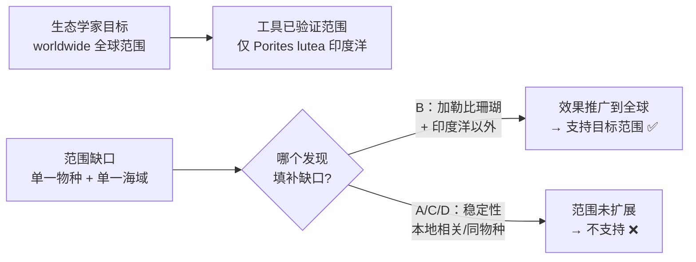

# SAT RW 2026年6月第2套 错题积累

> [!abstract] 试卷信息
> - **试卷**: 2026年6月 SAT Reading & Writing 第二套（Module 1 + Module 2）
> - **来源**: `~/高一/英语/SAT/0813hw/2026-06-02/2026-June-2-answers.md`
> - **当前积累**: 1 题（Module 2: Q13）
> - **薄弱技能**: Command of Evidence（Scientific Reasoning — 范围匹配 / 实验范围 vs 目标范围）
> - **备注**: 本地 LaTeX 源（练习批注版 + 标准答案与解析）；扫描版试卷，无官方 Question ID

---

> [!danger] 分析原则
> 详见 [[SAT Reading - Analysis Principles]]。

## 目录

- [[#1. Module 2 Q13 — 证据支持题（范围匹配 / 实验范围 vs 目标范围）]]

---

# 1. Module 2 Q13 — 证据支持题（范围匹配 / 实验范围 vs 目标范围）

> [!info] 我的答案: 未作答
> 正确答案: **B**

## 题干

Orbicella faveolata, a Caribbean coral with a boulder-like shape, and Porites lutea, a coral from the Indian Ocean with branching clusters, are both stony corals---the type that builds reefs. Increasing stony coral colonies worldwide is a key objective for ecologists, since land-based runoff and other pressures are causing growing harm to reefs. In the wild, crustose coralline algae (CCA) promote growth in the healthy reefs they inhabit by releasing lipids and other metabolites---chemical cues that trigger coral larvae settlement. Biotechnology researcher Lina Haddad and team have developed a tool to restore those cues in damaged reefs: a gel coating infused with metabolites derived from Indian Ocean CCA. In tests with Porites lutea, an Indian Ocean stony coral, settlement rates rose substantially.

Which finding, if true, would best support a claim that the new tool already has the capacity to support the scope of the ecologists' objective?

- **A.** The lipids and other metabolites derived from Indian Ocean CCA seem to remain stable for long periods under a variety of water temperatures and environmental conditions.
- **B.** Exposure to lipids and other metabolites released by CCA from Indian Ocean reefs improves settlement rates for larvae of Orbicella faveolata and a variety of other coral species in regions outside the Indian Ocean.
- **C.** In Indian Ocean reefs, higher concentrations of lipids and other metabolites released by local CCA are linked to larger colonies of Porites lutea and greater overall diversity of coral species.
- **D.** When CCA are present and releasing lipids and other metabolites, larvae settlement rates improve nearly as much in damaged reefs with Porites lutea as they do in healthy reefs containing that coral.

## 考点

**Command of Evidence — Scientific Reasoning（实验/证据支持题）· 范围匹配子类（scope matching）**

题干埋下一组**范围差**：生态学家的目标是 **worldwide（全球范围）**，而工具目前只在**单一印度洋物种（Porites lutea）**上验证有效。要证明"工具已具备支持**目标范围**的能力"，最直接的证据必须把效果推广到目标范围之外——即**跨物种 / 跨地区**的发现。范围不扩展的选项，无论多"支持工具有用"，都不支撑"支持全球目标"。

## 选项分析

| 选项 | 内容 | 评价 |
|:---|:---|:---|
| **A** | 印度洋 CCA 代谢物在多种水温/环境条件下长期稳定 | ❌ **性质 ≠ 效果**：说的是工具稳定性/耐久性，与"能促进哪些珊瑚定居"无关，更未扩展范围 |
| **B** ✅ | 印度洋 CCA 代谢物能提高 **Orbicella faveolata（加勒比珊瑚）** 及印度洋以外多种其他珊瑚的定居率 | ✅ **范围直接对位全球目标**：加勒比物种 + 印度洋以外地区——跨物种、跨海域，补上"世界范围"缺口 |
| **C** | 印度洋礁中本地 CCA 代谢物浓度与 Porites lutea 更大群落、更高多样性相关 | ❌ **范围太窄 + 相关性**：仍是印度洋本地、仍是 Porites lutea，且只是"相关"而非工具效果 |
| **D** | 受损礁 vs 健康礁中 Porites lutea 定居率几乎一样高 | ❌ 只比较**同一种珊瑚**的不同礁况，物种与地域范围均未扩展，与"全球目标"无关 |

## 推理过程

### 为什么 B 正确

B 是唯一把工具效果**推广出印度洋、推广出单一物种**的选项：加勒比珊瑚 Orbicella faveolata（对应题干第一句点名的另一造礁珊瑚）+ "regions outside the Indian Ocean"（对应 worldwide）。实验范围从"印度洋 + 单物种"扩展到"全球 + 多物种"，正好匹配生态学家目标的范围，因此直接支撑"已具备支持目标范围的能力"。

### 为什么 A 是最大干扰项

A 表面很"支持"——稳定持久当然是工具的优点。但它回答的是"工具**好不好保存**"，不是"工具**能管多大范围**"。题干的限定词是 *the scope of the ecologists' objective*（目标的范围），所有不谈范围扩展的选项都偏离问题核心。

## 陷阱识别

> [!warning] 三类陷阱
> 1. **范围缺口（Scope Gap）** — 目标范围（全球）vs 已验证范围（单物种/单海域）；正解必须扩展范围，干扰项只谈"有效"不谈"范围"
> 2. **性质混淆** — 稳定性/耐久性（A）等"工具品质" ≠ 跨物种/跨地区有效性
> 3. **本地相关** — 印度洋本地浓度-群落相关性（C）与同物种内比较（D）都不改变范围

## 解题策略

1. **读出两个范围**：目标范围（worldwide/global/所有人群）与已验证范围（单一物种/单一地区/单一群体）
2. **找范围缺口**：正解必须把效果从"已验证范围"推广到"目标范围"
3. **关键词对位**：B 中 "Orbicella faveolata"（另一物种）+ "outside the Indian Ocean"（另一地区）直接命中题干 "worldwide"
4. **排除三类干扰**：只谈性质不谈效果（稳定性）、本地相关性、同范围内比较
5. **验证"最直接"**：能填补范围缺口的选项优先于一切"工具很好用"的泛泛之谈

---

## 积累小结

| 题号 | 考点 | 我的答案 | 正确答案 | 错误类型 |
|:---|:---|:---:|:---:|:---|
| M2 Q13 | Command of Evidence（范围匹配 / 实验范围 vs 目标范围） | 未作答 | B | 未作答 · 代表性题 |

**行动项**: 出现"目标范围（worldwide/global）"限定词的证据题，先对比已验证范围，正解必须扩展范围（跨物种/跨地区）；警惕稳定性等"工具品质"干扰项。
