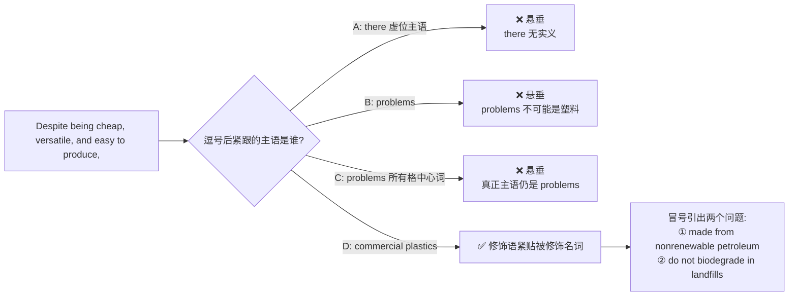
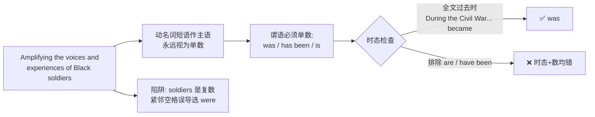
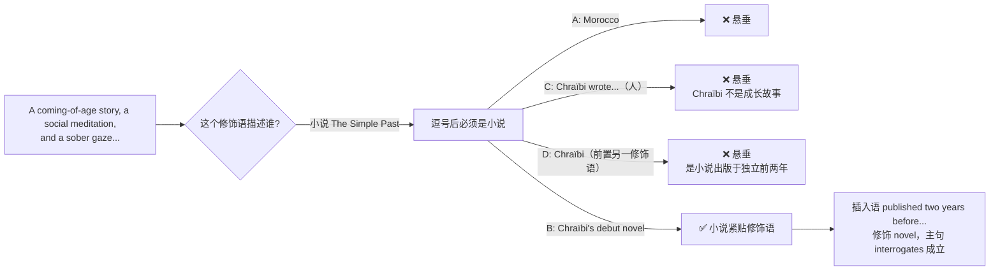
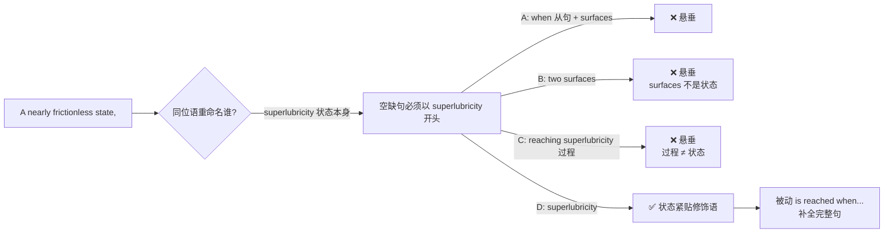
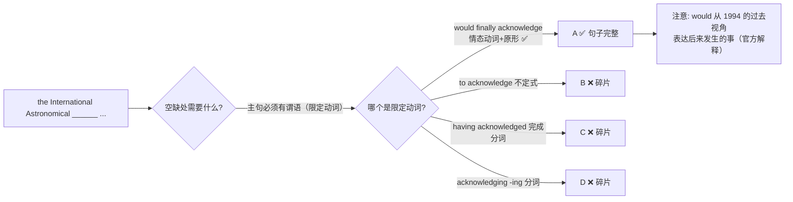
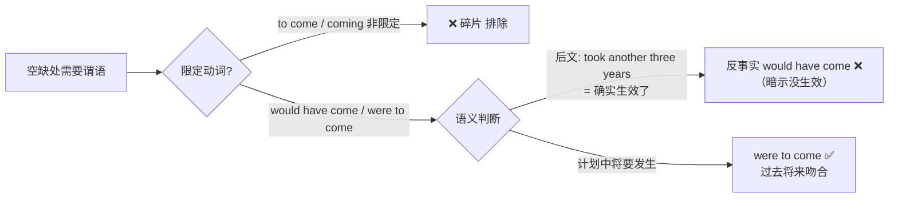

# SAT RW FormStructureSense Hard 错题积累

> [!abstract] 试卷信息
> - **试卷**: FormStructureSense Hard（Three Parts Practice 第三部分）
> - **来源**: `0801hw/6.FormStructureSense Hard Answer and Explanation.pdf` / `AI-practice/set1`
> - **当前积累**: 6 题（Q1, Q3, Q11, Q19, Q18, AI-P2 Q8）
> - **薄弱技能**: Standard English Conventions — Form, Structure, and Sense（悬垂修饰语、主谓一致、句子完整性、情态动词语义）

---

> [!danger] 分析原则
> 详见 [[SAT Reading - Analysis Principles]]。

## 目录

- [[#1. FSS Hard Q1 — 悬垂修饰语（Subject-Modifier Placement）]]
- [[#2. FSS Hard Q3 — 主谓一致（动名词短语作主语）]]
- [[#3. FSS Hard Q11 — 悬垂修饰语（人 vs 作品主语）]]
- [[#4. FSS Hard Q19 — 悬垂修饰语（过程 vs 状态：动名词陷阱）]]
- [[#5. FSS Hard Q18 — 句子完整性（主句谓语缺失：句子碎片陷阱）]]
- [[#6. AI-P2 Q8 — 反事实 vs 过去将来（would have done 陷阱）]]

---

# 1. FSS Hard Q1 — 悬垂修饰语（Subject-Modifier Placement）

> [!info] 我的答案: `A` — 正确答案: **D**
> Question ID: `37e5c794` | 难度: Hard

## 题干

Despite being cheap, versatile, and easy to produce, ______ they are made from nonrenewable petroleum, and most do not biodegrade in landfills.

Which choice completes the text so that it conforms to the conventions of Standard English?

- **A.** there are two problems associated with commercial plastics:
- **B.** two problems are associated with commercial plastics:
- **C.** commercial plastics' two associated problems are that
- **D.** commercial plastics have two associated problems:

## 考点

**Standard English Conventions — Form, Structure, and Sense — Subject-Modifier Placement（修饰语与被修饰对象的位置）**

句首的介词短语 `Despite being cheap, versatile, and easy to produce` 是修饰语，必须紧挨着它修饰的名词——"commercial plastics"。

## 选项分析

| 选项 | 内容 | 评价 |
|:---|:---|:---|
| **A** ❌ | there are two problems associated with commercial plastics: | 悬垂修饰语。`there` 是虚位主语（expletive），没有任何实义，不可能被描述为 cheap / versatile / easy to produce |
| **B** ❌ | two problems are associated with commercial plastics: | 悬垂修饰语。逗号后第一个名词是 `two problems`，句意变成"问题们"是 cheap、versatile、easy to produce |
| **C** ❌ | commercial plastics' two associated problems are that | 悬垂修饰语。虽以 `commercial plastics'` 开头，但它是所有格（possessive），句子的真正主语是 `problems`，修饰语依然悬垂 |
| **D** ✅ | commercial plastics have two associated problems: | 修饰语紧贴被修饰名词 `commercial plastics`；冒号正确引出两个具体问题（两个并列分句） |

## 推理过程

### 为什么 D 正确

- `commercial plastics` 紧跟在修饰语之后，是唯一"能被 cheap, versatile, and easy to produce 描述"的名词
- 冒号用法正确：`two associated problems:` 构成"总述 → 分述"结构，后面用两个并列分句列举具体问题

### 为什么 A 错

- `there are` 中的 `there` 是虚位主语（expletive），不指代任何东西，永远不可能被修饰
- 修饰语要求紧跟它描述的对象，A 中紧跟的是 `there` → 悬垂修饰语（dangling modifier）
- **⚠️ 我的原注错误归因**：答案文件里记的是"不用冒号，因为后面的 and 前加了逗号"——这个理由不成立：正确选项 D 同样使用冒号。本题根本不是标点题，而是修饰语位置题，说明当时把错误归因到了标点上，真正的问题在主语位置。

## 陷阱识别

> [!warning] Trap Identification
> - **虚位主语陷阱（Expletive "there is/are"）**：句首修饰语后紧跟 `there is/are` 开头，几乎必然是悬垂修饰语——`there` 无法被修饰
> - **"语义说得通"陷阱**：A、B 语义上都表达了"塑料有两个问题"，容易觉得"意思对就行"；但 SAT 考的是结构，修饰语必须紧贴被修饰名词
> - **所有格伪装陷阱**：C 以 `commercial plastics'` 开头，看似把塑料放在前面，但所有格短语的中心词是 `problems`，修饰语依然悬垂

## 解题策略

1. 看到句首以 `-ing` 分词或介词短语开头的修饰语，先问：**"它要修饰谁？"**
2. 在选项中找"被修饰名词紧跟在逗号后"的那个选项
3. 警惕 `there is/are` 开头的选项（虚位主语无法被修饰）
4. 标点只是配角：冒号"总述 → 分述"结构在本句成立，不要因标点而误判整题

---

# 2. FSS Hard Q3 — 主谓一致（动名词短语作主语）

> [!info] 我的答案: `A` — 正确答案: **D**
> Question ID: `c91ef0f0` | 难度: Hard

## 题干

During the American Civil War, Thomas Morris Chester braved the front lines as a war correspondent for the Philadelphia Press. Amplifying the voices and experiences of Black soldiers ______ of particular importance to Chester, who later became an activist and lawyer during the postwar Reconstruction period.

Which choice completes the text so that it conforms to the conventions of Standard English?

- **A.** were
- **B.** have been
- **C.** are
- **D.** was

## 考点

**Standard English Conventions — Form, Structure, and Sense — Subject-Verb Agreement（主谓一致）**

`Amplifying the voices and experiences of Black soldiers` 是动名词短语（gerund phrase），作句子主语。动名词作主语**永远是单数**，谓语动词必须用单数形式。

## 选项分析

| 选项 | 内容 | 评价 |
|:---|:---|:---|
| **A** ❌ | were | 复数动词，与单数主语 `Amplifying...` 不一致；`Black soldiers` 是紧邻空格的复数名词，纯干扰项 |
| **B** ❌ | have been | 复数（且现在完成时与全文过去时态不符） |
| **C** ❌ | are | 复数（且一般现在时与全文过去时态不符） |
| **D** ✅ | was | 单数动词，与动名词主语一致；过去时与全文时态一致（`braved`... `later became`） |

## 推理过程

### 为什么 D 正确

- 主语是动名词短语 `Amplifying...`（单数）→ 谓语用单数 `was`
- 时态上也唯一成立：全文为过去时叙述（`braved`、`later became`），只有 `was` 符合

### 为什么 A 错

- `were` 是复数动词，与单数主语不一致
- **陷阱机制**：空格前紧邻的 `Black soldiers` 是复数名词，容易误以为动词应与 `soldiers` 一致——实际上它是介词 of 的宾语，不是主语

## 陷阱识别

> [!warning] Trap Identification
> - **邻近干扰（Proximity Trap）**：主语和动词之间插入复数名词（`Black soldiers`），利用"就近一致"的错觉诱导选复数
> - **动名词单数规则**：`-ing` 短语作主语（Amplifying... / Reading... / Being...）永远按单数处理
> - **时态双保险**：即使数判断对了，也要用全文时态再验一遍——`have been`/`are` 时态同样不成立

## 解题策略

1. 先划掉介词短语（`of Black soldiers`），露出真正的主语
2. 判断主语是单数还是复数（动名词短语 → 单数）
3. 再用全文时态验证（Civil War 语境 → 过去时）

---

# 3. FSS Hard Q11 — 悬垂修饰语（人 vs 作品主语）

> [!info] 我的答案: `C` — 正确答案: **B**
> Question ID: `5b8f9cf2` | 难度: Hard

## 题干

In the canon of North African literature, Moroccan author Driss Chraïbi's 1954 novel The Simple Past (Le Passé simple) looms large. A coming-of-age story, a social meditation, and a sober gaze into the dark maw of French colonialism, ______ interrogates systemic power with memorable intensity.

Which choice completes the text so that it conforms to the conventions of Standard English?

- **A.** Morocco gained its independence two years before the publication of Chraïbi's debut novel, which
- **B.** Chraïbi's debut novel, published two years before Morocco gained its independence,
- **C.** Chraïbi wrote a debut novel that, published two years before Morocco gained its independence,
- **D.** published two years before Morocco gained its independence, Chraïbi wrote a debut novel that

## 考点

**Standard English Conventions — Form, Structure, and Sense — Subject-Modifier Placement（修饰语与被修饰对象的位置）**

句首修饰语 `A coming-of-age story, a social meditation, and a sober gaze into the dark maw of French colonialism` 描述的是**小说**（The Simple Past），因此逗号后必须紧接 `Chraïbi's debut novel`。

## 选项分析

| 选项 | 内容 | 评价 |
|:---|:---|:---|
| **A** ❌ | Morocco gained its independence... | 悬垂修饰语。修饰语描述小说，紧跟的却是 Morocco |
| **B** ✅ | Chraïbi's debut novel, published two years before Morocco gained its independence, | 小说紧跟修饰语；插入语 `published two years before...` 正确修饰 novel；主句 `...interrogates systemic power` 成立 |
| **C** ❌ | Chraïbi wrote a debut novel that, published two years before... | 悬垂修饰语。修饰语描述小说，紧跟的却是 Chraïbi（人）——"Chraïbi 是一篇成长故事"不合逻辑 |
| **D** ❌ | published two years before..., Chraïbi wrote... | 悬垂修饰语 ×2：句首两个修饰语都描述小说，但紧跟的主语是 Chraïbi（"Chraïbi 出版于独立前两年"不成立——是小说出版于那时） |

## 推理过程

### 为什么 B 正确

- `Chraïbi's debut novel` 紧跟在修饰语后，是修饰语真正描述的对象
- 中间插入 `published two years before Morocco gained its independence`（过去分词短语作插入修饰语，前后逗号隔开），依然正确修饰 novel
- 主句完整：`Chraïbi's debut novel ... interrogates systemic power with memorable intensity`

### 为什么 C 错

- 修饰语描述的是小说，C 却把 `Chraïbi wrote...` 放在逗号后，语法上暗示"Chraïbi 是一篇成长故事、社会沉思、对殖民主义的冷峻凝视"——逻辑荒谬
- C 的 `that, published two years before...,` 结构本身也臃肿，但核心错误是悬垂修饰语

## 陷阱识别

> [!warning] Trap Identification
> - **"人 vs 作品"陷阱**：修饰语描述作品时，紧跟的必须是作品（名词短语），而不是作者（`Chraïbi wrote`）——作者本人不可能是 coming-of-age story
> - **修饰语链陷阱**：D 在句首再加一个修饰语 `published two years before...`，但它同样描述小说，放在 Chraïbi 前面依然悬垂；句首多个修饰语时，每个都必须与紧邻主语匹配
> - **背景知识干扰**：Morocco 独立于 1956 年、小说出版于 1954 年——A 利用背景信息构造看似合理的句子，但语法结构不成立；SAT 不看背景知识对不对，只看修饰语位置

## 解题策略

1. 识别句首修饰语描述的对象（人？物？作品？）
2. 选项中以"该对象名词紧跟逗号"为第一筛选标准
3. 警惕 `wrote / gained / was` 等动词开头的主语——修饰语只能修饰名词性成分

---

# 4. FSS Hard Q19 — 悬垂修饰语（过程 vs 状态：动名词陷阱）

> [!info] 我的答案: `C` — 正确答案: **D**
> Question ID: `a14eef71` | 难度: Hard

## 题干

In 2015, a team led by materials scientists Anirudha Sumant and Diana Berman succeeded in reducing the coefficient of friction (COF) between two surfaces to the lowest possible level—superlubricity. A nearly frictionless (and, as its name suggests, extremely slippery) state, ______

Which choice completes the text so that it conforms to the conventions of Standard English?

- **A.** when their COF drops below 0.01, two surfaces reach superlubricity.
- **B.** two surfaces, when their COF drops below 0.01, reach superlubricity.
- **C.** reaching superlubricity occurs when two surfaces' COF drops below 0.01.
- **D.** superlubricity is reached when two surfaces' COF drops below 0.01.

## 考点

**Standard English Conventions — Form, Structure, and Sense — Subject-Modifier Placement（修饰语与被修饰对象的位置）**

句首同位语 `A nearly frictionless (and, as its name suggests, extremely slippery) state` 是对主语的**重命名**（appositive）：它描述的是 superlubricity **这个状态本身**，因此空缺句必须以 `superlubricity` 开头。

## 选项分析

| 选项 | 内容 | 评价 |
|:---|:---|:---|
| **A** ❌ | when their COF drops below 0.01, two surfaces reach superlubricity. | 悬垂修饰语。紧跟修饰语的是 when 从句，主句主语 surfaces 不是"状态" |
| **B** ❌ | two surfaces, when their COF drops below 0.01, reach superlubricity. | 悬垂修饰语。surfaces 不是"几乎无摩擦的状态" |
| **C** ❌ | reaching superlubricity occurs when two surfaces' COF drops below 0.01. | 悬垂修饰语。`reaching superlubricity` 是动名词，命名**达到该状态的过程**；过程不能被描述为 a nearly frictionless state |
| **D** ✅ | superlubricity is reached when two surfaces' COF drops below 0.01. | 状态名词 superlubricity 紧跟修饰语；被动语态 `is reached` 让状态作主语 |

## 推理过程

### 为什么 D 正确

- `superlubricity` 紧跟修饰语，正是修饰语重命名的对象
- 被动语态 `is reached` 是唯一能让 superlubricity 作主语的动词形式——**先定主语，再选语态**（"动词怎么放"的答案：让动词服务于主语）

### 为什么 C 错（我的选择）

- `reaching superlubricity`（动名词）= **过程**；`superlubricity`（名词）= **状态**。修饰语描述的是状态
- C 等于说"达到的过程是一个几乎无摩擦的状态"——把过程当状态，逻辑错位
- **我的自注校验**：我记的是"一开始没理解最后一句话，不知道动词怎么放"——真正的障碍不是动词本身，而是**没识别出逗号前是同位语重命名**：先确定"谁被重命名"，动词位置自然就定了

## 陷阱识别

> [!warning] Trap Identification
> - **过程 vs 状态陷阱（新增）**：`reaching superlubricity` / `writing the novel` 等动名词命名动作，`superlubricity` / `the novel` 命名事物/状态；同位语修饰语描述的是后者
> - **"动词放哪"焦虑陷阱**：不确定谓语位置时不要从动词出发——从修饰语重命名的名词出发，先定主语，再选语态（D 用被动正是为了让状态作主语）
> - **与前 3 题同源确认**：仍是"句首修饰语 + 逗号后第一个名词必须是它描述的对象"家族，本次新变体是"动名词伪装主语"

## 解题策略

1. 句首同位语（A state, / A chronicle, / A saga,）= 对主语的**重命名**，主语必须紧跟逗号
2. 区分动名词（过程）与名词（状态/事物）：修饰语描述哪个，哪个就作主语
3. 若正确名词作主语需要被动/特殊语态，**不要因此排除**——语态服务于主语选择
4. 悬垂修饰语家族已积累 3 个变体（there 虚位 / 人 vs 作品 / 过程 vs 状态），做题时先归类再选

---

# 5. FSS Hard Q18 — 句子完整性（主句谓语缺失：句子碎片陷阱）

> [!info] 状态: `未作答/不确定` — 正确答案: **A**
> Question ID: `50801257` | 难度: Hard

## 题干

In 1994, almost 200 years after the death of Wang Zhenyi, the International Astronomical ______ the contributions of the barrier-breaking 18th-century astronomer and author of "Dispute of the Procession of the Equinoxes," naming a crater on Venus after her.

Which choice completes the text so that it conforms to the conventions of Standard English?

- **A.** Union would finally acknowledge
- **B.** Union to finally acknowledge
- **C.** Union, having finally acknowledged
- **D.** Union, finally acknowledging

## 考点

**Standard English Conventions — Form, Structure, and Sense — 句子完整性（Sentence Fragments：主句必须有限定动词）**

主句必须包含一个**限定动词**（finite verb，有时态/人称变化的动词形式）作谓语。不定式（to acknowledge）、现在分词（acknowledging）、完成分词（having acknowledged）都不能单独作谓语。

## 选项分析

| 选项 | 内容 | 评价 |
|:---|:---|:---|
| **A** ✅ | Union would finally acknowledge | `would acknowledge` 是限定动词短语（情态动词 + 原形），能作主句谓语 → 句子完整 |
| **B** ❌ | Union to finally acknowledge | 不定式不能作谓语 → 句子碎片 |
| **C** ❌ | Union, having finally acknowledged | 完成分词短语不能作谓语 → 句子碎片 |
| **D** ❌ | Union, finally acknowledging | -ing 分词不能作谓语 → 句子碎片 |

## 推理过程

### 为什么 A 正确

- `would finally acknowledge` 是唯一含**限定动词**的选项：情态动词 `would` + 动词原形 `acknowledge`，主句完整成立
- 官方特别说明：这里的 `would` 不是"将来虚拟"，而是**从过去时间点（1994）叙述后来发生的事**——以过去视角回望 IAU 后来的致敬行为，完全合规

### 为什么 B/C/D 错

- 三者都缺主句谓语：`to acknowledge`（不定式）、`having acknowledged`（完成分词）、`acknowledging`（现在分词）都不是限定动词，无法与主语 `Union` 构成完整句子 → 全部是句子碎片
- 干扰设计：C/D 用逗号把分词隔开，伪装成"插入语 + 主句"结构，但主句谓语始终缺失

## 陷阱识别

> [!warning] Trap Identification
> - **句子碎片陷阱（新增考点家族）**：主句必须有限定动词；`to do` / `doing` / `having done` 单独出现都不是谓语
> - **分词伪装陷阱**：C/D 前面加逗号，让人误以为"分词短语 + 主句"，实际主句动词永远没出现
> - **长句迷失**：主语和空缺之间插入 `almost 200 years after...` 时间状语，容易忘记句子还缺谓语——先找主谓，再看修饰
> - **`would` 的过去视角**：从过去时间点叙述后来的事可以用 would，不要因为"would 表示将来"而排除 A

## 解题策略

1. 读完整句，先找主谓：主句主语 + 谓语动词是否齐全
2. 限定动词三特征：有时态、有人称/数变化、能独立作谓语（is/was/would do/has done...）
3. 非限定形式（to do / doing / having done / done）单独出现 = 句子碎片，直接排除
4. 不确定时把选项代入整句朗读，能独立成句的才保留

---

# 6. AI-P2 Q8 — 反事实 vs 过去将来（would have done 陷阱）

> [!info] 我的答案: `A` — 正确答案: **C**
> Question ID: `a7c3f6e9` | 难度: Hard | 来源: AI-practice/set1 P2

## 题干

Although the treaty was signed with much ceremony, its provisions ______ into effect only after every signatory had ratified it, a process that took another three years.

Which choice completes the text so that it conforms to the conventions of Standard English?

- **A.** would have come
- **B.** to come
- **C.** were to come
- **D.** coming

## 考点

**Standard English Conventions — Form, Structure, and Sense — 情态动词语义（虚拟反事实 vs 过去将来）**

A 和 C 都是限定动词（都能作谓语），区别在**语义**：`would have done` = 虚拟反事实（暗示没发生）；`were to do` = 过去将来（从过去视角看按计划将要发生）。

## 选项分析

| 选项 | 内容 | 评价 |
|:---|:---|:---|
| **A** ❌ | would have come | 虚拟反事实，暗示"本会生效但实际没生效"——与后文 `a process that took another three years` 直接矛盾 |
| **B** ❌ | to come | 不定式不能作谓语 → 句子碎片 |
| **C** ✅ | were to come | be to 的过去式 = 从过去视角表达"按计划将要生效"，语义与后文完全吻合 |
| **D** ❌ | coming | 分词不能作谓语 → 句子碎片 |

## 推理过程

### 为什么 C 正确

- `were to come` 是限定动词（be to 结构过去式），句子完整
- 语义 = "从过去视角看按计划将要发生"，与 `a process that took another three years`（后来确实发生）一致

### 为什么 A 错（我的选择）

- 我正确排除了 to come / coming（碎片），但不知道 `would have done` 的**反事实含义**
- `would have come into effect` = "原本会生效（但没生效）"——虚拟语气暗示事情未发生，与后文矛盾
- 本质：语法形式判断对了，卡在情态动词的**语义层**——`would have done` 是虚拟（没发生），`were to do` 是过去将来（计划发生）

## 陷阱识别

> [!warning] Trap Identification
> - **反事实陷阱（新增）**：`would have done` 永远暗示"本会发生但没发生"；看到后文说事情确实发生了 → 直接排除
> - **同形不同义**：A/C 都是限定动词短语，形式都对，只能靠语义区分——先排非限定（B/D），再在剩余项之间做语义甄别
> - **判断口诀**：`would have done` = 没发生；`was/were to do` = 计划中将要发生

## 解题策略

1. 先排除非限定形式（`to do` / `doing` = 碎片）
2. 剩余限定动词之间靠**语义**区分：与后文矛盾 → 反事实（would have done）；吻合 → 过去将来（were to do）
3. 情态动词家族：`would have done`（虚拟/没发生）、`was/were to do`（计划/将要）、`will have done`（将来完成）

---

## 积累小结

| 题号 | 考点 | 我的答案 | 正确答案 | 错误类型 |
|:---|:---|:---:|:---:|:---|
| Q1 | Subject-Modifier Placement（悬垂修饰语） | A | D | 虚位主语陷阱 |
| Q3 | Subject-Verb Agreement（动名词短语作主语） | A | D | 邻近复数名词干扰 |
| Q11 | Subject-Modifier Placement（悬垂修饰语） | C | B | 人/作品主语混淆 |
| Q19 | Subject-Modifier Placement（悬垂修饰语） | C | D | 过程 vs 状态（动名词陷阱） |
| Q18 | Sentence Completeness（句子完整性） | 未作答 | A | 待确认 |
| AI-P2 Q8 | 情态动词语义（反事实 vs 过去将来） | A | C | 反事实陷阱 |

**行动项**: ① 句首修饰语后紧跟 `there is/are`、动词（wrote/gained）、人或非被修饰名词时优先排除——验证"逗号后第一个名词能否被修饰语描述"；② 主谓一致题先划掉介词短语露出真正主语（动名词短语 → 单数），再用全文时态双保险；③ 错因记录须对准真正考点（如 Q1 不是标点题而是修饰语位置题）；④ 同位语=重命名，主语必须紧跟；动名词命名过程≠状态名词，先定主语再选语态；⑤ 句子完整性：主句必须有限定动词，`to do`/`doing`/`having done` 单独出现 = 句子碎片；先找主谓再判断修饰语；⑥ 反事实陷阱：`would have done` = 没发生（虚拟），`was/were to do` = 计划中将要发生（过去将来）；看到后文说事情确实发生 → 排除 would have done。
