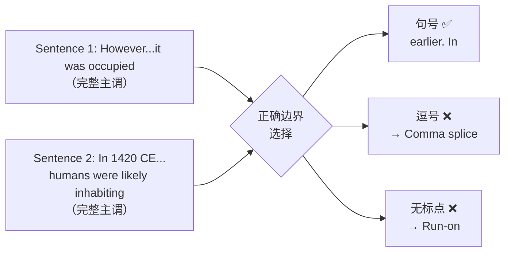
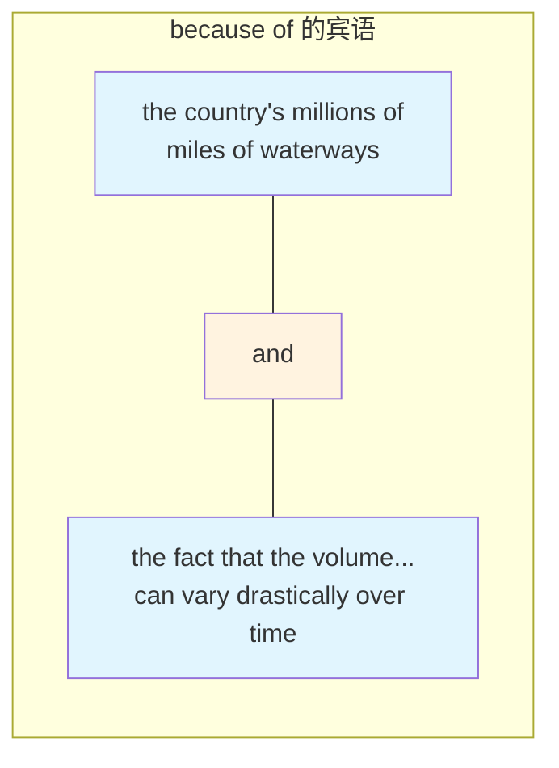
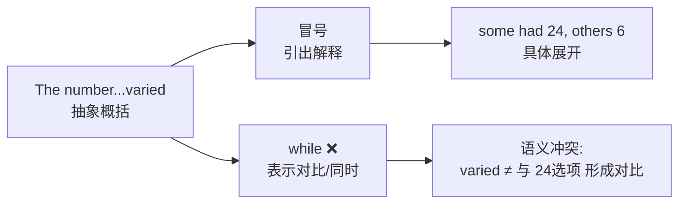
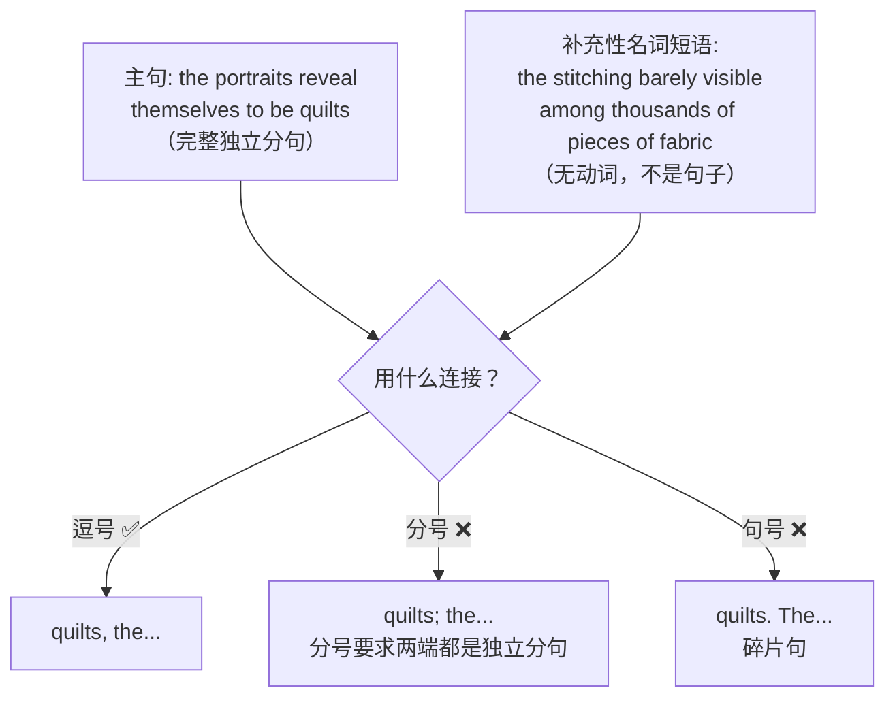
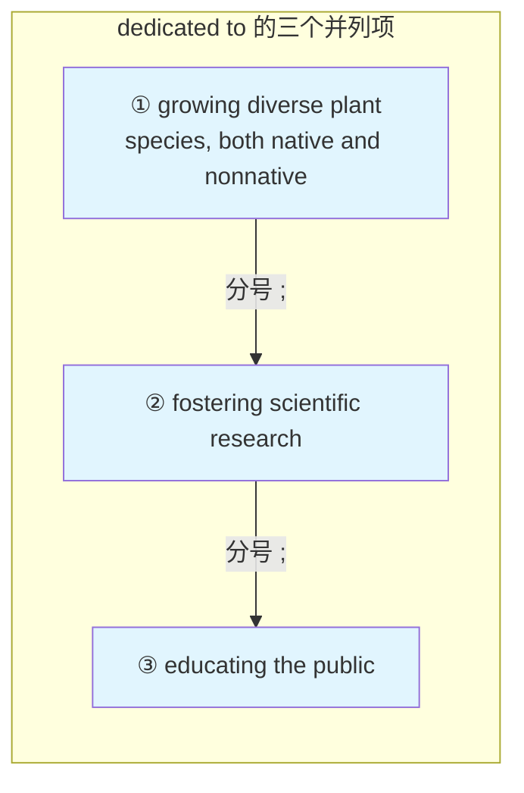
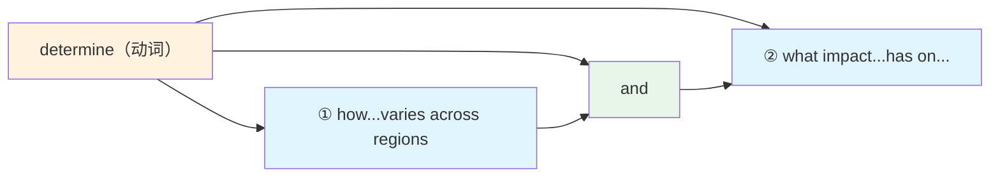

# SAT RW Four Parts Practice Boundaries 错题分析

> [!abstract] 试卷信息
> - **试卷**: Four Parts Practice — Boundaries Medium & Hard
> - **来源**: `0725hw/FourParts_answers.md` / `2. Boundaries Medium with Answer and Explanation.pdf` / `3. Boundaries Hard with Answer and Explanation.pdf`
> - **本次错题**: 7 道（P2: Q9, Q18, Q30；P3: Q8, Q11, Q15, Q17）
> - **薄弱技能**: Standard English Conventions — Boundaries（标点边界）
> - **说明**: 错题均属于 Standard English Conventions 中的 Boundaries 考点，涉及冒号/逗号/分号/句号在句子边界、并列结构、复杂列表中的正确使用。

---

> [!danger] 分析原则
> 详见 [[SAT Reading - Analysis Principles]]。

## 目录

- [[#1. P2 Q9 — 标点边界（冒号 vs 逗号 vs 分号 vs 句号）]]
- [[#2. P2 Q18 — 标点边界（句号 vs 逗号 + which）]]
- [[#3. P2 Q30 — 标点边界（并列名词短语中间不加逗号）]]
- [[#4. P3 Q11 — 标点边界（冒号 vs comma splice vs while 逻辑冲突）]]
- [[#5. P3 Q15 — 标点边界（逗号 vs 分号：补充性名词短语）]]
- [[#6. P3 Q17 — 标点边界（复杂列表中的分号）]]
- [[#7. P3 Q8 — 标点边界（并列坐标中不需要标点）]]

---

# 1. P2 Q9 — 标点边界（冒号 vs 逗号 vs 分号 vs 句号）

> [!info] 标记: `C` — 错选

## 题干

How do scientists determine what foods were eaten by extinct hominins such as Neanderthals? In the past, researchers were limited to studying the marks found on the fossilized teeth of skeletons, but in 2017 a team led by Laura Weyrich of the Australian Centre for Ancient DNA tried something ______ the DNA found in Neanderthals' fossilized dental plaque.

Which choice completes the text so that it conforms to the conventions of Standard English?

| 选项 | 内容 |
|:---|:---|
| **A** ✅ | new: sequencing |
| **B** | new; sequencing |
| **C** ✏️ | new, sequencing: |
| **D** | new. Sequencing |

**我的答案**: C &nbsp;&nbsp; **正确答案**: A

## 选项分析

| 选项 | 内容 | 评价 |
|:---|:---|:---|
| **A** ✅ | new: sequencing | ✅ "tried something new" 是完整独立分句，冒号引出对 "new thing" 的具体说明 |
| **B** | new; sequencing | ❌ 分号只能连接两个独立分句，"sequencing...plaque" 不是完整句子 |
| **C** ✏️ | new, sequencing: | ❌ 逗号把 "sequencing" 吞入前句，使 "new, sequencing" 不再是独立分句；冒号必须跟在完整独立分句后 |
| **D** | new. Sequencing | ❌ "Sequencing...plaque" 不是完整句子，句号将其变成碎片（sentence fragment） |

## 解题思路

### 考点：Standard English Conventions — Boundaries（冒号用法）

> **核心规则**：冒号只能放在完整独立分句之后，引出解释、列举或说明。

### 推理过程


### 为什么 A 正确

前半句 `a team...tried something new` 是完整的 **独立分句**（主谓宾齐全），后半句 `sequencing the DNA found in Neanderthals' fossilized dental plaque` 是一个名词短语，**解释** "something new" 的具体内容。冒号恰好满足这个结构需求：**独立分句 + 冒号 + 解释性成分**。

### 为什么 C 不对

`new, sequencing:` 有两个致命问题：

1. **逗号破坏了独立分句的完整性**：`tried something new` 本是一个完整的动宾结构。逗号插入后变成 `tried something new, sequencing`——把 "sequencing" 强行拽入前一个分句，使 `sequencing` 被误读为伴随状语的一部分，前句不再是一个干净的独立分句。

2. **冒号位置非法**：因为前句的独立分句身份已被破坏，冒号无法合法使用——冒号必须紧跟在完整独立分句之后。

> [!warning] 陷阱识别
> **冒号前必须是完整独立分句**。这是 SAT 高频考点。选项中如果冒号前出现逗号/连词打乱了句子完整性，一定错。判断方法：把冒号前的部分单独拿出来读——如果能独立成句（有完整主谓），才合法。这里 `tried something new, sequencing` 不是完整句子，所以冒号不能用。

---

# 2. P2 Q18 — 标点边界（句号 vs 逗号 + which）

> [!info] 标记: `C` — 错选

## 题干

Humans were long thought to have begun occupying the Peruvian settlement of Machu Picchu between 1440 and 1450 CE. However, a team led by anthropologist Dr. Richard Burger used accelerator mass spectrometry to uncover evidence that it was occupied ______ 1420 CE, according to Burger, humans were likely inhabiting the area.

Which choice completes the text so that it conforms to the conventions of Standard English?

| 选项 | 内容 |
|:---|:---|
| **A** ✅ | earlier. In |
| **B** | earlier, in |
| **C** ✏️ | earlier, which in |
| **D** | earlier in |

**我的答案**: C &nbsp;&nbsp; **正确答案**: A

## 选项分析

| 选项 | 内容 | 评价 |
|:---|:---|:---|
| **A** ✅ | earlier. In | ✅ 句号正确分隔两个独立句子 |
| **B** | earlier, in | ❌ **Comma splice**——逗号不能连接两个独立分句 |
| **C** ✏️ | earlier, which in | ❌ Comma splice + "which" 没有合理的先行词（详见下方） |
| **D** | earlier in | ❌ **Run-on**——两个句子无任何标点/连词直接融合 |

## 解题思路

### 考点：Standard English Conventions — Boundaries（句间标点）

> **核心规则**：两个独立句子之间只能用 **句号 / 分号 / 逗号+连词** 连接，**不能只用逗号**（comma splice），**不能无标点**（run-on）。

### 推理过程

**句子边界分析——原文有两个独立句子需要分开：**

```
Sentence 1: However...it was occupied ______
Sentence 2: In 1420 CE, according to Burger, humans were likely inhabiting the area.
```

两个句子各自主谓齐全，必须用正确的句间标点隔开。正确做法是用 **句号**：

> ...it was occupied **earlier. In** 1420 CE, according to Burger, humans were likely inhabiting the area.



### 为什么 A 正确

句号是将两个独立句子分开的最直接、最标准的方式。`In 1420 CE` 是一个介词短语做状語，修饰第二句的主谓结构 `humans were likely inhabiting`。

### 为什么 C 不对

C 有两个错误：

**错误 ① — Comma splice**：`it was occupied earlier` 和 `which in 1420 CE...area` 之间的逗号试图连接两个主句，但没有连词，构成 comma splice。

**错误 ② — `which` 没有合理的指代**：`which` 是关系代词，必须指向前面的一个**名词**。但 `earlier` 是副词（修饰 `occupied`），不是名词。这让 `which` 无所依附，产生一个语法上漂浮的从句。此外，`which in 1420 CE` 会使读者误以为 `in 1420 CE` 在修饰前面的 "earlier"（"更早，即在 1420 年"），而实际上它应该属于后面一句（"In 1420 CE, humans were inhabiting..."）。

> [!info] 同类历史错题
> Comma splice 在之前的 SAT 真题中也错过：[[SAT RW 2023年12月第一套 错题分析#3. Module 2 Q19]]（Canada semicolon）、[[SAT RW 2023年12月第一套 错题分析#2. Module 2 Q17]]（Alma Lavenson 断句）。该模式跨卷已出现 3 次。

> [!warning] 陷阱识别
> **"which" 必须有明确的名词先行词**——不能指代副词、动词短语或整个句子（至少在 SAT 标准英语用法中如此）。看到 `which` 时先问：它前面的名词是什么？如果找不到，这个选项大概率是错的。<br><br>
> **Comma splice vs Run-on**：SAT 中两个独立句子的连接方式只有三种合法——句号（.）、分号（;）、逗号+连词（, and/but/or）。三种之外的任何方式（只有逗号、只有连词无逗号、which/which in 等）都是错误选项。

---

# 3. P2 Q30 — 标点边界（并列名词短语中间不加逗号）

> [!info] 标记: `C` — 错选

## 题干

Gathering accurate data on water flow in the United States is challenging because of the country's millions of miles of ______ the volume and speed of water at any given location can vary drastically over time.

Which choice completes the text so that it conforms to the conventions of Standard English?

| 选项 | 内容 |
|:---|:---|
| **A** | waterways and the fact that, |
| **B** | waterways, and the fact that, |
| **C** ✏️ | waterways, and, the fact that |
| **D** ✅ | waterways and the fact that |

**我的答案**: C &nbsp;&nbsp; **正确答案**: D

## 选项分析

| 选项 | 内容 | 评价 |
|:---|:---|:---|
| **A** | waterways and the fact that, | ❌ 末尾多余的逗号不合法 |
| **B** | waterways, and the fact that, | ❌ "waterways," 后的逗号和末尾多余的逗号都不需要 |
| **C** ✏️ | waterways, and, the fact that | ❌ 三个多余逗号：A与and之间、and与B之间插入逗号，破坏并列结构 |
| **D** ✅ | waterways and the fact that | ✅ 并列名词短语之间不需要任何标点 |

## 解题思路

### 考点：Standard English Conventions — Boundaries（并列结构标点）

> **核心规则**：当 `because of [A] and [B]` 中的 A 和 B 都是名词短语时，这是一个**句内成分的并列**，不需要任何标点隔开。

### 推理过程

**语法结构拆解：**

```
... because of [the country's millions of miles of waterways] and [the fact that the volume...can vary drastically over time]
                  ├───────────── NP1 ─────────────┤       ├───────────── NP2 ───────────────────────────┤
                                       ↑ 简单并列，中间无标点 ↑
```

两个名词短语共同做 `because of` 的宾语，中间用 `and` 连接。这属于**短语层面的并列**，不是**句子层面的并列**，因此不需要逗号。



**判断标准**：当 `and` 连接的是两个**名称性成分**（名词短语）而非两个**完整句子**时，通常不加逗号。

### 为什么 D 正确

`waterways and the fact that`——两个名词短语干净利落地并列，`and` 直接连接，没有多余标点。`that the volume...time` 是定语从句修饰 `the fact`。

### 为什么 C 不对

`waterways, and, the fact that` 插入了**两个多余的逗号**：

- 逗号①：在 `waterways` 和 `and` 之间 → 把第一个并列项和连词分开
- 逗号②：在 `and` 和 `the fact that` 之间 → 把连词和第二个并列项分开

这两个逗号都没有任何语法功能，纯粹打乱了并列结构的流畅性。SAT 语法中，**句内并列的名词短语之间不需要逗号**。

> [!warning] 陷阱识别
> **并列区分"短语"与"句子"**：`and` 连接两个**独立句子**时需要用 `, and`；`and` 连接两个**短语（名词/动词/介词短语等）** 时，通常不加逗号。本题的 `because of [NP1] and [NP2]` 属于后者。<br><br>
> **"逗号遍地撒"的陷阱**：选项 C 的逗号看起来好像在制造"停顿"，实际上 SAT 语法中的标点不是为语感服务的，而是为**语法结构**服务的。不服务于结构的逗号一律多余。

---

# 4. P3 Q11 — 标点边界（冒号 vs comma splice vs while 逻辑冲突）

> [!info] 标记: `C` — 错选

## 题干

Over twenty years ago, in a landmark experiment in the psychology of choice, professor Sheena Iyengar set up a jam-tasting booth at a grocery store. The number of jams available for tasting ______ some shoppers had twenty-four different options, others only six. Interestingly, the shoppers with fewer jams to choose from purchased more jam.

Which choice completes the text so that it conforms to the conventions of Standard English?

| 选项 | 内容 |
|:---|:---|
| **A** ✅ | varied: |
| **B** | varied, |
| **C** ✏️ | varied, while |
| **D** | varied while |

**我的答案**: C &nbsp;&nbsp; **正确答案**: A

## 选项分析

| 选项 | 内容 | 评价 |
|:---|:---|:---|
| **A** ✅ | varied: | ✅ 独立分句 + 冒号 + 具体展开说明变化内容 |
| **B** | varied, | ❌ **Comma splice**——逗号不能连接两个独立分句 |
| **C** ✏️ | varied, while | ❌ `while` 引入逻辑矛盾（详见下方） |
| **D** | varied while | ❌ `while` 同 C 的逻辑问题 + 缺逗号的 run-on |

## 解题思路

### 考点：Standard English Conventions — Boundaries（冒号用法 + 连接词逻辑协调）

> **核心规则**：冒号用于独立分句后引出具体解释。`while` 只能表示 "同时发生" 或 "对比"——不能用于概括与具体展开之间。

### 推理过程

**区分句子结构：**

```
The number of jams available for tasting varied [完整独立分句].
Some shoppers had 24 options, others only 6 [对 "varied" 的具体展开].
```

两个部分之间是 **概括 → 具体说明** 的关系，最合适的标点是 **冒号**。



### 选项 C 详解

`varied, while some shoppers had twenty-four different options, others only six`

> 根据 PDF rationale：用 "while" 连接主句（the number varied）与对 jam 数量的描述，**暗示 "数量变化" 与 "一些人有 24 种选择" 之间存在对比关系**，但后者是前者的具体表现，不存在对比。

- **若 while = "whereas"（然而）** → 暗示变化与 24 种选择形成对照，但 24 种选择恰恰是变化的具体表现，方向一致，逻辑矛盾
- **若 while = "during the time"（同时）** → 暗示两个独立事件并行，但 "变化" 本身不是一个独立事件，它就是 "24 vs 6" 这个事实的概括

> [!warning] 陷阱识别
> **连接词不能替代冒号/破折号的功能**：当后面的内容是对前面的**具体解释/展开**时，需要用冒号或破折号，不能用 `while`/`which`/`whereas` 等连接词。判断方法：
> 1. 如果后半句可以理解为一个**清单、展开、定义** → 考虑冒号
> 2. 如果后半句与前半句是**并列/对比/因果/时间**关系 → 考虑连词
> 3. 如果后半句只是**拼凑**在逗号后，两者都完整 → comma splice，必错

---

# 5. P3 Q15 — 标点边界（逗号 vs 分号：补充性名词短语）

> [!info] 标记: `C` — 错选

## 题干

From afar, African American fiber artist Bisa Butler's portraits look like paintings, their depictions of human faces, bodies, and clothing so intricate that it seems only a fine brush could have rendered them. When viewed up close, however, the portraits reveal themselves to be ______ stitching barely visible among the thousands of pieces of printed, microcut fabric.

Which choice completes the text so that it conforms to the conventions of Standard English?

| 选项 | 内容 |
|:---|:---|
| **A** | quilts, and the |
| **B** ✅ | quilts, the |
| **C** ✏️ | quilts; the |
| **D** | quilts. The |

**我的答案**: C &nbsp;&nbsp; **正确答案**: B

## 选项分析

| 选项 | 内容 | 评价 |
|:---|:---|:---|
| **A** | quilts, and the | ❌ `and` 无法连接主句与补充性名词短语 |
| **B** ✅ | quilts, the | ✅ 逗号正确分隔主句与补充性名词短语 |
| **C** ✏️ | quilts; the | ❌ 分号只能连接两个独立分句，后半句不是完整句子 |
| **D** | quilts. The | ❌ 句号制造碎片句——"the stitching barely visible..." 不是完整句子，不能独立成句 |

## 解题思路

### 考点：Standard English Conventions — Boundaries（补充性名词短语 vs 独立句子）

> **核心规则**：分号只能连接两个**独立分句**（主谓齐全）。补充性名词短语（supplementary noun phrase）不是独立分句，不能用分号连接。

### 句法分析

**原文后半段的结构：**

> ...the portraits reveal themselves to be quilts (主句), the stitching barely visible among the thousands of pieces of printed, microcut fabric (补充性名词短语).

`the stitching` 是名词，`barely visible among...` 是形容词短语修饰 `the stitching`。整个 `the stitching barely visible...` 是**一个名词短语 + 后置修饰**，**没有动词**，不是独立句子。



### 为什么 B 正确

逗号可以用于分隔主句与一个补充性名词短语——后者对主句中的 "quilts" 提供进一步描述（缝线很细，藏在数千块微切布料中）。这是一个**合法的补充性结构**，类似于同位语或独立主格。

### 为什么 C 不对

分号的唯一合法用途是连接两个**独立分句**。但 `the stitching barely visible among...` 没有谓语动词——`barely visible` 是形容词短语，不是动词。所以这不是一个独立分句，不能用分号。

> **判断技巧**：问自己——分号后面的部分能否单独作为一个句子？如果不能（缺少动词或主谓不完整），分号就是非法使用。

> [!warning] 陷阱识别
> **分号的滥用**：SAT 语法常见陷阱是考生以为 "长的/复杂的短语需要用分号隔开"，但分号的唯一标准是**两个独立分句**。不论补充性短语多长，只要没有主谓结构，就不能用分号。<br><br>
> **判断方法**：把分号/句号后面的部分单独拿出来——如果它没有完整的主谓结构（尤其缺少动词），那它就不是独立句子，只能用逗号连接前文。

---

# 6. P3 Q17 — 标点边界（复杂列表中的分号）

> [!info] 标记: `A` — 错选

## 题干

The Arctic-Alpine Botanic Garden in Norway and the Jardim Botânico of Rio de Janeiro in Brazil are two of many botanical gardens around the world dedicated to growing diverse plant ______ fostering scientific research; and educating the public about plant conservation.

Which choice completes the text so that it conforms to the conventions of Standard English?

| 选项 | 内容 |
|:---|:---|
| **A** ✏️ | species, both native and nonnative, |
| **B** ✅ | species, both native and nonnative; |
| **C** | species; both native and nonnative, |
| **D** | species both native and nonnative, |

**我的答案**: A &nbsp;&nbsp; **正确答案**: B

## 选项分析

| 选项 | 内容 | 评价 |
|:---|:---|:---|
| **A** ✏️ | species, both native and nonnative, | ❌ 逗号不能用于分隔包含内部逗号的列表项 |
| **B** ✅ | species, both native and nonnative; | ✅ 分号正确分隔列表项1与列表项2；逗号正确分隔species与补充短语 |
| **C** | species; both native and nonnative, | ❌ 分号不能在species与补充短语之间使用；末尾逗号也不合法 |
| **D** | species both native and nonnative, | ❌ species与补充短语之间缺少标点；末尾逗号不合法 |

## 解题思路

### 考点：Standard English Conventions — Boundaries（复杂列表中的分号）

> **核心规则**：当一个列表中的某个项目**自身包含逗号**时，各项目之间必须用**分号**而非逗号分隔，以避免歧义。

### 列表结构拆解

botanical gardens 的使命是三个并列的动作：

```
dedicated to
├── (1) growing diverse plant species, both native and nonnative  ← 含内部逗号
├── (2) fostering scientific research                             ← 无内部逗号
└── (3) educating the public about plant conservation
```

由于列表项 (1) 中已经有一个逗号（分隔 species 与 both native and nonnative），列表项之间就不能再用逗号分隔，否则读者无法判断哪些逗号是列表内部分隔、哪些是列表项分隔。正确的做法是将列表项之间的逗号升级为分号。



### 为什么 B 正确

`species, both native and nonnative;` 做到了两件事：

1. **逗号**在 `species` 后正确分隔名词与其补充说明 `both native and nonnative`
2. **分号**在 `nonnative` 后正确将列表项①与列表项②分开——因为①中已经用了逗号

### 为什么 A 不对

`species, both native and nonnative,`——末尾的逗号被误用作列表项分隔符。但①自身已经包含逗号（species, both native and nonnative），列表项之间的分隔符必须升级为**分号**。如果再用逗号，读者会混淆：

> "growing diverse plant species" 是第一项？还是 "growing diverse plant species, both native and nonnative" 是第一项？

```
❌ 用逗号分隔 → 混乱
  growing diverse plant species, both native and nonnative, fostering scientific research
                          ↑列表内逗号           ↑列表项分隔符？→ 分不清

✅ 用分号分隔 → 清晰  
  growing diverse plant species, both native and nonnative; fostering scientific research
                          ↑列表内逗号           ↑列表项分隔符（清晰！）
```

> [!warning] 陷阱识别
> **"列表项含逗号 → 分隔符升级为分号"**：这是 SAT 的固定考点。看到列表中有奇怪的标点时，立刻分析：(1) 有哪些列表项？(2) 是否有列表项内部包含逗号？如果是，列表间的分隔符必须用分号。<br><br>
> **A 选项的迷惑性**：看起来 "species, both native and nonnative," 每个标点都有"道理"，但问题出在层次——同一个标点符号（逗号）被同时用来做两件事（修饰性分隔 + 列表项分隔），导致歧义。

---

# 7. P3 Q8 — 标点边界（并列坐标中不需要标点）

> [!info] 标记: `A` — 错选

## 题干

In 2018, a team of researchers led by Dr. Caitlin Whalen compiled every available measurement of ocean mixing rates from the past two decades. With this novel data set, the team was able to determine how current-driven mixing varies across ______ and what impact it has on the distribution of heat and nutrients in the ocean.

Which choice completes the text so that it conforms to the conventions of Standard English?

| 选项 | 内容 |
|:---|:---|
| **A** ✏️ | regions, |
| **B** | regions: |
| **C** | regions; |
| **D** ✅ | regions |

**我的答案**: A &nbsp;&nbsp; **正确答案**: D

## 选项分析

| 选项 | 内容 | 评价 |
|:---|:---|:---|
| **A** ✏️ | regions, | ❌ 两个并列坐标之间不需要任何标点 |
| **B** | regions: | ❌ 冒号用于引出解释/列举，此处不合适 |
| **C** | regions; | ❌ 分号只能连接独立分句，此处不是 |
| **D** ✅ | regions | ✅ 两个"how..."坐标由"and"直接连接，无标点 |

## 解题思路

### 考点：Standard English Conventions — Boundaries（并列坐标标点）

> **核心规则**：当两个并列成分（coordinates）共同完成一个动词的宾语时，如果只有两个且由"and"连接，它们之间不需要任何标点。

### 推理过程

**句子结构：**

```
the team was able to determine
├── (1) how current-driven mixing varies across regions
└── (2) what impact it has on the distribution of heat and nutrients in the ocean
```

→ `determine [how...regions] and [what...ocean]`

两个并列的"how..."和"what..."从句共同充当 `determine` 的宾语。它们之间由 `and` 连接，且只有**两个并列项**。这种情况下，不需要任何标点。



**SAT 标点规则速查（并列结构）：**

| 情况 | 标点 | 例句 |
|:---|:---|:---|
| 两个并列项（短语） | 无标点，仅 and/or | X and Y |
| 两个并列主句 | `, and` | ..., and ... |
| 三个及以上并列项 | 逗号分隔，最后一项前加 and | X, Y, and Z |
| 含内部逗号的列表 | 分号分隔 | X, a; Y, b; and Z |

本题的 `how...regions` 和 `what...ocean` 是**两个并列的短语级从句**（不是独立主句），所以规则适用第一行：**无标点**。

> [!warning] 陷阱识别
> **"and 前面总要加逗号"的误区**：很多考生习惯性地在 `and` 前加逗号，但 SAT 语法中，`and` 前是否加逗号取决于它连接的是什么：
> - 两个独立主句 → 需要 `, and`
> - 两个短语/坐标 → **不需要**逗号
> 
> 判断方法：`and` 后面的部分能独立成句吗？如果不能（缺少主谓），那就不是主句并列，不需要逗号。

---

## 总结：薄弱技能分布

| # | 题号 | 来源 | 考点 | 错误原因 | 优先级 |
|:---:|:---|:---|:---|:---|:---:|
| 1 | P2 Q9 | Med | 冒号前必须是完整独立分句 | 逗号破坏了前句完整性，冒号位置非法 | 🔴 |
| 2 | P2 Q18 | Med | 句间边界 / Comma splice / which 先行词 | 逗号连接两主句；which 没有名词先行词 | 🔴 |
| 3 | P2 Q30 | Med | 并列名词短语不加逗号 | 在 and 两侧插入多余逗号，破坏并列 | 🟡 |
| 4 | P3 Q8 | Hard | 并列坐标中不需要标点 | 两个短语级并列项由 and 连接，加逗号多余 | 🟡 |
| 5 | P3 Q11 | Hard | 冒号 vs while 逻辑冲突 | while 在概括-展开结构中引入错误的对比/同时含义 | 🟡 |
| 6 | P3 Q15 | Hard | 逗号 vs 分号：补充性名词短语 | 分号只能连接独立分句，但后半句不是完整句子 | 🔴 |
| 7 | P3 Q17 | Hard | 复杂列表中的分号 | 列表项含逗号时应用分号而非逗号分隔 | 🔴 |

### 来源分布

| 来源 | 错题数 |
|:---|:---:|
| Boundaries Medium (P2) | 3 |
| Boundaries Hard (P3) | 4 |

### 行动建议
1. **Comma splice 识别训练**：见到逗号 + 主句（主谓齐全）立即警觉——检查是否有连词（and/but/or）。无连词 = comma splice = 必错。
2. **冒号前"独立分句测试"**：冒号前的内容单独拿出来读，能独立成句才合法。
3. **"which" 的先行词检查**：which 前必须有明确的名词，不能指副词/动宾短语/整个句子。
4. **并列结构"逗号反射"抑制**：`and` 连接短语而非句子时，第一反应是**不加逗号**，除非后面有多个并列项的 list 需要 Oxford comma。
5. **分号"独立分句"测试**：分号前和后分别读——各自主谓齐全（尤其不能缺动词）才合法。如果后面是名词短语 + 修饰语，用逗号而非分号。
6. **复杂列表检查**：列表中某一项已含逗号 → 列表间分隔符必须升级为分号，否则造成层次歧义。
7. **并列项问"能独立成句吗"**：`and` 前加逗号之前先问——and 后面是独立主句还是短语/从句？只有独立主句才需要 `, and`。
3. **"which" 的先行词检查**：which 前必须有明确的名词，不能指副词/动宾短语/整个句子。
4. **并列结构"逗号反射"抑制**：`and` 连接短语而非句子时，第一反应是**不加逗号**，除非后面有多个并列项的 list 需要 Oxford comma。
5. **分号"独立分句"测试**：分号前和后分别读——各自主谓齐全（尤其不能缺动词）才合法。如果后面是名词短语 + 修饰语，用逗号而非分号。
