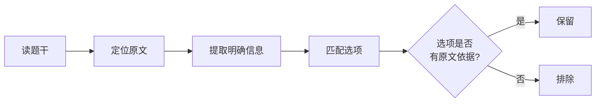
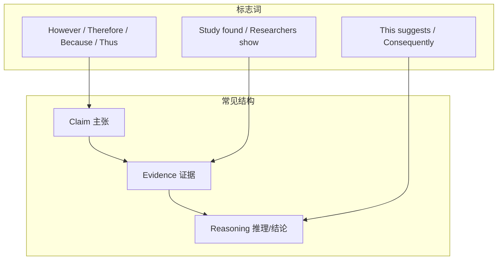
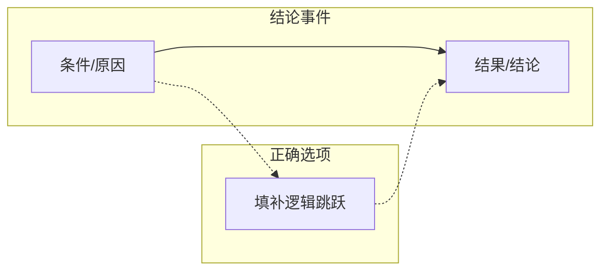
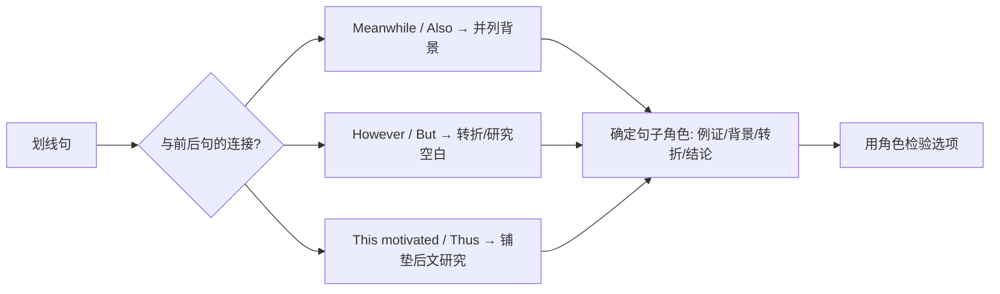
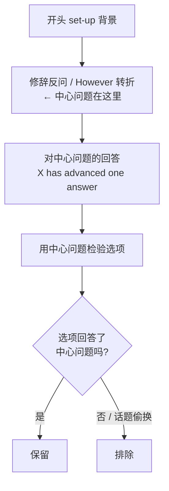
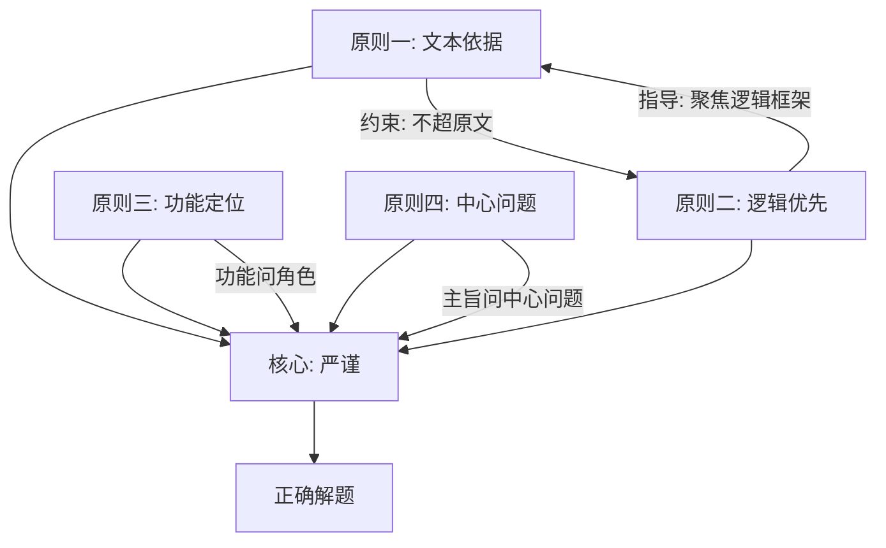

# SAT Reading - Analysis Principles

> [!abstract] 概述
> SAT 阅读语法部分的错题分析需要遵循严格的原则，避免常见陷阱。本文档归纳四条核心分析原则：**文本依据原则**、**逻辑优先原则**、**功能定位原则**和**中心问题定位原则**。

---

## 原则一：文本依据原则

> [!danger] 核心要求
> **原文中没有明确提及的字句绝对不要自己推断。**

### 说明

分析 SAT 阅读题目时，所有判断必须严格基于题干、选项和原文中**明确写出**的信息。不得添加任何原文未直接支持的推理或细节。

### 常见违规行为

| 违规类型 | 示例 | 后果 |
|:---|:---|:---|
| **过度推断** | 原文只提到"A 导致 B"，自行推断"所以 A 是 B 的唯一原因" | 选择了超出原文范围的选项 |
| **添加背景知识** | 用自己已知的课外知识补充原文没有的信息 | 对选项做出错误判断 |
| **因果补全** | 原文说了"如果 X 则 Y"，推断出"如果不 X 则一定不 Y"（否定前件谬误） | 逻辑跳跃 |
| **情感归因** | 原文陈述了一个事实，自行推断作者"认为这很可惜/令人担忧" | 加入原文未表达的立场 |

### 正确做法

> [!tip] 检验方法
> 对于每个看似正确的选项，问自己：**"原文的哪一句话支持这个选项？"** 如果找不到确切的原文依据，则不能选。

---

## 原则二：逻辑优先原则

> [!danger] 核心要求
> **逻辑优先于内容 — 必须首先找到段落的中心句（Central/Controlling Idea）。**

### 说明

SAT 阅读的每一道题（尤其是 Command of Evidence 类），本质上都在考察 **论证逻辑**，而非具体内容。具体内容只是逻辑的载体，选项的内容看起来"正确"并不代表它在逻辑上成立。解题时，**必须先定位中心句，以中心句建立的逻辑框架为准绳来检验选项**。

### 为什么逻辑比内容更重要

| 情况 | 说明 |
|:---|:---|
| 内容正确但逻辑错误 | 选项描述的事实本身是对的，但与题干要求的**逻辑功能**（支持结论/削弱论点/开始叙事）不匹配 |
| 内容有偏差但逻辑正确 | 选项看似"说得不完整"，但在逻辑链条中恰好填补了缺失的环节 |
| 逻辑锁定后内容自然明确 | 一旦理清段落的论证结构（claim → evidence → reasoning），正确选项往往自动显现 |

### 如何找到中心句

#### 1. 识别论证结构

SAT 阅读文章通常遵循以下结构之一：

#### 2. 定位中心句的方法

| 方法 | 说明 | 标志词 |
|:---|:---|:---|
| **找转折后** | 文章/段落中心通常在 **but / however / yet** 之后 | however, but, yet, nevertheless, although |
| **找结论句** | 研究结果、结论性陈述往往是论证的核心 | conclude, find, suggest, therefore, thus |
| **找重复点** | 反复出现的概念通常是主题 | 关键词在句首、段首重复出现 |
| **问"所以呢？"** | 每读完一句问"作者说这个想证明什么？" | — |

#### 3. 实战示例

> **题目**: 研究人员认为 Grande Terre 的物种是古老 clade 在岛屿出现前的幸存者。但 Sauquet 发现山毛榉冠龄 16.4 mya，远小干岛屿年龄 37 mya。

**错误做法**：关注"山毛榉"、"南太平洋"等具体名词 → 被内容带着走。

**正确做法**：
1. 找中心句：**"Sauquet et al. found that the crown age ... is 16.4 million years"**
2. 识别逻辑关系：**"However"** 标志 → 这个发现**反驳**了前面的假说
3. 用逻辑检验选项：
   - 如果冠龄 < 岛龄 → 该 clade **不可能**在岛屿出现前已存在
   - 选项 C 准确表达了这层逻辑 → 正确

### 逻辑链条分析法

对于大多数 SAT 阅读题目，画出以下链条即可解题：

> [!tip] 检验方法
> 找到中心句后，问：**"作者用这个中心句想达到什么逻辑目的？"**
> - 是支持一个结论？
> - 是反驳一个假说？
> - 是开始一段叙事？
> - 是解释一个因果？
>
> 确定了逻辑目的，再筛选选项。内容细节可以暂时不管。

---

## 原则三：功能定位原则（Rhetorical Purpose）

> [!danger] 核心要求
> **判断句子功能时，先看它在整段论证链中的角色，再看句子内部的内容。**

### 说明

Rhetorical Purpose（句子功能）题考察的是"这句话在段落中**做什么工作**"，而不是"句子里写了什么信息"。一句话的功能由它的**逻辑位置**决定——它是背景、例证、转折、结论，还是铺垫？判断依据是它与前后句的连接关系（连接词、时间线、因果链），而非句内的局部内容。

### 常见违规行为

| 违规类型 | 示例 | 后果 |
|:---|:---|:---|
| **功能 vs 内容混淆** | 划线句内含破折号定义（"a phenomenon that occurs when..."），就以为整句功能是"澄清概念" | 把句内附带信息当成整句功能 |
| **因果方向颠倒** | 把"后文研究由研究空白促成"说成"被划线句中的研究者影响" | 选了方向相反的选项 |
| **虚构后文细节** | 认为划线句介绍的人物"后文会详细讨论"（实际后文主角另有其人） | 选了与文本不符的选项 |

### 正确做法

> [!tip] 检验方法
> 问自己：**"如果把这句话删掉，段落的逻辑链条哪里断了？"** 或者 **"这句话服务于哪一句 / 为谁提供背景？"**
> - 连接词（Meanwhile / However / This motivated）是功能的最强信号
> - 句内出现定义性插入语 ≠ 句子的功能是澄清概念

---

## 原则四：中心问题定位原则（Central Ideas — 主旨题）

> [!danger] 核心要求
> **主旨题先定位文本的中心问题（核心主张），开头的背景铺垫（set-up）不是中心。**

### 说明

SAT 文本的开头常常是背景、直觉或常识铺垫，真正的中心问题出现在**修辞性反问**或**转折之后**。主旨 = 对中心问题的回答，而不是对背景的重述。正确选项必须覆盖全文核心要素，且不能偷换成一个文本从未提出的问题。

### 常见违规行为

| 违规类型 | 示例 | 后果 |
|:---|:---|:---|
| **set-up 当中心** | 把开头"很多人直觉认为说谎有时可允许"当作主旨 | 答非所问 |
| **话题偷换** | 选项描述一个文本从未提出的问题（如"如何辨认哪些情形可以说谎"） | 看似合理实则不存在 |
| **部分覆盖** | 选项只提一位作者/一个发现，忽略文本的共同点 | 以偏概全 |
| **矛盾/反向解读** | "inviolable duty" 与原文 "unless" 例外冲突；把"提供了理由"说成"理由不清晰" | 与文本直接矛盾 |

### 正确做法

1. **找中心问题句**：通常在修辞性反问（"what grounds opposition to lying?"）或转折（However）之后
2. **找到对问题的回答**：常以 "X has advanced one answer"、"one potential means" 等标记引出
3. **用选项对照**：是否回答了这个中心问题？是否覆盖全部核心要素？是否含与原文矛盾的词（如 inviolable）？

> [!tip] 检验方法
> 问自己：**"这个选项回答的是文本真正提出的那个问题吗？"** 如果选项描述的问题是文本里找不到的问题，无论多合理都是错的。同时检查每个修饰词（inviolable / unclear / only）是否与原文一致。

---

## 四条原则的关系

- **原则一（文本依据）** 管的是**不能做什么**：不添加原文没有的信息
- **原则二（逻辑优先）** 管的是**应该做什么**：聚焦论证逻辑而非内容细节
- **原则三（功能定位）** 管的是**功能题看角色**：句子功能 = 在段落逻辑链中的位置，不是句内信息
- **原则四（中心问题）** 管的是**主旨题看问题**：锁定文本真正提出的中心问题，不被 set-up 带偏
- 四者互补：在原文范围内，用逻辑框架与功能角色解题

---

## 相关笔记

- [[SAT RW 错题解析标准模板]]（v3.3 标准格式：全部错题笔记统一 7 步结构）
- [[SAT RW 23.12-1 错题分析]]
- [[SAT RW 25.5-4 错题分析]]
- [[SAT RW 25.6-1 错题分析]]
- [[SAT RW 25.6-2 错题分析]]
- [[SAT RW 25.6-3 错题分析]]
- [[SAT RW 26.6-1 错题分析]]
- [[SAT RW 26.6-2 错题积累]]
- [[SAT RW Four Parts Practice Boundaries 错题分析]]
- [[SAT RW FormStructureSense Hard 错题积累]]

## 错题总览

| 试卷 | 错题数 | 主要薄弱技能 | 最近更新 |
|:---|:---:|:---|:---|
| [[SAT RW 23.12-1 错题分析\|2023年12月第一套]] | 4 | Standard English Conventions, Command of Evidence | 2026-07-22 |
| [[SAT RW 25.5-4 错题分析\|2025年5月第4套]] | 8 | Command of Evidence, Central Ideas | 2026-07-23 |
| [[SAT RW 25.6-1 错题分析\|2025年6月第1套（亚太A）]] | 3 | 修饰语位置, Rhetorical Purpose, Central Ideas | 2026-08-04 |
| [[SAT RW 25.6-2 错题分析\|2025年6月第2套（亚太B）]] | 6 | Main Idea, Command of Evidence, SEC 标点, Transitions, 笔记题 | 2026-08-13 |
| [[SAT RW 25.6-3 错题分析\|2025年6月第3套（北美）]] | 8 | Scientific Reasoning, Words in Context | 2026-07-21 |
| [[SAT RW 26.6-1 错题分析\|2026年6月第1套]] | 8 | Command of Evidence (表格/笔记), SEC 动词形式, Rhetorical Purpose, Transitions | 2026-08-13 |
| [[SAT RW Four Parts Practice Boundaries 错题分析\|FourParts Boundaries]] | 7 | Boundaries (100%) | 2026-07-28 |
| **合计** | **44** | — | — |

### 跨卷重复错误模式

| 错误模式 | 出现卷次 | 频次 |
|:---|:---|:---:|
| **Comma splice** | 23.12-1 (Q17, Q19), FourParts P2 Q18 | 3 |
| **冒号使用**（前无独立分句 / while替代冒号） | FourParts P2 Q9, P3 Q11 | 2 |
| **分号滥用**（连接短语/从句而非主句） | FourParts P3 Q15, P3 Q17 | 2 |
| **并列结构多余逗号** | FourParts P2 Q30, P3 Q8 | 2 |
| **修饰语错位**（which 从句未紧贴先行词） | 25.6-1 Q17 | 1（新出现） |
| **双谓语**（同句两个有限动词：with 结构内 / 长修饰语遮蔽谓语） | 26.6-1 (Q16, Q20) | 2 |
| **表格变量偷换**（绝对量 vs 占比） | 26.6-1 Q12 | 1（新出现） |
| **表格单点以偏概全**（cherry-pick 单行） | 26.6-1 Q11 | 1（新出现） |

> [!warning] 最大弱点
> **Standard English Conventions — Boundaries（标点边界）**在 44 道错题中占 15+ 道，是绝对的第一薄弱项。Comma splice 更是跨卷复现 3 次。25.6-1 新增**修饰语错位**（which 从句未紧贴先行词）；26.6-1 新增**双谓语**（同卷 Q16/Q20 两次：with 结构内有限动词、长修饰语遮蔽谓语）——SEC 动词结构成为第二语法薄弱点。表格题方面，26.6-1 暴露**变量偷换**与**单点以偏概全**两个新错误模式（Q11/Q12）。建议优先训练 Boundaries、修饰语位置与动词结构专项，表格题按 D1.3 三查法加固。

## 注意事项

1. **每步问依据**：对于每个判断，问自己"原文里明确写了什么"
2. **先找中心句**：对任何题目，先定位中心句，再分析选项
3. **逻辑 > 字面**：字面内容再花哨，也必须服务于中心句的逻辑目的
4. **功能问角色**：功能题问"这句在段落里扮演什么角色"，而不是"句子里有什么"
5. **主旨问中心问题**：主旨题锁定反问/转折后的中心问题，不被开头 set-up 带偏
6. **结合使用**：四条原则需同时使用，缺一不可
