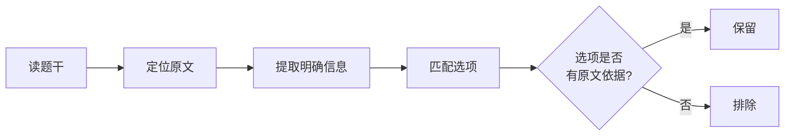
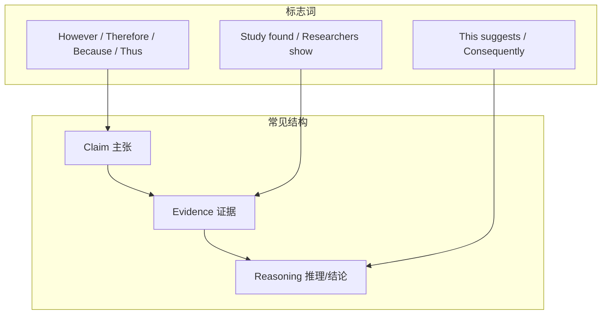
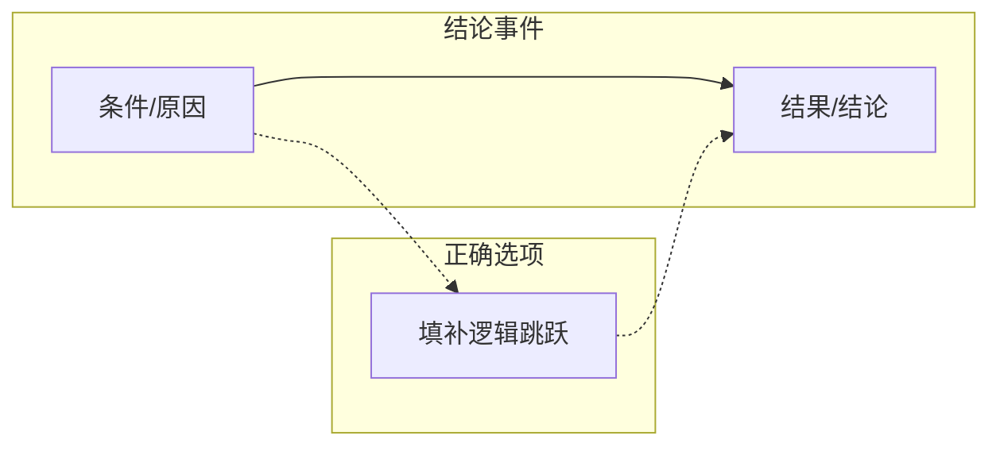
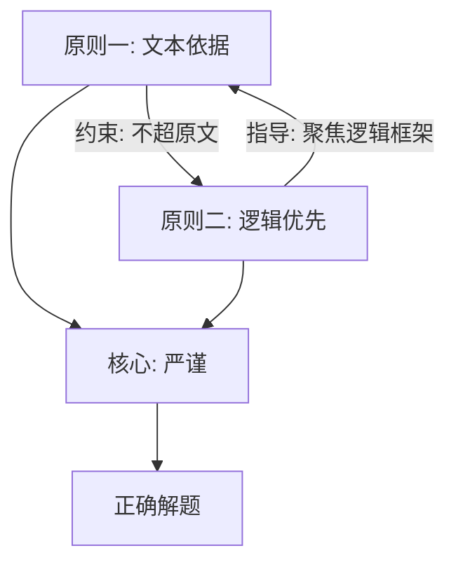

# SAT Reading - Analysis Principles

> [!abstract] 概述
> SAT 阅读语法部分的错题分析需要遵循严格的原则，避免常见陷阱。本文档归纳两条核心分析原则：**文本依据原则**和**逻辑优先原则**。

---

## 原则一：文本依据原则

> [!danger] 核心要求
> **原文中没有明确提及的字句绝对不要自己推断。**

### 说明

分析 SAT 阅读题目时，所有判断必须严格基于题干、选项和原文中**明确写出**的信息。不得添加任何原文未直接支持的推理或细节。

### 常见违规行为

| 违规类型 | 示例 | 后果 |
|:---|:---|:---|
| **过度推断** | 原文只提到"A 导致 B"，自行推断"所以 A 是 B 的唯一原因" | 选择了超出原文范围的选项 |
| **添加背景知识** | 用自己已知的课外知识补充原文没有的信息 | 对选项做出错误判断 |
| **因果补全** | 原文说了"如果 X 则 Y"，推断出"如果不 X 则一定不 Y"（否定前件谬误） | 逻辑跳跃 |
| **情感归因** | 原文陈述了一个事实，自行推断作者"认为这很可惜/令人担忧" | 加入原文未表达的立场 |

### 正确做法

> [!tip] 检验方法
> 对于每个看似正确的选项，问自己：**"原文的哪一句话支持这个选项？"** 如果找不到确切的原文依据，则不能选。

---

## 原则二：逻辑优先原则

> [!danger] 核心要求
> **逻辑优先于内容 — 必须首先找到段落的中心句（Central/Controlling Idea）。**

### 说明

SAT 阅读的每一道题（尤其是 Command of Evidence 类），本质上都在考察 **论证逻辑**，而非具体内容。具体内容只是逻辑的载体，选项的内容看起来"正确"并不代表它在逻辑上成立。解题时，**必须先定位中心句，以中心句建立的逻辑框架为准绳来检验选项**。

### 为什么逻辑比内容更重要

| 情况 | 说明 |
|:---|:---|
| 内容正确但逻辑错误 | 选项描述的事实本身是对的，但与题干要求的**逻辑功能**（支持结论/削弱论点/开始叙事）不匹配 |
| 内容有偏差但逻辑正确 | 选项看似"说得不完整"，但在逻辑链条中恰好填补了缺失的环节 |
| 逻辑锁定后内容自然明确 | 一旦理清段落的论证结构（claim → evidence → reasoning），正确选项往往自动显现 |

### 如何找到中心句

#### 1. 识别论证结构

SAT 阅读文章通常遵循以下结构之一：

#### 2. 定位中心句的方法

| 方法 | 说明 | 标志词 |
|:---|:---|:---|
| **找转折后** | 文章/段落中心通常在 **but / however / yet** 之后 | however, but, yet, nevertheless, although |
| **找结论句** | 研究结果、结论性陈述往往是论证的核心 | conclude, find, suggest, therefore, thus |
| **找重复点** | 反复出现的概念通常是主题 | 关键词在句首、段首重复出现 |
| **问"所以呢？"** | 每读完一句问"作者说这个想证明什么？" | — |

#### 3. 实战示例

> **题目**: 研究人员认为 Grande Terre 的物种是古老 clade 在岛屿出现前的幸存者。但 Sauquet 发现山毛榉冠龄 16.4 mya，远小干岛屿年龄 37 mya。

**错误做法**：关注"山毛榉"、"南太平洋"等具体名词 → 被内容带着走。

**正确做法**：
1. 找中心句：**"Sauquet et al. found that the crown age ... is 16.4 million years"**
2. 识别逻辑关系：**"However"** 标志 → 这个发现**反驳**了前面的假说
3. 用逻辑检验选项：
   - 如果冠龄 < 岛龄 → 该 clade **不可能**在岛屿出现前已存在
   - 选项 C 准确表达了这层逻辑 → 正确

### 逻辑链条分析法

对于大多数 SAT 阅读题目，画出以下链条即可解题：

> [!tip] 检验方法
> 找到中心句后，问：**"作者用这个中心句想达到什么逻辑目的？"**
> - 是支持一个结论？
> - 是反驳一个假说？
> - 是开始一段叙事？
> - 是解释一个因果？
>
> 确定了逻辑目的，再筛选选项。内容细节可以暂时不管。

---

## 两条原则的关系

- **原则一（文本依据）** 管的是**不能做什么**：不添加原文没有的信息
- **原则二（逻辑优先）** 管的是**应该做什么**：聚焦论证逻辑而非内容细节
- 两者互补：在原文范围内，用逻辑框架解题

---

## 相关笔记

- [[SAT RW 25.5-4 错题分析]]
- [[SAT Reading - Command of Evidence 全解]]
- [[SAT Reading - Words in Context 逻辑关系分类]]

## 注意事项

1. **每步问依据**：对于每个判断，问自己"原文里明确写了什么"
2. **先找中心句**：对任何题目，先定位中心句，再分析选项
3. **逻辑 > 字面**：字面内容再花哨，也必须服务于中心句的逻辑目的
4. **结合使用**：两条原则需同时使用，缺一不可
