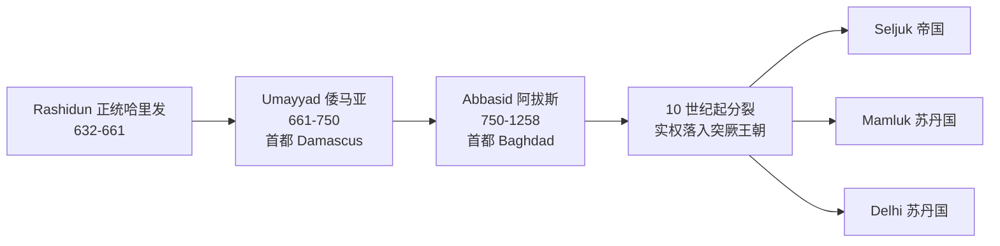

# 伊斯兰与 Dar al-Islam（伊斯兰之家）

> [!abstract] 概述
> 本笔记覆盖伊斯兰历史单元的三层内容：①伊斯兰教的兴起（Muhammad 与麦加–Medina 时期，610–632）；②哈里发国家的扩张与 Abbasid 瓦解；③AP 考试核心考点 Topic 1.2「Developments in Dar al-Islam, c. 1200–c. 1450」。核心考试母题：**Abbasid 的政治分裂不等于伊斯兰文化衰落**。

> [!warning] 考试范围提醒
> AP World History 命题范围是 **1200–2001**。第 1、2 节的伊斯兰教起源史不在直接命题范围内，它是理解 Topic 1.2 的背景铺垫。直接考点集中在第 3 节，并联动 Unit 2（贸易网络传播伊斯兰）与 Unit 3（Ottoman/Safavid）。

## 1 伊斯兰教的兴起（c. 570–632）

### 1.1 Muhammad 早年

| 时间 | 事件 |
|---|---|
| c. 570 | 出生于 Mecca，属 Quraysh 部落 Banu Hashim 家族；父亲 Abdullah 在其出生前去世 |
| c. 576 | 母亲 Aminah 去世，由祖父 Abdul-Muttalib 抚养 |
| c. 578 | 祖父去世，改由叔父 Abu Talib 抚养至成年 |

Muhammad 青年期的三个关键行为：①每年 Quraysh 在 Kaaba 向偶像献祭的节庆上，他**拒绝参与偶像献祭**，自称"以掌管我生命的真主起誓，我绝不向偶像献祭"；②自己宰牲时说 Bismillah（奉真主之名），不呼告部落偶像；③成年后每年在 Ramadan 月退隐到 Hira 山洞静修（tahannuth）。**610 年**，他在其中一次退隐中获得首次启示。

> [!note] 夜行登宵（Isra and Mi'raj）
> 传统称 Muhammad 一夜之间从 Mecca 到 Jerusalem 并升天，五次礼拜即定于此时。此事件是后世争议点：身体旅行还是精神异象、是否以耶路撒冷为目的地、发生年份，均有不同传述。考试不考细节，知道它体现 Muhammad 与一神教传统（Judaism、Christianity）的连续性即可。

### 1.2 传教、Hijra 与建国

- **613**：开始公开传教。一神论冲击了 Quraysh 部落以 Kaaba 偶像为中心的经济与权威。
- **622 Hijra**：受麦加贵族迫害，迁往 Yathrib（后改名 Medina），建立政教合一共同体。Hijra 是伊斯兰历元年。
- Medina 时期的核心主张：所有信徒是一个共同体（umma），Jews、Christians 同为一神教"有经人"。

### 1.3 三大会战与《Hudaybiyyah 和约》

| 会战 | 年份 | 结果 | 关键点 |
|---|---|---|---|
| **Badr** | 624 | 穆斯林胜 | 约 313 人击败约 1000 人的麦加商队护卫军；确立 Muhammad 的军事威信 |
| **Uhud** | 625 | 麦加胜 | 弓箭手擅离高地，Khalid ibn al-Walid 骑兵包抄；Muhammad 负伤，叔父 Hamza 阵亡 |
| **壕沟战（Khandaq）** | 627 | 穆斯林战略胜 | 约 10000 联军围城；Salman al-Farsi 建议掘壕沟废掉骑兵优势；联军无果撤退 |

**628 年《Hudaybiyyah 和约》**：10 年停战。条款表面屈辱——穆斯林当年返回、次年才准朝觐；逃往 Medina 的麦加人须遣返，反向不遣返；部落可自由选边。Qur'an 48:1 称之为"明显的胜利"：停战期内和平传教，穆斯林人口两年翻倍。

**630 年**：麦加盟友 Banu Bakr 攻击穆斯林盟友 Khuza'ah，和约破裂。Muhammad 率约 10000 人进军，**基本兵不血刃收复 Mecca**，宽赦居民，清除 Kaaba 偶像。

### 1.4 史料局限

- Muhammad 生平细节主要来自后出文献：sira 传记（Ibn Ishaq，c. 767）与圣训集（Bukhari、Muslim，c. 850），晚于事件 150–200 年。
- 除 Qur'an 简短经文外，无同时代记载。夜行登宵、早年拒祭等故事属传统记述，非当代史实记录。

## 2 哈里发时代：扩张至 c. 1200

- **军事扩张先行，宗教扩张随后**（CED KC-3.1.III.A）：Muslim rule 靠军事扩张进入 Afro-Eurasia 广大地区；伊斯兰教本身则靠**商人、传教士、Sufi 苏菲派**传播。
- Abbasid 时期 Baghdad 的 **House of Wisdom（智慧宫）** 系统翻译希腊哲学与科学，是知识转移的枢纽。
- 1258 Mongol 攻陷 Baghdad，Abbasid 名义终结——但 see 第 3 节：这不是文化终点。

## 3 CED 核心考点：Topic 1.2 Developments in Dar al-Islam（c. 1200–c. 1450）

### 3.1 三条 Learning Objective 与对应史实

| LO | 内容 | 对应 Key Concept |
|---|---|---|
| **LO-D** | 解释信仰体系及其实践如何影响社会（c. 1200–1450） | KC-3.1.III.D.iii：Islam、Judaism、Christianity 及其核心信仰与实践持续塑造 Africa 和 Asia 的社会 |
| **LO-E** | 解释伊斯兰国家兴起的因果 | KC-3.2.I：Abbasid 瓦解后新伊斯兰政治实体涌现，**多数由突厥人主导**；这些国家体现 continuity、innovation、diversity |
| **LO-F** | 解释 Dar al-Islam 知识创新的效应 | KC-3.2.II.A.i：穆斯林国家鼓励大量知识创新与转移 |

> [!tip] 定义：Dar al-Islam
> **Dar al-Islam 是文化区域，不是单一帝国。** 它指伊斯兰法通行、穆斯林网络连接的整个地带，从西非经中东延伸到东南亚。Abbasid 政治瓦解后，这片区域反而更碎片化、更多元。

### 3.2 新伊斯兰政治实体（必背例证清单）

| 实体 | 地区 | 要点 |
|---|---|---|
| **Seljuk Empire** | 中东/安纳托利亚 | 突厥人；1055 年入主 Baghdad，架空 Abbasid 哈里发 |
| **Mamluk Sultanate** | Egypt | 突厥裔军事奴隶政权；1250 年建立；1258 后庇护 Abbasid 余脉；1260 年击败 Mongols（Ain Jalut） |
| **Delhi Sultanates** | 南亚 | 突厥-阿富汗人；将伊斯兰统治引入印度 |

记忆钩子（来自错题清单）：**Turkic sword, Persian pen, Arab faith**——突厥人掌军权，波斯文化提供行政与文学范式，阿拉伯信仰是纽带。后 Abbasid 国家高度**波斯化**。

### 3.3 知识创新与转移（LO-F 必背例证）

**创新 Innovations**：
- 数学：**Nasir al-Din al-Tusi**（三角学、天文台）
- 文学：**'A'ishah al-Ba'uniyyah**（Sufi 女诗人，CED 点名例证）
- 医学：医院体系与医学百科

**转移 Transfers**：
- 希腊道德与自然哲学的**保存与注释**（Aristotle、Plato 经阿拉伯语传承）
- **House of Wisdom**（Abbasid Baghdad）
- **Muslim and Christian Spain** 的学术文化交流（托莱多翻译运动进入欧洲）

### 3.4 宗教的社会影响（LO-D）

- 五功（Five Pillars）：念诵 shahada、礼拜 salat、施舍 zakat、斋戒 sawm、朝觐 hajj——塑造共同体节律与社会纽带。
- Islam 与 Judaism、Christianity 在 Africa 和 Asia 并存且互相塑造；Sufi 行善团是向乡村与非阿拉伯世界传教的主力。

## 4 伊斯兰的持续扩张（Unit 2 联动）

| 通道 | 例证 | 考点 |
|---|---|---|
| 印度洋贸易 | **Swahili Coast** 城邦（Kilwa、Mogadishu） | 班图基底 + 阿拉伯/波斯/印度融入；**精英采纳伊斯兰**，文化是混成体不是阿拉伯殖民地 |
| 跨撒哈拉贸易 | **Mali、Songhai** | 骆驼鞍与商队支撑黄金-盐贸易；Mansa Musa 1324 年朝觐展示马里黄金 |
| 旅行者 | **Ibn Battuta** | 其游记是 14 世纪 Dar al-Islam 连通性的核心史料 |

对应错题清单陷阱："Swahili Coast = 阿拉伯殖民地"是错的——是 Creole 混成文化，不是 colony。

## 5 考试陷阱清单（来自 session 错题清单 D1/D3）

1. **"Dar al-Islam = 阿拉伯帝国"**——错。Dar al-Islam 是文化区；Abbasid 瓦解后的新国家由**突厥人**主导（Seljuk、Mamluk、Delhi）且波斯化。
2. **"Abbasid 崩溃 = 伊斯兰衰落"**——错。政治分裂 ≠ 文化终点；House of Wisdom、al-Tusi、al-Ba'uniyyah、医学、希腊哲学保存都在 Abbasid 名存实亡后继续繁荣。
3. **Turkic $\neq$ Arab**——后 Abbasid 国家是 Seljuk、Mamluk、Delhi；"突厥"不等于"阿拉伯"。
4. **时段锚点**：Unit 1 与 Unit 2 都终于 c. 1450；命题范围 1200–2001。
5. **Unit 3 标签配对**：devshirme = **Ottoman**；Twelver Shi'ism 国教 = **Safavid**（以此区别于 Sunni 的 Ottoman）；Akbar 废 jizya，Aurangzeb 重征——同一帝国两套政策。
6. **传播机制表述**：军事扩张带来 Muslim rule，伊斯兰教本身的扩散靠商人、传教士、Sufi——因果链别倒置。

## 相关链接

- [[AP_World_History_Unit1_MOC]]（Unit 1 知识地图）
- [[AP_World_History_Unit2_Networks_of_Exchange]]（Unit 2：贸易网络如何传播伊斯兰）
- [[AP_World_History_Unit3_Land_Based_Empires]]（Unit 3：Ottoman、Safavid 伊斯兰帝国）
- [[AP_World_History_Error_Traps]]（全 9 单元陷阱索引）
- 工作目录产物：`~/高二/世界历史/AP_World_History_Error_Checklist.pdf`（可直接打印的易错点清单）、`~/高二/世界历史/AP考纲资料/`（CED 官方考纲抽取）
