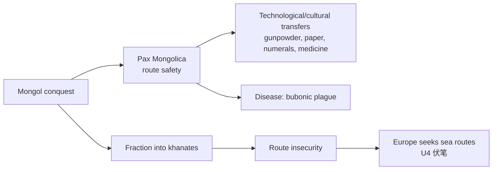

# Unit 2 — Networks of Exchange（c. 1200–c. 1450，权重 8–10%）

> [!abstract] 概述
> 核心母题：**交换网络的扩张 = 商业技术 + 国家保护 + 环境知识**，随之而来的是文化、作物、疾病与技术的双向扩散。考试最爱考三条因果链：①技术革新 → 贸易增长 → 城市兴起；②贸易 → 文化/宗教扩散；③贸易 → 病原体扩散（bubonic plague）。与 Unit 1 同属 Period 1。

## 1 四大网络速览

| 网络 | 时段 | 关键技术/制度 | 关键节点 | 主 cargo |
|---|---|---|---|---|
| **Silk Roads**（陆） | 复兴于 1200 后 | caravanserai、bills of exchange、banking houses、paper money | Kashgar、Samarkand | 轻高值：丝绸、瓷器、马匹 |
| **Indian Ocean**（海） | 古已有之，1200 后强化 | monsoon 知识、compass、astrolabe、更大船型 | Calicut、Malacca、Gujarat、Swahili Coast、Kilwa | 低值大宗：纺织、香料、木材 |
| **Trans-Saharan**（沙漠） | Mali/Songhai 时代 | camel saddle、caravan | Timbuktu | 黄金、盐、kola |
| **Mongol routes** | Pax Mongolica | 驿站、Uyghur script、治世保护 | Karakorum、Khanbaliq | 使节、技术、疾病 |

> [!tip] 列宽记忆钩
> **陆路轻高值，海路低值大宗**——运费结构决定货物结构。这是 MCQ "most directly" 题的判别器。

## 2 CED Learning Objectives 与史实

| LO | 要求 | 必背史实 |
|---|---|---|
| LO-A (2.1) | Silk Roads 兴起的因果 | Improved commercial practices → 贸易量与地理范围扩大 → powerful new trading cities |
| LO-B/C (2.2) | 国家兴衰与帝国扩张对贸易的影响 | Mongol khanates 取代旧帝国，**Mongol 扩张促进 Afro-Eurasian 贸易** |
| LO-E (2.3) | Indian Ocean 兴起之因 | compass、astrolabe、larger ship designs；**monsoon winds 知识** |
| LO-H/I (2.4) | Trans-Saharan 增长 | camel saddle、caravans；**Mali 扩张促进贸易** |
| LO-J (2.5) | 文化后果 | diffusion of 文学/艺术/科学；**Gunpowder from China、Paper from China** |
| LO-K (2.6) | 环境后果 | **bubonic plague 沿商路扩散**；bananas 进非洲、new rice varieties、citrus 扩散 |
| LO-L (2.7) | 经济交换比较 | 网络加深加宽 → cultural/technological/biological diffusion |

## 3 Mongol 双面性（2.2 专节）

- **破坏**：攻灭 Khwarazm、Abbasid（1258 Baghdad）、宋。
- **建设**：Pax Mongolica 保障商路安全；采纳 **Uyghur script** 作为行政文字；**transfer of Greco-Islamic medical knowledge to western Europe**、**numbering systems to Europe**。
- 帝国后分裂为 Yuan、Chagatai、Ilkhanate、Golden Horde； fragmentation → 商路安全下降，间接推动欧洲海上探索（Unit 4 伏笔）。

## 4 商业与金融创新（高频考点）

- **bills of exchange**（汇票）与 **banking houses**：降低长途携银风险。
- **paper money**（China/Yuan）与 money economies。
- **caravanserai**：沙漠驿站，兼旅舍与文化交流节点——**是旅舍不是市场**。
- **diasporic communities**：Arab/Persian、Chinese、Malay 商人侨居港市，双向影响彼此文化（不是单向同化）。

## 5 旅行者与史料

| 旅行者 | 身份 | 路线 | 史料 |
|---|---|---|---|
| **Ibn Battuta** | 摩洛哥穆斯林法学家 | 1325 起遍游伊斯兰世界至印度、中国 | Rihla——Dar al-Islam 连通性的核心一手史料 |
| **Marco Polo** | 威尼斯商人 | 经丝绸之路至 Yuan 宫廷 | 狱中口述成书，是欧洲对东方想象的主要来源 |
| **Margery Kempe** | 英格兰基督徒 | 圣地朝圣 | 中世纪英文自传（CED 新增点名例证） |

> [!warning] 高频陷阱：Marco Polo ≠ Ibn Battuta
| 错 | 对 |
|---|---|
| Marco Polo 是穆斯林旅行家 | **Ibn Battuta** 才是；Marco Polo 是威尼斯基督徒商人 |
| 两者都写了宫廷服务经历 | Polo 侍奉 **Kublai Khan**；Battuta 在 **Delhi Sultanate** 任 qazi |
| 两者路线相同 | Polo 走陆路去、海路回；Battuta 主要沿伊斯兰网络 |

## 6 环境与疾病（2.6 必考）

- **bubonic plague**（14 世纪）沿陆路传播 → 人口锐减 → 劳动力升值 → 欧洲封建结构松动。
- 作物扩散改善营养：**bananas in Africa**（补足热带主食）、**new rice varieties**（越南早熟稻入宋）、**citrus spread**（地中海）。
- 城市 fate varied：贸易枢纽兴起（Calicut、Malacca），旧陆路城随网络衰退。

## 7 考试陷阱清单

1. **"Silk Road 是一条路、只运丝绸"**——错。是**网络**；货、idea、宗教、病同路。
2. **"贸易增长因为人们想要"**——错。CED 机制是**商业技术与运输革新**（caravanserai/credit/money economies）。
3. **"Indian Ocean 贸易始于欧洲人到来"**——错。远早于此；葡萄牙人 1498 后**加入并试图垄断**已有网络。
4. **"Swahili Coast 是阿拉伯殖民地"**——错。**Bantu 基底 + 阿拉伯/波斯融入**的 creole 混成文化。
5. **"Mongol 只破坏"**——错。Pax Mongolica + 技术转移（gunpowder、paper、numerals、medicine）。
6. **"Trans-Saharan 只运奴隶"**——错。**黄金、盐、kola、布匹**为主。
7. **"Mansa Musa 建立了 Mali"**——错。**Sundiata** 建国；Mansa Musa 是 1324 年 hajj 展示国力的鼎盛君主。
8. **Unit 归属**：U1、U2 都终于 c. 1450；Columbian Exchange 属 **U4**，勿混。

## 相关链接

- [[AP_World_History_Unit1_MOC]]（Period 1 政治背景）
- [[AP_World_History_Dar_al-Islam]]（伊斯兰沿商路传播）
- 待建：[[AP_World_History_Unit3_Land_Based_Empires]]
- 打印清单：`~/高二/世界历史/AP_World_History_Error_Checklist.pdf`
