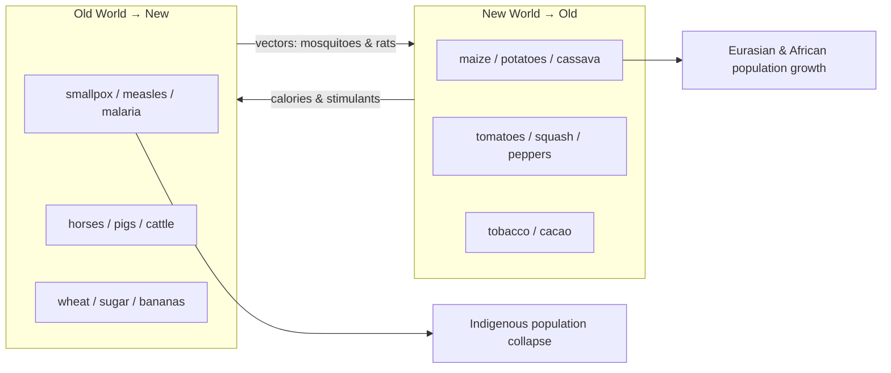

# Unit 4 — Transoceanic Interconnections（c. 1450–c. 1750，权重 12–15%）

> [!abstract] 概述
> 权重最高的两个单元之一（与 U5 并列 12–15%）。核心母题：**航海技术 + 国家资助 → 全球网络 → 哥伦布大交换 → 强制劳动体系 → 大西洋经济**。三条必背因果链：①旧技术扩散（非欧洲发明）→ 探索可行；②Columbian Exchange 双向流动；③美洲劳动力真空 → coerced labor 体系（encomienda / mita / hacienda / chattel slavery）。

## 1 Topic 4.1–4.2 技术与探索动因

**技术（CED 4.1）**：caravel、carrack、fluyt 船型；magnetic compass、astrolabe；lateen sail。**扩散来源**：compass 出中国、astrolabe 经伊斯兰世界、lateen sail 出印度洋——欧洲是**集大成者**，不是发明者。

**动因（CED 4.2）**：
- 找新航路去 Asia（香料直接贸易）；
- Ottoman/Mamluk 控制东地中海贸易 → 西欧绕行动机；
- Iberian **reconquista** 收官后的军事-宗教外溢；
- 大西洋国家间竞争（Portugal vs Spain 先行，荷兰/英/法跟进）。

**国家资助形式**：joint-stock companies（Dutch/British East India Companies）、monopoly charters。

## 2 Topic 4.3 Columbian Exchange（本单元最重考点）

**CED 关键句**（KC-4.1.V.A）：疾病是 **"unintentional transfer of disease vectors, including mosquitoes and rats"** ——不是生物武器。

- **Foods brought by African enslaved persons: okra, rice**（CED 点名）——非洲不只是"受害者"，也是作物与文化输入方。
- 新大陆作物 → 欧亚人口增长 → （U5 伏笔）工业革命劳动力与市场。

## 3 Topic 4.4–4.5 海上帝国与强制劳动

### 3.1 劳动体系四件套（必背辨析）

| 体系 | 定义 | 关键区分 |
|---|---|---|
| **encomienda** | 王室授予殖民者征用 Indigenous 劳役与贡赋、名义上负保护义务 | 不是奴隶制；是**劳役+贡赋**的封地特权 |
| **mita** | **Inca 原有**劳役税，被 Spain 复用至 Potosí 银矿 | 源头是 Andean，不是西班牙发明 |
| **hacienda** | 大地产，面向本地/区域市场 | 不是面向出口的种植园 |
| **chattel slavery** | 世袭、终身、法律上为财产 | 跨大西洋奴隶制的法律形态 |

### 3.2 社会等级：sistema de castas

peninsulares（半岛人）→ creoles（土生白人）→ mestizos / mulattos（混血）→ Indigenous → enslaved Africans。**hierarchy ⊃ slavery**（等级制包含奴隶制，但不等于）。

### 3.3 海上帝国的竞争与限制

- Portuguese 先行（非洲-印度洋），Spain 拿美洲，Dutch/English/French 后起挑战——U4 后半段的"Maritime Empires Maintained"。
- **亚洲强权的拒绝**（CED 4.4 例证）：**Ming China 与 Tokugawa Japan 采纳 restrictive/isolationist trade policies**（澳门体制/广州体制；Dejima）。
- Indian Ocean 内 Asian merchants 仍是主力（**Swahili Arabs、Omanis、Gujaratis、Javanese**——CED 点名）。

## 4 Topic 4.6–4.7 挑战与社会变迁

### 4.6 抵抗（CED 点名例证，必背）

- **Pueblo Revolts**（1680，Popé 领导逐西 12 年）
- **Fronde**（法，贵族-民众反马扎然/路易十四）
- **Cossack revolts**（俄边疆）
- **Maratha conflict with Mughals**
- **Ana Nzinga's resistance**（Ndongo-Matamba 女王抗葡）
- **Metacom's War / King Philip's War**（新英格兰 Wampanoag）
- **Maroon societies in the Caribbean and Brazil**（Palmares 等）

### 4.7 社会等级变动（CED 例证）

- **Expulsion of Jews from Spain and Portugal ↔ acceptance in the Ottoman Empire**——跨帝国对比最爱。
- **Restrictive policies against Han Chinese in Qing China**。
- Ottoman 帝国内不同阶层女性的 status 差异；Ottoman timars、Russian boyars、European nobility 旧精英。

## 5 考试陷阱清单

1. **"航海技术是欧洲发明"**——错。扩散-集成；compass（中）、astrolabe（希腊-伊斯兰）、lateen（印度洋）。
2. **"Columbian Exchange 单向"**——错。**双向**；方向记法：病与牲畜西→东，卡路里作物东→西。
3. **"Disease 是生物武器"**——错。CED 明文 **unintentional**。
4. **"Encomienda = 奴隶制"**——错。四件套辨析见 §3.1；mita 尤其不能算西班牙发明。
5. **"Casta system = 奴隶制"**——错。是**混血等级**法律体系。
6. **"mercantilism = 自由贸易"**——错。重商主义是零和 bullion 观 + 保护关税；laissez-faire 是其对立面（U5）。
7. **"Indigenous 抵抗都失败了"**——错。Pueblo 逐西 12 年、Maroon 建国百年、Ethiopia/Siam 从未被殖民。
8. **"亚洲被完全边缘化"**——错。Ming/Tokugawa **主动限贸**，Indian Ocean 内 Asian 商人依旧主导份额。
9. **单元归属**：Columbian Exchange 属 **U4**；Mansa Musa、Swahili 黄金贸易属 **U2**。

## 相关链接

- [[AP_World_History_Unit3_Land_Based_Empires]]（同期陆上帝国对照）
- [[AP_World_History_Unit2_Networks_of_Exchange]]（葡萄牙加入的"旧网络"）
- 待建：[[AP_World_History_Unit5_Revolutions]]（大交换作物 → 人口 → 工业革命）
- 打印清单：`~/高二/世界历史/AP_World_History_Error_Checklist.pdf`
