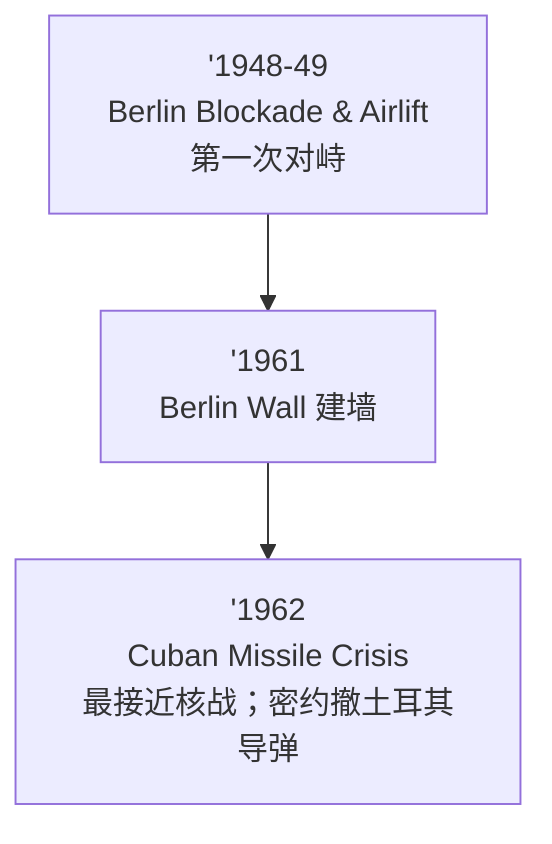
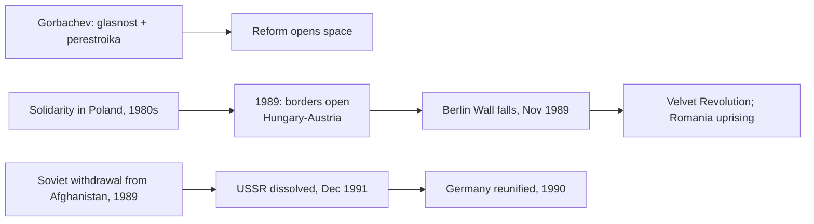

# Unit 8 — Cold War and Decolonization（c. 1900–2001 命题窗口，权重 8–10%）

> [!abstract] 概述
> 两条线交织：**美苏对峙（proxy 而非 direct war）**与**帝国解体**。核心母题：①冷战靠**代理人战争 + 经济/军事援助 + 意识形态竞争**打；②去殖民化方法随**定居者存在与否**变化；③新国家面临相同的建国三件套（土地/资源重新分配、国有化、教育卫生国家化）。

## 1 Topic 8.1 Setting the Stage

- **WWI 后**：self-government hopes unfulfilled——mandate system、Versailles 种怨（CED KC-6.2.II 原文）。
- **WWII 后**：anti-imperialist sentiment + 欧洲列强削弱 + US/USSR 崛起 $\to$ **dissolution of empires**。
- Atlantic Charter（1941）的 self-determination 措辞被殖民地反向引用。

## 2 Topic 8.2 The Cold War

### 2.1 两大阵营的工具箱（必背辨析）

| 工具 | 内容 | 区分 |
|---|---|---|
| **Truman Doctrine** (1947) | 军事+经济援助 Greece/Turkey | 针对"共产主义威胁"的具体承诺 |
| **Marshall Plan** (1948) | 西欧经济重建援助 | **经济**工具；苏联禁止东欧参加 |
| **NATO** (1949) | 集体防御军事同盟 | 对手：**Warsaw Pact** (1955) |
| **COMECON** | 苏联阵营经济互助 | 对手：马歇尔计划体系 |
| **Containment** | 总战略（Kennan 长电报） | 不等于具体某一项 |

> [!tip] 一句话辨析
> **Aid (Truman) $\to$ Money (Marshall) $\to$ Guns (NATO)**；苏联镜像：COMECON + Warsaw Pact。

### 2.2 Proxy Wars（CED 8.2/8.3 例证）

Korea (1950–53)、**Vietnam**、Afghanistan (1979–89)、**Angola、Nicaragua (Contra)**、Congo。超级大国出钱出枪，本地人打仗。

### 2.3 危机时序（易错排序）

### 2.4 Non-Aligned Movement

- **Bandung Conference 1955**（亚非会议）$\to$ 1961 正式成立。
- 领袖（CED 点名）：**Sukarno in Indonesia、Kwame Nkrumah in Ghana**；另有 Tito、Nasser、Nehru。
- 定性：**主动拒绝加入任一集团、要求第三条路**，不是中立孤立。

## 3 Topic 8.3 Effects of the Cold War

- 新军事同盟：NATO / Warsaw Pact；**nuclear proliferation + proxy wars**（KC-6.2.IV.D 原文）。
- 政权形态：coups（Iran 1953、Guatemala 1954、Chile 1973）、new constitutions、land/resource redistribution、**nationalization**：
  - **Mossadegh nationalises Iranian oil (1951)** $\to$ 英美政变（1953）
  - **Nasser nationalises Suez Canal Company (1956)** $\to$ Suez Crisis
- **Dissidents**（CED 例证）：Solzhenitsyn（苏联）、Havel（Czechoslovakia）、Pope John Paul II（波兰团结工会的精神同盟）、Aung San Suu Kyi（缅甸）。
- **Liberation theology**（拉美天主教、Second Vatican Council 后）与 **U.S. Civil Rights Act (1964/65)**、**end of apartheid**（U8–U9 交叉）。

## 4 Topic 8.4 Spread of Communism After 1900

| 案例 | 要点 |
|---|---|
| USSR | 1917 October Revolution；Stalin collectivization/five-year plans |
| **China** | 1949 CCP 建国（Mao）；**Great Leap Forward (1958–62) 大饥荒**；**Cultural Revolution (1966–76)** 意识形态清洗（不是经济改革） |
| **Cuba** | Castro + Guevara (1959)；Bay of Pigs、导弹危机 |
| **Vietnam** | Ho Chi Minh；partition 1954 $\to$ 1975 统一 |
| **Cambodia** | Khmer Rouge (1975–79) $\to$ CED 7.8 点名 atrocity |

> [!warning] 中苏分裂（阵营非铁板）
| 错 | 对 |
|---|---|
| "中苏冷战全程盟友" | **1960 年前后 Sino-Soviet split**（意识形态+边界）；1969 Ussuri 冲突；1972 Nixon 访华——毛的中国独立于莫斯科 |

## 5 Topic 8.5 Decolonization After 1900

**CED 点名例证（方法分类）**：

| 方法 | 案例 |
|---|---|
| **Negotiated independence** | **India from the British Empire**；**the Gold Coast from the British Empire**（Nkrumah）；**French West Africa** |
| **Independence through armed struggle** | **Algeria from the French empire**；**Angola from the Portuguese empire**；**Vietnam from the French** |
| Nationalist leaders/parties | **Indian National Congress**（Gandhi Nehru）、**Ho Chi Minh in French Indochina**、**Kwame Nkrumah in British Gold Coast**、**Gamal Abdel Nasser in Egypt** |
| States created by redrawing boundaries | **Israel、Cambodia、Pakistan**（CED 点名） |

- **India 1947 Partition**：India / Pakistan 分治；两因素——**two-nation theory + British divide-and-rule**；Ambedkar 代表 Dalits 另立议程。
- **South Africa 不是常规去殖民化**：1961 成为共和国但白人 minority rule 延续；apartheid (1948–1994) 结束于 Mandela 1994 当选——**settler colonial 的反向案例**。

## 6 Topic 8.6–8.8 新国家与冷战终结

### 8.6 Newly Independent States 三件套

- **Land and resource redistribution**；**nationalization**（伊朗油、苏伊士）；state-run education/health（以 Cuba literacy campaign 为典型）。
- 政体光谱：one-party states、military dictatorships、monarchies——民主非唯一结局。

### 8.7 Global Resistance to Established Order

- **1968 全球抗议**（巴黎、布拉格、墨西哥城）；**Anti-apartheid**；American Indian Movement；Black Power；feminism；**Earth Day / Greenpeace**（U9 交叉）；**Amnesty International (1961)**。

### 8.8 End of the Cold War

- 内因 > 外因：**体制内部改革 + 民族东欧压力**；军备竞赛是背景压力，不是唯一原因。

## 7 考试陷阱清单

1. **"Cold War 没有热战"**——错。**proxy wars**：Korea、Vietnam、Angola、Nicaragua、Afghanistan、Congo。
2. **"Containment = Marshall Plan"**——错。总战略 vs 具体经济工具；Truman Doctrine 才是军事-政治承诺。
3. **"Non-Aligned = 中立孤立"**——错。**主动拒绝选边**、要求第三条路（Bandung 1955）。
4. **"去殖民化只有一条路"**——错。谈判（India、Gold Coast）vs 武装（Algeria、Angola、Vietnam）随**定居者存在与否**分化。
5. **"Gandhi 单独赢得印度独立"**——错。**INC + Muslim League (Jinnah) + Ambedkar**；Partition 1947 是多方博弈。
6. **"Partition 纯宗教原因"**——错。**two-nation theory + British divide-and-rule** 政治机制。
7. **"独立 = 外国影响结束"**——错。**neo-colonialism**：债务、结构性调整、French Africa 的持续干预。
8. **"新国家都民主化"**——错。one-party、military、monarchy 并存。
9. **"Nationalization = 共产主义"**——错。Mossadegh (1951)、Nasser (1956) 是**民族主义资源主权**行动。
10. **"第一次超级大国对峙 = 古巴导弹危机"**——错。**Berlin Blockade 1948–49** 在前。
11. **"南非在 1960s 去殖民"**——错。1961 共和国但 **apartheid 延续至 1994**。
12. **"冷战终结靠军备竞赛拖垮"**——错（不完整）。Gorbachev 改革 + Solidarity + 1989 边界开放是主链。

## 相关链接

- [[AP_World_History_Unit7_Global_Conflict]]（WWII 削弱列强 $\to$ 去殖民窗口）
- [[AP_World_History_Unit6_Consequences_of_Industrialization]]（抵抗传统的延续）
- 待建：[[AP_World_History_Unit9_Globalization]]
- 打印清单：`~/高二/世界历史/AP_World_History_Error_Checklist.pdf`
