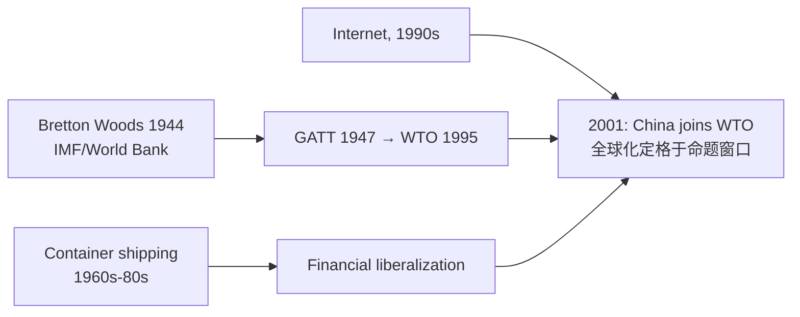

# Unit 9 — Globalization（c. 1900–2001 命题窗口，权重 8–10%）

> [!abstract] 概述
> 收束单元：**技术、疾病、环境、经济、文化、制度**六条全球线。核心母题：①全球化是**加速而非新造**（1944 布雷顿森林 → 集装箱 → 互联网）；②**收益与代价并存**（Green Revolution 养更多人但也制造不平等；连接带来繁荣也带来流行病）。注意：本单元教学写 "to the present"，但**命题窗口止于 2001**。

## 1 Topic 9.1–9.2 Technology & Disease

**连接技术**（CED 9.1）：radio → cellular → **internet**；air travel + **shipping containers**（集装箱是被低估的全球化引擎）。
**能源技术**：petroleum + **nuclear power**（民用与军用双面）。
**医学**：vaccines、antibiotics → 寿命延长；**birth control** → 生育率下降（KC-6.1.III.B）。

**疾病三分类（CED 9.2 点名，必背）**：

| 类别 | CED 例证 |
|---|---|
| Diseases associated with **poverty** | **Malaria、Tuberculosis、Cholera** |
| **Emergent epidemic** diseases | **1918 influenza pandemic、Ebola、HIV/AIDS** |
| Diseases associated with **increased longevity** | **Heart disease、Alzheimer's disease** |

> [!tip] 记忆钩
> **穷病（古老）、新疫（突袭）、慢病（长寿的代价）**——三类对应三种公共卫生策略。

## 2 Topic 9.3 Environment（CED KC 原文）

- 人类活动 → **deforestation、desertification、decline in air quality、fresh water 消耗加剧** → 资源竞争白热化（KC-6.1.II.A）。
- **greenhouse gases and pollutants** → 关于气候变化性质与成因的 **debates**（KC-6.1.II.B）——CED 用词是 debates，考试尊重争议存在的表述。
- 核能风险案例（标准课程内容）：**Chernobyl (1986)、Fukushima (2011)**——CED 未点名，但 SAQ/LEQ 引用有效。
- 环境运动：**Greenpeace、Wangari Maathai's Green Belt Movement (Kenya)**（CED 点名）。

## 3 Topic 9.4 Economics in the Global Age

### 3.1 CED 点名例证（必背）

| 类别 | 例证 |
|---|---|
| **Free-market 政策转向** | **US under Reagan、Britain under Thatcher、China under Deng Xiaoping、Chile under Pinochet** |
| **Knowledge economies** | **Finland、Japan、U.S.** |
| **制造业转移 Asia** | **Vietnam、Bangladesh** |
| **制造业转移 Latin America** | **Mexico、Honduras** |
| **Economic institutions & regional trade agreements** | **WTO、NAFTA、ASEAN** |
| **Multinational corporations** | **Nestlé、Nissan、Mahindra and Mahindra** |

### 3.2 机构三件套辨析（高频混淆）

| 机构 | 职能 |
|---|---|
| **WTO** (1995, GATT 继任) | 制定与仲裁**贸易规则** |
| **IMF** (1944 Bretton Woods) | **国际收支危机贷款** + 条件性（structural adjustment） |
| **World Bank** (1944) | **发展项目长期贷款** |
| **EU** (Maastricht 1993 生效) | 经济政治联盟 + **euro**；supranational |
| **NAFTA** (1994) | 北美**政府间**贸易协定（无超国家主权） |
| **ASEAN** (1967) | 东南亚政府间协调 |

> [!warning] 中国 1978 后改革
| 错 | 对 |
|---|---|
| "Deng 改革让中国变成资本主义" | **社会主义市场经济**：家庭联产承包、经济特区、市场定价，但**一党体制不变**；2001 加入 WTO 重返全球体系 |

## 4 Topic 9.5–9.6 Society & Culture

**Calls for reform（CED 点名）**：
- **U.N. Universal Declaration of Human Rights**（1948，保护 children/women/refugees）
- **Global feminism movements**；**Negritude movement**（文学-哲学运动，Senghor/Césaire——不是政党）；**Liberation theology in Latin America**（天主教，不是世俗运动）
- 女性选举权时间线（CED 点名）：**US 1920、Brazil 1932、Turkey 1934、Japan 1945、India 1947、Morocco 1963**——权利到达**不均匀**
- **The end of apartheid**；**Caste reservation in India**

**Globalized culture（CED 点名）**：
- Music: **Reggae**；Movies: **Bollywood**；Social media: **Facebook, Twitter**；Television: **BBC**；Sports: **World Cup、Olympics**
- Consumerism: **Alibaba、eBay**（在线商业）；**Toyota、Coca-Cola**（全球品牌）

> [!warning] 文化全球化 ≠ 单向美国化
- 双向：**homogenization + hybridization（glocalization）**并存；本地替代平台（**Weibo in China**——CED 9.7 点名）是刻意的反向工程。
- 抵抗案例（CED 9.7）：**Anti-IMF and anti-World Bank activism**。

## 5 Topic 9.8–9.9 Institutions & CCOT

**Institutions（KC-6.3.II.A）**：**United Nations**（1945）为维持和平与国际合作而立；衍生系统——和平行动、国际法、NGO（Amnesty International 1961、Médecins Sans Frontières 1971、International Criminal Court 2002）。**League → UN** 的制度学习：安理会五常否决权专为避免 League 的瘫痪设计。

**9.9 CCOT 骨架**（KC-6.1 原文）：Rapid advances in science and technology → **communication、transportation、industry、agriculture、medicine** 全线提速 → 人类对宇宙与自然界的理解被改写。

## 6 考试陷阱清单

1. **"Green Revolution 降低了人口增长"**——错。**提高产量 → 支撑人口增长**；代价是环境损害与区域不平等（CED 9.2/KC-6.1.I.B 原文方向）。
2. **"今天的疾病都是新病"**——错。三分类见 §1：**穷病古老、新疫突袭、慢病随长寿**。
3. **"核技术 = 武器"**——错。民用电力是主面；标准案例 Chernobyl 1986 / Fukushima 2011。
4. **"气候变化在 CED 是定论"**——措辞陷阱。CED 写 **debates about the nature and causes of climate change**——承认争议存在是考纲原文。
5. **"WTO = World Bank = IMF"**——错。**规则 / 救急 / 发展**三职能。
6. **"EU = NATO"**——错。经济政治联盟 vs 军事同盟。
7. **"NAFTA/ASEAN/EU 同类"**——错。**integration 有深度差**：EU 有超国家主权与单一货币；NAFTA/ASEAN 政府间。
8. **"全球文化 = 美国化"**——错。**hybridization + 本地替代平台（Weibo）**。
9. **"Negritude / Liberation theology 是政党"**——错。**文学-哲学运动 / 天主教神学流派**。
10. **"NGO = 慈善机构"**——错。Amnesty（监督）、MSF（医疗）、ICC（司法）职能各异。
11. **"Microcredit = 外援"**——错。Grameen Bank / BRAC 是**小额信贷**（bottom-up 资本）——标准课程内容，CED 未点名。
12. **"全球化始于 1990s/互联网"**——错。**1944 Bretton Woods + GATT → 集装箱 → 金融自由化 → 互联网**是接力链。
13. **"命题窗口 = 至今"**——错。**Unit 9 教学写 to the present，命题止于 2001**。

## 相关链接

- [[AP_World_History_Unit8_Cold_War_and_Decolonization]]（冷战终结 → 自由化加速）
- [[AP_World_History_Unit5_Revolutions]]（工业革命 ↔ 绿色革命的技术接力）
- [[AP_World_History_Unit1_MOC]]（起点：1200 年的世界）
- 打印清单：`~/高二/世界历史/AP_World_History_Error_Checklist.pdf`
