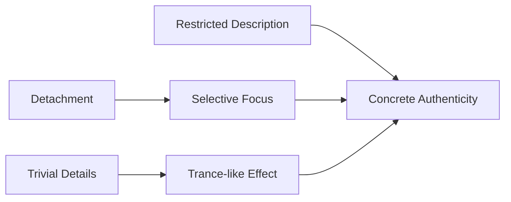

# Carver - Feathers

## Framework

### Macro
Environment

### Micro
Imagery, vivid language

### Choice
How could I successfully use detachment as a tool

set the tone

---

Daily Life
Country Drive
Sentence length
short, fragmented
longer, continuous
Perceptual mode
automatic, fatigued
open, trance-like
Narrator's role
agent (doing things)
passive receiver (seeing things)
## Analysis

### Carver's Language

> Where'd those eight months go? Hell, where's the time gone since? I remember the day Bud came to work with a box of cigars. He handed them out in the lunchroom. They were drugstore cigars. Dutch Masters. But each cigar had a red sticker on it and a wrapper that said IT'S A BOY!

He lets the characters speak for themselves, using their language: rough, simple, southern. His descriptions are restricted, being shortened into simple sentences. On the other hand, he tends to use many casual conversations. Together, these choices establish a concrete authenticity for the environment of his stories.

>[!note] Importance
>These sentences establish a specified, specific narration that belongs to the kind of southern, lower-middle class. The effect is that the characters are shaped naturally, in their tones of speaking, and in their ways to perceive the world.

### Fran's Hair — Detail as Revelation

The detail of Fran's hair shows that the couple still has a genuine relationship, for Fran knows that the protagonist likes her hair. Yet her threat of cutting it off shows that she is very tired after a hard day of automatic labour. It is reasonable to say that, their relationship would be eventually worn down in these daily routines.

### The Country Drive — Two Registers

The travel to the country involves many trivial descriptions of the scene:

> We saw red-winged blackbirds on the fences, and pigeons circling around haylofts. There were gardens and such, wildflowers in bloom, and little houses set back from the road.
> We turned right like the map said and drove exactly three and three-tenths miles. On the left side of the road, I saw a field of corn, a mailbox, and a long, graveled driveway.

This contrasts with the descriptions about the protagonist's daily lives, which are shorter and less continuous. Yet the description here is more fluent. It almost feels as if the characters simply let these objects be projected onto their pupils: they numbly perceive the world in a state of trance. This is how Carver uses details to create his characters.

|                     | Daily Life           | Country Drive                    |
| ------------------- | -------------------- | -------------------------------- |
| **Sentence length** | short, fragmented    | longer, continuous               |
| **Perceptual mode** | automatic, fatigued  | open, trance-like                |
| **Narrator's role** | agent (doing things) | passive receiver (seeing things) |

### The Peacock — Wordless Response

> Then something as big as a vulture flapped heavily down from one of the trees and landed just in front of the car. It shook itself. It turned its long neck toward the car, raised its head, and regarded us.

"Goddamn," the narrator says. Then again. Then a third time. The description of the bird is long — its tail "like a big fan folding in and out," "every color in the rainbow." But the characters say nothing of substance. They watch. The word "Goddamn" carries everything they cannot put into words.

### Olla's Teeth — Object as Narrative

> "They're to remind me how much I owe Bud."

The plaster teeth sit on the TV next to a red vase and a glass swan. Olla tells their story in one paragraph: crooked teeth as a kid, parents couldn't afford to fix them, first husband was a drunk, Bud came along and got them fixed. The object condenses all of this. Carver does not need to show her past — the teeth do it for him.

### The Ugliest Baby

> Bar none, it was the ugliest baby I'd ever seen. It was so ugly I couldn't say anything. No words would come out of my mouth. I don't mean it was diseased or disfigured. Nothing like that. It was just ugly. It had a big red face, pop eyes, a broad forehead, and these big fat lips. It had no neck to speak of, and it had three or four fat chins. Its chins rolled right up under its ears, and its ears stuck out from its bald head. Fat hung over its wrists. Its arms and fingers were fat. Even calling it ugly does it credit.

This is one of Carver's longest descriptive passages — unusual for a writer who keeps descriptions restricted. It goes on longer than it should, which is the point. The narrator cannot stop looking. The language is plain but the accumulation is almost grotesque.

### Bud's Grace

> Bud cleared his throat. He bowed his head and said a few words of grace. He talked in a voice so low I could hardly make out the words. But I got the drift of things—he was thanking the Higher Power for the food we were about to put away.

He says grace. That is all. The narrator cannot hear the words but gets "the drift of things." It is a small ritual, mentioned once and never returned to.

## Connections

- [[二十世纪文学理论与价值问题]] — "价值不在作品说了什么，而在于怎么说"：卡佛通过控制叙述距离和细节密度来实现"陌生化"，正是形式主义对"文学性"定义的当代实践
